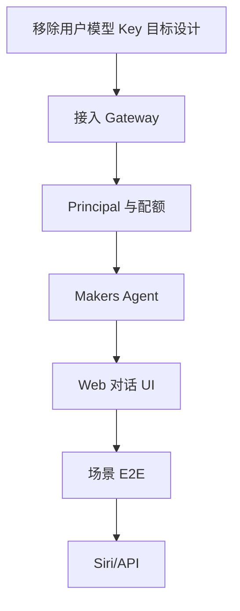

# AI Home Agent + 用户配额实现 TODO

> 依据：[AI Home Agent PoC 详细设计](./ai-home-poc-design.md)  
> 状态：Ready for implementation  
> 更新日期：2026-09-17

Phase 0 的冻结 contract 见 [AI Home Phase 0 Contract](./ai-home-phase-0-contract.md)。后续阶段必须先完成人工门禁，不得跳过项目可用性和模型 ID 验证。

## 1. 后续 Agent 开始前必读

1. 阅读根目录 `AGENTS.md`、`README.md`。
2. 阅读 `docs/ai-home-poc-design.md`。
3. 审计当前 AI 实现，至少包括：
   - `app/api/ai/command/route.ts`
   - `app/api/ai/token/route.ts`
   - `lib/ai/config.ts`
   - `lib/ai/intent-orchestrator.ts`
   - `lib/ai/providers/qwen-openai-provider.ts`
   - `lib/ai/security/binding.ts`
   - `lib/ai/security/conversation.ts`
4. 确认工作区没有用户未提交的改动。
5. 本 TODO 允许调整建议文件路径，但不能改变身份、配额和工具安全边界。

## 2. 迁移目标

| 当前/旧设计 | 目标 |
|---|---|
| 用户提交 Qwen Key | Makers AI Gateway 项目级 Key |
| Automation Token 包含模型 Key | Token 只包含用户身份、米家 Binding 和 scopes |
| `/api/ai/command` 主要面向 Siri | PoC 先增加 Cookie 鉴权的 Web Chat |
| 无用户级共享额度 | 按 principal 的应用配额 |
| 无 Agent 托管会话 | Makers Agent + `context.store` |
| 页面无统一 AI 入口 | 全局 AI 助手按钮和对话抽屉 |



## 3. Phase 0：冻结 Contract 与 ADR

### TODO

- [x] 根据官方快速开始确认 Makers Agents 的目录、入口、会话头和部署配置 contract。
- [x] 在目标 EdgeOne 项目人工确认 Agents 可用，并完成 `edgeone makers link`。
- [x] 确认 `AI_GATEWAY_API_KEY`、`AI_GATEWAY_BASE_URL` 通过服务端项目环境注入，Agent 从 `context.env` 读取。
- [x] 记录 2026-09-17 首期批准模型 `@makers/deepseek-v4-flash`，仅作为部署配置，不设源码默认值。
- [x] 固定 Web Chat API、Agent 内部请求和错误码。
- [x] 将旧“每用户自带 LLM Key”标记为 superseded。
- [x] 保留 `/api/ai/command` 作为旧兼容入口，迁移完成前新部署默认关闭。
- [x] Vercel Preview 使用只读 mock，不调用 Agent 或真实设备。

### 验收

- [x] 目标文档不再要求用户提供模型 Key，并明确旧实现仅为待迁移兼容路径。
- [x] Gateway Key 不出现在客户端 contract。
- [x] 未验证的模型名不进入生产默认配置。

## 4. Phase 1：Gateway Provider

建议文件：

```text
lib/ai/providers/makers-gateway-provider.ts
lib/ai/config.ts
tests/ai-makers-gateway-provider.test.mjs
```

### TODO

- [x] 通过 OpenAI 兼容协议接入 `AI_GATEWAY_BASE_URL`。
- [x] 只从服务端 env/context 读取 `AI_GATEWAY_API_KEY`。
- [x] 实现模型 allowlist、超时、最大输出 Token 和非思考模式配置。
- [x] 解析 Gateway 返回的 prompt/completion/total token usage。
- [x] usage 缺失时提供保守估算并标记 `estimated=true`。
- [x] 统一映射 401/403、429、timeout 和 5xx。
- [x] 清理错误对象，禁止序列化 Authorization Header。
- [x] 删除用户 API Key 校验和请求级模型凭据依赖。

Phase 1 只落地新的 Gateway Provider 与服务端配置：Provider 不接受请求级凭据，也不调用用户 Key 校验。旧 `/api/ai/command` 兼容入口按 Phase 0 决策保持关闭，待 Phase 7 统一迁移到 `AiAgentService` 后移除。

### 测试

- [x] Provider 请求指向配置的 Gateway URL。
- [x] API Key 只出现在上游 Authorization Header。
- [x] 日志、异常和响应不包含 Gateway Key。
- [x] 模型不在 allowlist 时调用前失败。
- [x] usage 正常与缺失路径均有测试。

### 人工验证

- [x] 2026-09-17 使用本地服务端环境完成一次真实 Gateway smoke 请求；模型返回 `no_action`，未执行任何场景。
- [x] 上游返回实际 `prompt/completion/total` usage，未触发估算路径。
- [x] 验证输出不包含 Gateway Key 或完整上游响应。

## 5. Phase 2：可信 Principal

建议文件：

```text
lib/ai/security/principal.ts
tests/ai-principal.test.mjs
```

### TODO

- [ ] 从服务端解密的 Xiaomi Session 读取 `userId`。
- [ ] 使用 HMAC-SHA256 和 `AI_PRINCIPAL_SECRET` 派生稳定 `principalId`。
- [ ] 输出使用 `usr_` 前缀的 Base64URL ID。
- [ ] 禁止请求体/Header 覆盖 principal。
- [ ] 提供登录后查看本人 principalId 的安全 UI/API。
- [ ] 记录 Secret 轮换影响和环境隔离规则。

### 测试

- [ ] 同一环境同一 userId 产生相同 principalId。
- [ ] 不同用户、不同 Secret 产生不同 ID。
- [ ] 输出不包含原始 userId。
- [ ] 非法/缺失 Xiaomi Session 返回 401。

## 6. Phase 3：配额策略与 QuotaStore

建议文件：

```text
lib/ai/quota/policy.ts
lib/ai/quota/quota-store.ts
lib/ai/quota/in-memory-quota-store.ts
edge-functions/api/ai-quota.ts
lib/ai/quota/edgeone-kv-quota-store.ts
lib/ai/quota/quota-service.ts
tests/ai-quota-*.test.mjs
```

### 3.1 策略 TODO

- [ ] 读取并 schema 校验默认分钟请求数、日请求数、月 Token 数。
- [ ] 解析 `AI_QUOTA_UNLIMITED_IDS`。
- [ ] 解析 `AI_QUOTA_OVERRIDES_JSON`。
- [ ] 实现固定优先级：unlimited > override > default。
- [ ] 配置非法时 fail fast，不静默使用无限额度。
- [ ] unlimited 用户仍写入 metrics。

### 3.2 Store TODO

- [ ] 定义 `reserve/commit/release/getSnapshot` 接口。
- [ ] 本地和单元测试实现 InMemory adapter。
- [ ] 在 EdgeOne 控制台启用 KV、创建 `ai-quota` namespace，并绑定全局变量 `ai_quota_kv`。
- [ ] 在 Edge Function 中直接使用绑定的全局变量，禁止错误地读取 `context.env.ai_quota_kv`。
- [ ] 实现 EdgeOne KV adapter；Agent/Node Function 不直接访问 KV。
- [ ] 明确实现为软限额：KV 最终一致性最长约 60 秒，且没有原子自增/CAS。
- [ ] key 使用 `q_v1_<env>_<principalKey>_<period>_<date>`，只包含字母、数字和下划线。
- [ ] `principalKey` 使用 principalId 的 SHA-256 十六进制截断值，不包含原始 userId。
- [ ] Value 记录 requests、prompt/completion/estimated tokens 和 updatedAt。
- [ ] 不依赖未公开的 KV TTL；按日/月 key 自然换窗并增加旧 key 清理任务。
- [ ] 以真实多节点并发测试量化 60 秒传播窗口内的最大超用量。
- [ ] 根据测试结果为默认额度设置安全余量。
- [ ] 周期按 `Asia/Shanghai` 计算并测试月末、闰日和 DST 无关性。

### 3.3 API TODO

- [ ] Agent 调用前 reserve。
- [ ] 成功后按 actual usage commit。
- [ ] 失败、取消或超时 release/部分结算。
- [ ] 配额不足返回 429 `AI_QUOTA_EXCEEDED` 和恢复时间。
- [ ] Store 故障按 `AI_QUOTA_FAIL_MODE` 处理，生产默认 closed。
- [ ] 增加 `GET /api/ai/quota`，只返回当前用户摘要。

### 测试

- [ ] 默认、覆盖和 unlimited 三种策略。
- [ ] 客户端伪造 ID 不影响配额主体。
- [ ] 并发测试明确记录软限额偏差，不能断言 EdgeOne KV 提供硬限额。
- [ ] Token 估算和实际 usage 差额正确结算。
- [ ] 用户 A 无法读取用户 B 的 quota snapshot。
- [ ] Store 故障不会无意放开生产额度。

## 7. Phase 4：Makers Agent

建议结构：

```text
agents/ai-home/index.ts
lib/ai/agent/ai-agent-service.ts
lib/ai/tools/list-scenes.ts
lib/ai/tools/activate-scene.ts
```

### TODO

- [ ] 建立 Agent endpoint，并使用固定 `onRequest(context)` 入口。
- [ ] 使用可信服务端生成的 `conversation_id`。
- [ ] 将 current principal/home 作为受信上下文传入，不来自模型。
- [ ] 接入 Gateway Provider、`context.store`、`context.tools` 和 tracing。
- [ ] 保持“已有场景高置信度匹配优先”。
- [ ] 注册 `list_scenes` 和 `activate_scene` 两个首期工具。
- [ ] Tool 侧重新校验 principal、homeId、场景审核状态和风险级别。
- [ ] 模型上下文不包含 Gateway Key、Mi Cloud Token、DID 或未审核 ID。
- [ ] side effect 前要求 Idempotency-Key。
- [ ] 支持 Agent stop/cancel。

### 测试

- [ ] 同一用户同一会话可连续对话。
- [ ] 不同 principal 即使提交相同 conversationId 也被隔离。
- [ ] 模型编造工具名、homeId、sceneId 均不能执行。
- [ ] 否定、条件、疑问和转述不误执行场景。
- [ ] 相同幂等键只执行一次。

## 8. Phase 5：Web Chat API

建议文件：

```text
app/api/ai/chat/route.ts
app/api/ai/quota/route.ts
app/api/ai/conversations/route.ts
```

### TODO

- [ ] 只接受有效 `xiaomi_session` Cookie。
- [ ] 校验 message、homeId、conversationId 和请求大小。
- [ ] 校验 homeId 属于当前登录用户。
- [ ] 统一执行 principal → quota → agent → usage commit 流程。
- [ ] 响应返回 requestId、conversationId、message、tool result 和 quota summary。
- [ ] 明确错误码：未登录、额度不足、Agent 失败、Gateway 失败、场景失败。
- [ ] 响应设置 `Cache-Control: no-store`。
- [ ] 首期可使用非流式响应；SSE 必须作为独立增量任务。

## 9. Phase 6：页面 AI 助手

建议文件：

```text
app/components/ai-assistant/ai-assistant-button.tsx
app/components/ai-assistant/ai-assistant-panel.tsx
app/components/ai-assistant/ai-message-list.tsx
app/components/ai-assistant/ai-composer.tsx
```

具体路径遵循现有组件约定。

### TODO

- [ ] 在主要页面挂载右下角 AI 助手按钮。
- [ ] 未登录点击时引导现有小米登录。
- [ ] 桌面显示侧边面板，移动端显示全屏抽屉。
- [ ] 展示当前家庭、剩余额度和建议语句。
- [ ] 支持发送、加载、取消、重试和新会话。
- [ ] 场景执行展示明确结果，不做虚假乐观更新。
- [ ] 配额不足显示恢复时间且不自动重试。
- [ ] 提供“清除会话”操作并明确其只清除对话记忆。
- [ ] 不提供模型 Key 输入框。
- [ ] 处理键盘访问、焦点、屏幕阅读器名称及安全区域。

### UI 测试

- [ ] 登录/未登录两种入口状态。
- [ ] 手机与桌面布局。
- [ ] 发送中禁止重复提交。
- [ ] 错误、空、配额不足和部分成功状态。
- [ ] 对话内容不写入 Local Storage，除非未来 ADR 明确允许。

## 10. Phase 7：Web 场景 E2E

- [ ] 使用低风险测试家庭和测试场景。
- [ ] “我回家了”优先匹配已存在场景。
- [ ] “我还没回家”不执行。
- [ ] “如果我回家了”不执行。
- [ ] 模糊场景进入澄清，不选择第一个结果。
- [ ] 模型失败与 Mi Cloud 失败有不同 UI。
- [ ] 用户达到默认日额度后不再调用 Agent。
- [ ] unlimited principal 可继续使用并留下 usage 指标。
- [ ] 用户 A/B 的会话、配额和家庭隔离。
- [ ] Vercel Preview 不控制真实设备。

## 11. Phase 8：Siri 与外部 API

依赖：Web PoC 完成，不阻塞 Phase 0–7。

- [ ] 重构现有 Automation Token：移除用户模型 Key 字段。
- [ ] Token 只包含 principal、密封米家会话、home、scopes、环境和有效期。
- [ ] 登录后提供 Token 生成页面。
- [ ] `/api/ai/command` 与 Web Chat 调用同一 `AiAgentService`。
- [ ] Siri 请求使用同一 Quota Service。
- [ ] Token 只通过 Authorization Header 传输。
- [ ] Shortcut 每次生成 Idempotency-Key。
- [ ] 返回适合 Siri 朗读的精简 message。
- [ ] 完成 Wi-Fi、蜂窝网络、过期 Token 和自动重试测试。

## 12. Phase 9：提醒与主动建议

- [ ] 核对 Makers 定时任务 API、重试和取消语义。
- [ ] 定义 Reminder Store，不能只依赖活跃 Agent 内存。
- [ ] 实现 `create/list/cancel reminder` tools。
- [ ] 接入至少一个国内可用通知渠道。
- [ ] 提醒默认发送选项，不直接执行设备动作。
- [ ] 长期习惯只保存经过用户确认的低敏偏好。
- [ ] 提供查看、暂停和删除记忆的入口。
- [ ] 高风险动作永不由习惯模型自动执行。

## 13. 配置迁移

目标配置：

```env
AI_ASSISTANT_ENABLED=true
AI_EXTERNAL_API_ENABLED=false
AI_GATEWAY_API_KEY=<platform-injected>
AI_GATEWAY_BASE_URL=https://ai-gateway.edgeone.link/v1
AI_GATEWAY_MODEL=<verified-model-id>
AI_AGENT_INTERNAL_SECRET=<environment-specific-secret>
AI_PRINCIPAL_SECRET=<environment-specific-secret>
AI_QUOTA_ENABLED=true
AI_QUOTA_DEFAULT_REQUESTS_PER_MINUTE=10
AI_QUOTA_DEFAULT_REQUESTS_PER_DAY=50
AI_QUOTA_DEFAULT_TOKENS_PER_MONTH=100000
AI_QUOTA_UNLIMITED_IDS=
AI_QUOTA_OVERRIDES_JSON={}
AI_QUOTA_FAIL_MODE=closed
AI_QUOTA_KV_BINDING=ai_quota_kv
```

清理项：

- [ ] 删除用户模型 Key 配置页面目标。
- [ ] 删除把模型 Key 密封进 Automation Token 的目标。
- [ ] 删除共享 `LLM_API_KEY` 及 Qwen 直连 fallback。
- [ ] 不把真实 env 值提交到仓库。
- [ ] Production、Preview、Development 使用不同应用 Secret。

## 14. 质量门禁

- [ ] `npm run typecheck`
- [ ] `npm run lint`
- [ ] `npm test`
- [ ] 审阅 `git diff`
- [ ] 搜索 Gateway Key、Mi Cloud Token、原始 userId 和 Authorization 日志泄漏。
- [ ] 检查所有 Mermaid 块和 Markdown 链接。
- [ ] PR 描述包含配置迁移、回滚、存储一致性和已知限制。

## 15. 推荐提交拆分

| Commit | 内容 |
|---|---|
| 1 | Gateway Provider 与配置 |
| 2 | Principal 派生 |
| 3 | Quota policy/store/service |
| 4 | Makers Agent 与 Tools |
| 5 | Web Chat API |
| 6 | AI 助手 UI |
| 7 | E2E、指标和文档 |
| 8 | 后续 Siri/API（独立 PR 亦可） |

## 16. Definition of Done

- [ ] 页面 AI 图标和对话面板可用。
- [ ] 所有模型请求通过 Makers AI Gateway。
- [ ] 用户不再输入或保存模型 Key。
- [ ] principal 完全由服务端登录态派生。
- [ ] 默认、覆盖和 unlimited 配额策略均有测试。
- [ ] 生产配额存储的一致性级别被验证并记录。
- [ ] EdgeOne KV namespace 已绑定，生产代码未将其误当成 `context.env` 变量。
- [ ] UI 与文档明确当前是软配额，不承诺并发下精确不超额。
- [ ] Agent 会话、配额、家庭和工具调用均按用户隔离。
- [ ] 只有审核场景能执行，并有幂等保护。
- [ ] Vercel Preview 不控制生产设备。
- [ ] Siri/API 演进不需要复制 Agent 或配额逻辑。
