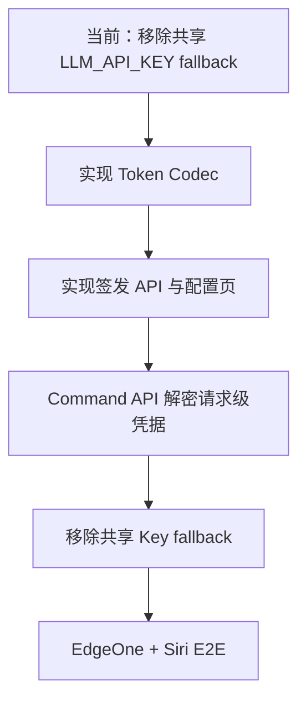
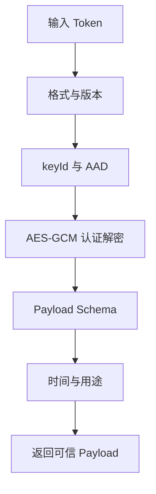
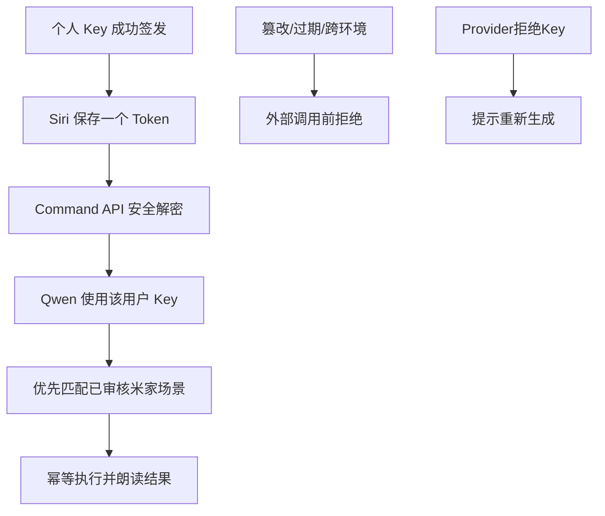

# AI Home Automation Token 实现 TODO

> 目标：在不引入数据库、KV 或 Redis 的前提下，让每个米家登录用户使用自己的 LLM API Key，并通过 Siri 快捷指令携带自包含加密 Automation Token 调用 AI Home。
>
> 设计依据：[AI Home PoC 详细设计](./ai-home-poc-design.md)
>
> 状态：Ready for implementation  
> 更新日期：2026-09-16

## 1. 后续 Agent 开始前必读

按顺序阅读：

1. 根目录 `AGENTS.md`
2. `README.md`
3. `docs/ai-home-poc-design.md`
4. 当前实现：
   - `app/api/ai/token/route.ts`
   - `app/api/ai/command/route.ts`
   - `lib/ai/config.ts`
   - `lib/ai/security/binding.ts`
   - `lib/ai/security/conversation.ts`
   - `lib/ai/providers/qwen-openai-provider.ts`
   - `lib/ai/intent-orchestrator.ts`

实现代码前先确认工作区/分支没有用户未提交改动。不要修改设备拓扑、场景同步或 Mi Cloud 协议，除非对应任务明确要求。

## 2. 当前状态与目标差距

| 能力 | 当前状态 | 目标 |
|---|---|---|
| LLM API Key | 已移除共享 `LLM_API_KEY` fallback | 每个用户自己的 Key |
| Provider 创建 | Command Route 从请求级解密凭据创建 | 从请求级解密凭据创建 |
| Siri Binding | 米家会话 + 可选 homeId | 统一 Automation Token |
| 用户配置 | 无独立页面 | 登录后一次性签发页面 |
| 凭据持久化 | 无数据库 | 不持久化，自包含 Token |
| Provider endpoint | 全局 URL | 服务端大陆 endpoint allowlist |
| Token 撤销 | 无 | 到期、用户 Key 轮换或全局 Secret 轮换 |
| 场景路由 | 已有动态米家场景优先 | 保持不变 |



## 3. 实施原则

- 每个阶段都必须提交对应测试，不能最后集中补测试。
- 原始 LLM Key 和完整 Automation Token 不得出现在日志、异常、快照、测试输出或客户端持久化存储。
- 加密必须发生在服务端；客户端永远拿不到 `AI_AUTOMATION_TOKEN_SECRET`。
- Provider endpoint 和模型必须来自服务端 Catalog，不接受用户任意 URL。
- Token 解密和策略校验必须早于任何 Qwen 或 Mi Cloud 网络调用。
- 不允许保留共享 `LLM_API_KEY` 作为 fallback。
- 生产、Preview、开发使用不同 Secret 与 keyId。
- 所有代码改动完成后运行：
  ```bash
  npm run typecheck
  npm run lint
  npm test
  ```

## 4. Phase 0：冻结 Contract 与错误码

依赖：无。

### TODO

- [x] 定义 `AutomationTokenPayload` 的 TypeScript 类型。
- [x] 固定 `purpose = "ai-home-automation"` 和 `version = 1`。
- [x] 固定 Token 格式：`v1.<keyId>.<iv>.<ciphertext>.<authTag>`。
- [x] 固定默认有效期 30 天、允许范围 1–90 天。
- [x] 增加稳定错误码：
  - `AUTOMATION_TOKEN_INVALID`
  - `AUTOMATION_TOKEN_EXPIRED`
  - `AUTOMATION_TOKEN_ENVIRONMENT_MISMATCH`（内部可区分，对外可合并为 invalid）
  - `LLM_CREDENTIAL_INVALID`
  - `LLM_PROVIDER_NOT_ALLOWED`
  - `LLM_MODEL_NOT_ALLOWED`
- [x] 确认旧 `/api/ai/token` 的迁移策略：PoC 推荐保留但标记 deprecated，前端不再引导使用；确认无调用后再删除。
- [x] 更新 API 类型和测试夹具，全部使用明显虚构的 Key。

### 验收

- 类型中不存在客户端可控 `baseUrl`。
- Payload 必须包含 `principalId`、米家 Session、region、Provider、模型、Key、签发时间和过期时间。
- 对外错误不暴露“认证标签错误”“解密失败”等内部密码学细节。

## 5. Phase 1：实现 Automation Token Codec

依赖：Phase 0。

建议文件：

```text
lib/ai/security/automation-token.ts
tests/ai-automation-token.test.mjs
```

### TODO

- [x] 使用 Web Crypto API 的 AES-256-GCM，兼容 EdgeOne/Vercel/Worker 运行时。
- [x] 每次签发生成随机 96-bit IV。
- [x] 从环境变量读取独立的 `AI_AUTOMATION_TOKEN_SECRET`。
- [x] 支持 `AI_AUTOMATION_TOKEN_KEY_ID`。
- [x] AAD 至少包含：应用名、部署环境、purpose、version、keyId。
- [x] 实现 `seal(payload)`。
- [x] 实现 `open(token)`。
- [x] 解密后执行运行时 schema 校验，不仅依赖 TypeScript 类型。
- [x] 使用常量或专用错误类型映射失效、过期和格式错误。
- [x] 不在任何异常中附带 Token 或解密后的 Payload。
- [x] 明确 UTF-8、Base64URL、时间戳单位和 Secret 解码规则。
- [x] 增加当前 keyId 的严格校验；若实现旧 keyId 重叠窗口，必须由显式配置开启。

### 单元测试

- [x] seal → open 往返成功。
- [x] 相同 Payload 两次签发产生不同密文。
- [x] 修改 IV、ciphertext、authTag 任一字节均失败。
- [x] 缺段、空段、非法 Base64URL、未知版本、未知 keyId 均失败。
- [x] 错误 purpose、错误环境 AAD 均失败。
- [x] `expiresAt <= now` 返回 expired。
- [x] `issuedAt` 位于不合理未来时拒绝。
- [x] Payload 缺少 Key、principalId、Session 或 Provider 时拒绝。
- [x] 测试日志和错误序列化不包含虚构原始 Key。

### 验收



只有全部关卡通过才能返回 Payload；任何失败都不能访问外部服务。

## 6. Phase 2：Provider Catalog 与签发 API

依赖：Phase 1。

建议文件：

```text
lib/ai/providers/provider-catalog.ts
app/api/ai/automation-token/route.ts
tests/ai-automation-token-api.test.mjs
```

### Provider Catalog TODO

- [x] 首期只允许 `qwen-cn`。
- [x] 大陆 endpoint 在服务端固定，不从请求读取。
- [x] 配置允许的 Flash 模型列表与默认模型。
- [x] 提供 `resolveProvider(provider, model)`，未知值稳定失败。
- [x] 避免在 Catalog 中保存任何业务 API Key。
- [x] 为后续大陆 Provider 预留注册接口，但不要过度抽象。

### 签发 API TODO

- [x] 仅接受有效浏览器 `xiaomi_session`。
- [x] 限制请求方法、Content-Type 和请求体大小。
- [x] 校验 `provider/model/homeId/expiresInDays/apiKey`。
- [x] 拒绝请求体中的 `baseUrl` 或其他未声明字段。
- [x] 从米家登录会话构造稳定 `principalId`。
- [x] 校验 `homeId` 属于当前用户；未指定时按当前项目规则选择或要求用户选择。
- [x] 使用用户 Key 对 Provider 发起最小验证请求。
- [x] 验证请求不携带家庭、场景、对话或设备数据。
- [x] 验证成功后生成 `AutomationTokenPayload` 并密封。
- [x] 只返回 Token、Provider、模型、homeId 和 expiresAt。
- [x] 不返回原始 Key、解密 Payload 或米家 Session。
- [x] 为签发接口增加应用层限流；EdgeOne 同时配置边缘限流。
- [x] 统一 Provider 的 `401/403/timeout/5xx` 错误映射。
- [x] 响应设置 `Cache-Control: no-store`。

### API 测试

- [x] 未登录返回 401。
- [x] 非法 Provider/模型在调用外部 Provider 前失败。
- [x] 任意 `baseUrl` 被拒绝。
- [x] 非法 homeId 被拒绝。
- [x] 有效 Key 返回可由 Codec 解密的 Token。
- [x] 无效 Key 不签发 Token。
- [x] Provider timeout 不签发 Token。
- [x] 响应和日志不包含原始 Key。
- [x] Token 中 principal、Session 与登录用户一致。
- [x] 有效期小于 1 天或超过 90 天被拒绝。

## 7. Phase 3：AI 自动化配置页

依赖：Phase 2。

建议文件：

```text
app/ai/settings/page.tsx
app/ai/settings/automation-token-form.tsx
```

具体路径可遵循现有路由和组件约定调整。

### TODO

- [x] 未登录用户跳转到现有米家登录流程。
- [x] 表单包含 Provider、模型、API Key、家庭和有效期。
- [x] Provider 首期固定显示“通义千问（中国大陆）”。
- [x] 模型只能从服务端允许列表选择。
- [x] API Key 输入框默认隐藏，并支持临时显示。
- [x] 提交时调用 `POST /api/ai/automation-token`。
- [x] 成功后一次性展示 Automation Token、过期时间和复制按钮。
- [x] 明确提示 Token 等价于密码，需保存到快捷指令，页面不会代为找回。
- [x] 页面刷新后不尝试恢复 Token 或原始 Key。
- [x] 不写入 Local Storage、Session Storage、IndexedDB 或客户端可读 Cookie。
- [x] 复制后允许用户主动清空页面中的 Token。
- [x] 提供 Siri 快捷指令配置说明。
- [x] 实现移动端布局、键盘访问、加载状态和错误状态。
- [x] 响应页面设置避免缓存；确认浏览器返回导航不会恢复敏感表单值。

### UI 测试

- [x] API Key 不出现在 DOM 快照的默认状态。
- [x] 提交中禁止重复提交。
- [x] 失败后清除或保留 Key 的行为明确且测试覆盖；推荐清除。
- [x] Token 只在成功结果区出现一次。
- [x] 页面刷新后敏感字段为空。
- [x] 手机尺寸下可以完成选择、生成和复制。

## 8. Phase 4：Command API 接入请求级凭据

依赖：Phase 2；可与 Phase 3 并行开发，但合并时必须完成 Phase 3。

主要文件：

```text
app/api/ai/command/route.ts
lib/ai/providers/qwen-openai-provider.ts
lib/ai/config.ts
tests/ai-command-api.test.mjs
```

### TODO

- [x] 从 `Authorization: Bearer <token>` 读取 Automation Token。
- [x] 禁止从 query string 或请求体读取 Token。
- [x] 在读取场景、调用 Qwen 或访问 Mi Cloud 前完成解密与全部校验。
- [x] 从 Payload 创建请求级 `ResolvedProviderCredential`。
- [x] endpoint 始终从 Provider Catalog 解析。
- [x] Provider 改为显式接收请求级 Key，不从全局配置读取。
- [x] 校验 Payload 中 principal、米家 Session、region 和 homeId 的一致性。
- [x] 保持“现有审核场景优先”逻辑不变。
- [x] 保持 Tool allowlist 和 Scene Service 边界不变。
- [x] 删除正常路径和 fallback 中对共享 `LLM_API_KEY` 的读取。
- [x] 缺失 `AI_AUTOMATION_TOKEN_SECRET` 时启动/请求明确失败，不降级到共享 Key。
- [x] Provider 返回 401/403 时映射 `LLM_CREDENTIAL_INVALID`。
- [x] 清理异常对象，避免 HTTP client 把 Authorization Header带入日志。
- [x] 对 Automation Token Header 设置合理长度上限。
- [x] 评估旧 Shortcut Token 的兼容窗口；默认新 AI Command 不接受旧 Token。

### 测试

- [x] Token A 的请求只把 Key A 传给 Provider mock。
- [x] Token B 的请求只把 Key B 传给 Provider mock。
- [x] Token A 无法访问不属于 A 的 homeId。
- [x] 篡改、过期、跨环境 Token 不调用 Provider 或 Mi Cloud mock。
- [x] Provider 401 不调用共享 Key 重试。
- [x] Provider timeout 的确定性回退符合最终 ADR。
- [x] 场景 Tool 参数非法时不执行。
- [x] 否定、条件、疑问和转述语句不执行。
- [x] 同一 Idempotency-Key 不重复执行场景。
- [x] 响应、日志和异常中不包含完整 Token、Key 或米家 Session。

## 9. Phase 5：迁移配置与清理共享 Key

依赖：Phase 4。

### TODO

- [x] 从目标部署配置中移除 `LLM_API_KEY`。
- [x] 从 `lib/ai/config.ts` 移除业务 Key 必填逻辑。
- [x] 保留的部署级配置仅包括 Provider 策略、默认模型、超时和 Token Secret。
- [x] 更新 `.env.example`（若仓库存在且允许），只放虚构占位符。
- [x] 更新 README 的 AI 配置说明。
- [x] 搜索源码、测试和文档，确认没有共享业务 Key fallback。
- [x] 搜索日志语句，确认不会打印 Headers、Payload 或 Provider error request config。
- [x] 生产、Preview、本地配置不同的 Secret 与 keyId。
- [x] 记录紧急 Secret 轮换步骤及影响范围。
- [x] 明确旧 Automation Token 在轮换后全部失效，用户需要重新生成。

### 建议搜索

```bash
rg "LLM_API_KEY|LLM_CREDENTIAL_STORE|apiKey|Authorization|automation-token" .
```

检查结果需要人工区分正常类型/测试引用与危险日志或 fallback。

## 10. Phase 6：Siri 快捷指令与 E2E

依赖：Phase 3、Phase 4、Phase 5。

### 快捷指令 TODO

- [ ] 用户登录 WebApp 并打开 AI 自动化配置页。
- [ ] 输入个人 Qwen Key，选择家庭和有效期。
- [ ] 生成并复制 Automation Token。
- [ ] 快捷指令把 Token 放入 `Authorization: Bearer ...`。
- [ ] 每次请求生成 UUID 作为 `Idempotency-Key`。
- [ ] 固定短语版本先发送“我回家了”。
- [ ] 任意语音版本使用“听写文本”。
- [ ] 读取响应 `message` 并朗读。
- [ ] Token 过期或 Key 失效时给出重新生成提示。
- [ ] 不把 Token 放在 URL、JSON Body、通知文本或调试输出中。

### E2E 场景

- [ ] EdgeOne + 中国大陆源站 + 百炼大陆 endpoint。
- [ ] Wi-Fi 网络调用。
- [ ] 蜂窝网络调用。
- [ ] Siri 自动重试不会重复执行场景。
- [ ] “我回家了”触发唯一已审核回家场景。
- [ ] “我还没回家”不执行。
- [ ] “如果我回家了”不执行。
- [ ] Qwen timeout 返回可解释错误或按 ADR 执行确定性回退。
- [ ] 米家失败与模型失败返回不同错误。
- [ ] Vercel Preview 无法使用生产 Token。
- [ ] Secret 轮换后旧 Token 按设计失效。
- [ ] 使用低风险测试场景完成首次 E2E，不直接改动生产家庭场景。

## 11. Phase 7：安全与发布检查

依赖：全部开发阶段。

### 安全检查

- [ ] 原始 Key 仅经 HTTPS 从表单发送到签发 API。
- [ ] Token 仅经 HTTPS Authorization Header 发送。
- [ ] WAF/CDN/源站访问日志不记录 Authorization。
- [ ] 前端错误监控不采集表单 Key 或 Token。
- [ ] Provider SDK/HTTP 错误不序列化 Authorization Header。
- [ ] `Cache-Control: no-store` 覆盖签发接口和配置结果页。
- [ ] Content Security Policy 不允许不必要的第三方脚本读取配置页。
- [ ] 签发接口与 Command API 都有长度和频率限制。
- [ ] 生产 Secret 不出现在 Vercel Preview、源码、PR、构建日志或客户端 Bundle。
- [ ] 无数据库导致的单 Token 不可撤销限制已在 UI 和运维文档中说明。

### 质量门禁

- [ ] `npm run typecheck`
- [ ] `npm run lint`
- [ ] `npm test`
- [ ] 审阅 `git diff`
- [ ] 确认无真实凭据、设备 ID、家庭数据或生成目录进入提交
- [ ] 更新设计文档中“当前实现审计”为已实现状态
- [ ] PR 描述包含迁移步骤、部署变量、回滚方式和已知限制

## 12. 推荐提交拆分

| Commit | 内容 | 可独立验证 |
|---|---|---|
| 1 | Token types、Codec、单元测试 | 是 |
| 2 | Provider Catalog、签发 API、API 测试 | 是 |
| 3 | 配置页与 UI 测试 | 是 |
| 4 | Command API 请求级凭据接入 | 是 |
| 5 | 移除共享 Key、更新部署文档 | 是 |
| 6 | Siri/E2E 文档与最终回归 | 是 |

不要把密码学实现、UI 和 Command API 迁移压在一个不可审阅的大提交中。

## 13. 完成定义



以下条件全部满足才算完成：

- 用户不需要数据库即可完成个人 LLM Key 配置。
- 服务端不持久化用户 Key 或 Automation Token。
- 快捷指令只保存一个自包含 Token。
- 用户隔离、家庭隔离、环境隔离和模型白名单均有自动化测试。
- 共享 `LLM_API_KEY` 不再参与任何用户请求。
- 现有场景优先策略、Tool allowlist 和未来 HA Executor 边界保持不变。
