# AI Home Agent PoC 详细设计

> 项目：`mijia-web-console`  
> 状态：Draft v0.6  
> 更新日期：2026-09-17  
> 当前目标：在 WebApp 中提供可对话的 AI 助手，统一使用 EdgeOne Makers AI Gateway，并为每个登录用户实施应用级用量配额；后续复用同一能力接入 Siri 等自动化客户端。

## 1. 本次架构调整

旧方案要求每个用户提交并保存自己的 Qwen API Key。新方案改为：

- 模型统一通过 EdgeOne Makers AI Gateway 调用；
- Gateway Key 由平台注入，只存在于服务端 `context.env`；
- WebApp 根据登录用户的可信身份实施独立配额；
- 默认用户使用统一标准额度；
- 运维人员可以通过环境变量让指定内部用户 ID 绕过额度，或为其配置独立额度；
- PoC 先提供网页内对话入口；
- Siri、快捷指令及其他语音入口放到下一阶段，通过独立 Automation Token 调用同一内部 Agent Service。

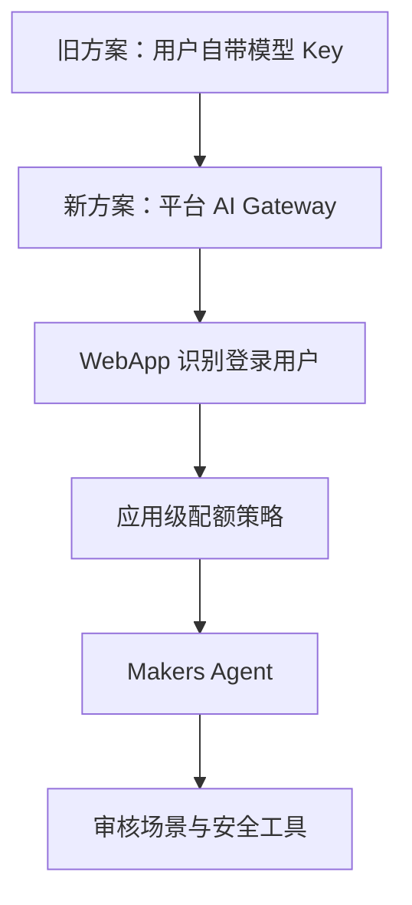

### 1.1 官方能力依据

EdgeOne Makers Agents 官方文档确认：

- `agents/` Runtime 支持会话粘性、LLM/Agent 循环与最长 60 分钟执行；
- 平台向 `context.env` 注入 `AI_GATEWAY_API_KEY` 和 `AI_GATEWAY_BASE_URL`；
- AI Gateway 兼容 OpenAI 协议；
- `context.store` 提供会话级消息与记忆；
- `context.tools` 提供框架适配后的工具；
- 定时任务是官方列出的适用场景之一；
- 免费额度及平台限制是账号级、所有项目共享，不能替代本项目的用户级配额。

参考：[EdgeOne Makers Agents 概览](https://cloud.tencent.com/document/product/1552/132759)

## 2. 目标与非目标

### 2.1 PoC 目标

1. 登录用户在任意 WebApp 页面看到 AI 助手图标。
2. 用户打开对话面板，与助手进行连续对话。
3. 助手优先理解并匹配当前家庭已经存在的米家场景。
4. 只有审核过的低风险场景可以通过 `activate_scene` 执行。
5. 模型调用全部经过 Makers AI Gateway。
6. 每个登录用户按可信 `principalId` 独立计费和限额。
7. 指定 `principalId` 可以通过环境变量绕过应用配额。
8. 对话、场景执行、模型消耗和配额结果可追踪但不泄露凭据。
9. Agent API 与 UI 解耦，为 Siri、快捷指令和后续 HA 接入保留稳定边界。

### 2.2 PoC 非目标

- 自建 STT、VAD、唤醒词或 TTS；
- 摄像头视频、门锁、门禁、燃气等高风险操作；
- 让模型自由构造 MIoT 请求；
- 自动执行未经审核的场景；
- 完整的主动习惯学习；
- 跨家庭共享记忆；
- 把 Agent Store 当作通用用户数据库；
- 精确的商业计费系统。

## 3. 总体架构

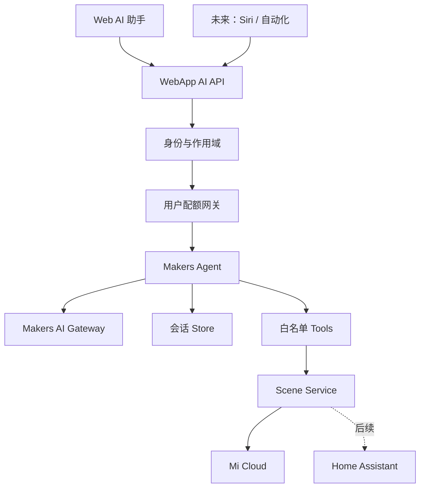

### 3.1 组件职责

| 组件 | 负责 | 不负责 |
|---|---|---|
| AI 助手 UI | 输入、展示、确认、重试和移动端交互 | 保存 Gateway Key、直接控制设备 |
| WebApp AI API | 登录校验、principal、配额、幂等和安全策略 | 自行进行开放式 Agent 推理 |
| Quota Service | 解析策略、检查及记录用户用量 | 依赖客户端提交的用户 ID |
| Makers Agent | 会话、模型调用、工具选择和自然语言回复 | 绕过配额或直接访问任意设备 API |
| AI Gateway | 统一模型鉴权、模型路由 | 本项目的用户级额度与设备权限 |
| Agent Store | 会话消息、摘要和 Checkpoint | 用户业务档案、精确计费账本 |
| Scene Service | 场景发现、审核映射和安全执行 | 理解任意自然语言 |
| EdgeOne KV Quota Store | 保存跨实例日/月用量计数 | 保存模型 Key、米家会话或提供强一致硬限额 |

## 4. 身份模型

### 4.1 Principal 来源

Web 对话请求只能使用服务端从 `xiaomi_session` 解密得到的 `session.userId`，不能接受请求体或 Header 中自报的用户 ID。

为减少原始小米账号 ID 在日志、指标和环境变量中的传播，服务端派生稳定内部 ID：

```text
principalId = "usr_" + base64url(
  HMAC-SHA256(AI_PRINCIPAL_SECRET, "xiaomi:" + session.userId)
)
```

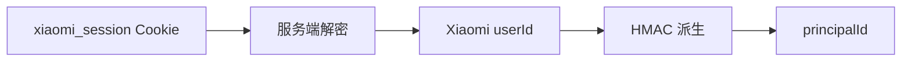

规则：

- `AI_PRINCIPAL_SECRET` 只能在服务端读取；
- 生产、Preview、开发使用不同 Secret；
- `principalId` 可以在 AI 设置页展示，供管理员配置额度；
- Secret 轮换会改变全部 principalId，必须提供迁移说明；PoC 默认不轮换；
- 家庭仍以 `homeId` 为第二级作用域，禁止跨家庭共享会话和场景。

### 4.2 会话标识

客户端不直接决定 Makers `conversation_id`。服务端创建并签名会话句柄，再映射为：

```text
agentConversationId = HMAC(principalId + homeId + clientConversationId)
```

这样可以防止用户猜测其他会话 ID 并读取其记忆。

## 5. 用户配额设计

### 5.1 两层额度

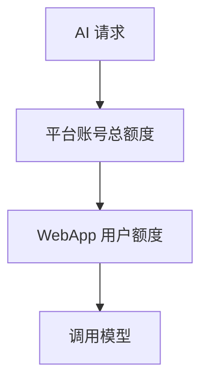

| 层级 | 管理者 | 目的 |
|---|---|---|
| Makers 平台总额度 | 腾讯云 | 控制账号/项目总体资源 |
| WebApp 用户额度 | 本项目 | 防止单个登录用户耗尽共享额度 |

应用配额不能以平台免费额度数字作为永久常量；平台价格和额度变化时，只修改环境配置。

### 5.2 策略优先级

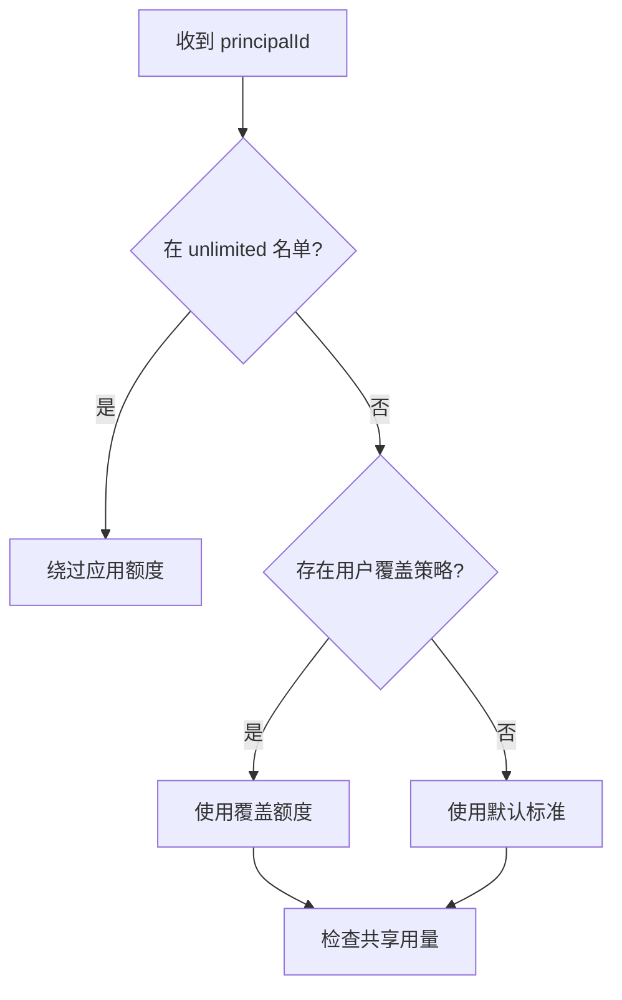

优先级固定为：

1. `AI_QUOTA_UNLIMITED_IDS`；
2. `AI_QUOTA_OVERRIDES_JSON`；
3. 默认标准额度。

建议环境变量：

```env
AI_GATEWAY_API_KEY=<platform-injected>
AI_GATEWAY_BASE_URL=https://ai-gateway.edgeone.link/v1
AI_GATEWAY_MODEL=<approved-fast-model>

AI_PRINCIPAL_SECRET=<high-entropy-secret>
AI_QUOTA_ENABLED=true
AI_QUOTA_DEFAULT_REQUESTS_PER_MINUTE=10
AI_QUOTA_DEFAULT_REQUESTS_PER_DAY=50
AI_QUOTA_DEFAULT_TOKENS_PER_MONTH=100000
AI_QUOTA_UNLIMITED_IDS=usr_admin_a,usr_admin_b
AI_QUOTA_OVERRIDES_JSON={"usr_test":{"requestsPerDay":500,"tokensPerMonth":1000000}}
AI_QUOTA_FAIL_MODE=closed
```

约束：

- 环境变量中的 ID 必须是服务端派生的 `principalId`，不是邮箱、昵称或客户端自报 ID；
- `unlimited` 只绕过本项目额度，不绕过 Makers 平台总额度；
- 绕过用户仍记录调用次数和 Token 指标，但不阻止请求；
- `AI_QUOTA_OVERRIDES_JSON` 必须在启动时完成 schema 校验；非法配置应明确失败，不能静默放开额度；
- 默认 `fail closed`：配额存储不可用时，不继续产生共享模型费用；管理员可在显式运维事件中临时修改。

### 5.3 用量状态

`env` 只保存策略，不能保存已使用次数。PoC 确认使用 **EdgeOne KV** 保存跨实例用量，并通过 `QuotaStore` 接口隔离平台实现：

```ts
interface QuotaStore {
  reserve(input: QuotaReservation): Promise<QuotaLease>;
  commit(leaseId: string, usage: ActualModelUsage): Promise<void>;
  release(leaseId: string): Promise<void>;
  getSnapshot(principalId: string): Promise<QuotaSnapshot>;
}
```

EdgeOne Makers KV 是全球分布式持久 KV，免费版文档标明每账号 1 GB、单值不超过 25 MB、最多 10 个 namespace，并在全球节点间最长约 60 秒完成同步。它仅能在 **Edge Functions** 中通过绑定的全局变量访问，不位于 `context.env`，也不能直接在 Node Functions 或 Makers Agent Runtime 中调用。

官方公开 API 只有 `get/put/delete/list`，没有原子自增、CAS 或事务。因此本项目接受以下 PoC 边界：

- EdgeOne KV 用于日/月累计用量和最近更新时间；
- WebApp 的 Edge Function 配额门面在调用 Agent 前后读写 KV；
- 分钟级突发限制同时由 EdgeOne/WAF 和单实例快速限流承担；
- 日/月限制属于**软配额**，并发请求和 60 秒传播窗口内可能少量超用；
- 配额配置采用保守阈值，为同步窗口预留余量；
- 如果未来需要商业计费或严格硬限额，`QuotaStore` 必须替换为支持原子条件更新的大陆区存储，而不改变上层 API。

参考：[EdgeOne Makers KV 官方开发说明](https://github.com/TencentEdgeOne/edgeone-makers-tools/blob/main/skills/edgeone-makers-tools/references/makers-storage/references/kv.md)

不能使用浏览器 Local Storage、签名 Token 自带计数或单实例内存作为日/月额度账本，因为这些方式可重放或无法跨实例同步。

### 5.3.1 KV Namespace 与 Key

控制台创建独立 namespace `ai-quota`，绑定到项目的全局变量名建议为 `ai_quota_kv`：

```text
q_v1_<env>_<principalKey>_d_<yyyyMMdd>
q_v1_<env>_<principalKey>_m_<yyyyMM>
```

其中 `principalKey` 使用 `SHA-256(principalId)` 的十六进制截断结果，确保 key 仅包含字母、数字和下划线，不把原始账号 ID 写入 KV key。

Value 使用小型 JSON：

```json
{
  "requests": 23,
  "promptTokens": 14201,
  "completionTokens": 1902,
  "estimatedTokens": 0,
  "updatedAt": "2026-09-17T08:00:00Z"
}
```

每日和每月使用新 key 自然换窗；旧 key 由低频清理任务删除。由于官方 KV API 未公开 TTL 参数，设计不依赖自动过期。

### 5.4 Reserve/Commit 流程

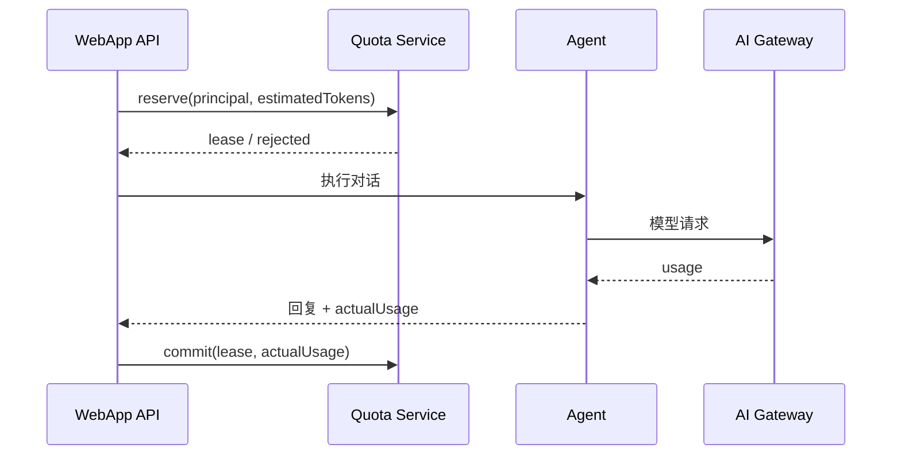

若 Agent 或 Gateway 失败，调用 `release` 或按最小实际消耗结算。`QuotaLease` 是请求生命周期内的应用对象；EdgeOne KV 不承担精确租约锁。因最终一致性产生的竞态由软配额边界和保守额度吸收。

### 5.5 对外额度响应

配额不足返回：

```json
{
  "code": "AI_QUOTA_EXCEEDED",
  "message": "今天的 AI 助手额度已用完，请稍后再试。",
  "quota": {
    "period": "day",
    "retryAfter": "2026-09-18T00:00:00+08:00"
  }
}
```

不得返回其他用户额度、平台 Gateway Key、平台总余额或内部覆盖名单。

## 6. Makers Agent 设计

### 6.1 Runtime 与框架

PoC 推荐 LangGraph 或轻量自定义 Agent loop。首期不使用 CrewAI 多 Agent：家庭场景控制需要确定性、低延迟和明确审批，而不是开放式协作。

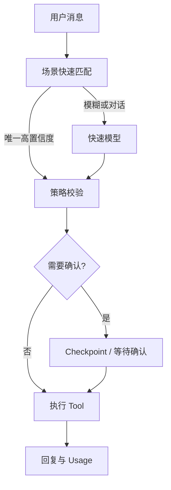

### 6.2 首期工具

| Tool | PoC | 说明 |
|---|---:|---|
| `list_scenes` | 是 | 返回当前家庭已同步、允许展示的场景摘要 |
| `activate_scene` | 是 | 只执行审核后的低风险现有场景 |
| `get_scene_status` | 可选 | 查询上一次执行结果，不读取任意设备 |
| `create_reminder` | 后续 | 创建提醒，不默认执行设备动作 |
| `remember_preference` | 后续 | 只保存用户明确确认的低敏偏好 |

模型上下文不包含 Mi Cloud Token、Gateway Key、真实设备 DID 或未审核 Scene ID。`activate_scene` 接收内部别名，由 Scene Service 解析真实目标。

### 6.3 记忆分层

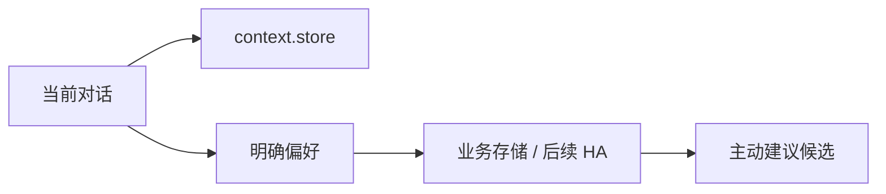

| 数据 | 存放位置 |
|---|---|
| 对话消息、摘要、Checkpoint | Makers `context.store` |
| 当前会话选定的家庭/场景 | 会话 state |
| 配额计数 | EdgeOne KV `QuotaStore`（软配额） |
| 长期偏好和习惯证据 | 后续业务存储或 HA Recorder |
| 小米会话 | 现有服务端密封 Cookie/Automation Token |

## 7. WebApp AI 助手 PoC

### 7.1 入口

所有主要页面右下角显示 AI 助手浮动按钮：

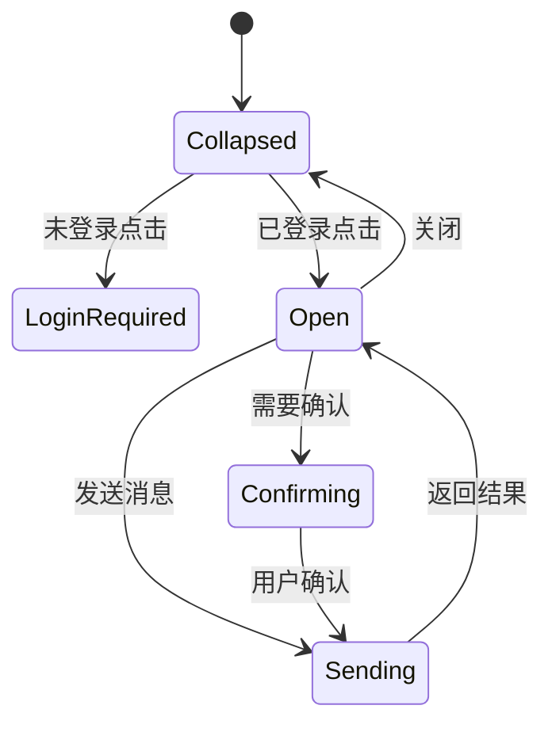

行为：

- 未登录时可以看到入口，但点击后引导完成现有小米登录；
- 已登录时打开桌面侧边面板或移动端全屏抽屉；
- 首屏显示当前家庭和可用场景建议，例如“我回家了”“查看可用场景”；
- 支持多轮对话、停止生成、重试和新建会话；
- 场景执行结果必须显示成功、部分成功或失败，不使用乐观 UI 掩盖错误；
- 达到配额时显示恢复时间，不反复自动重试；
- PoC 页面不再要求用户填写模型 API Key。

### 7.2 调用时序

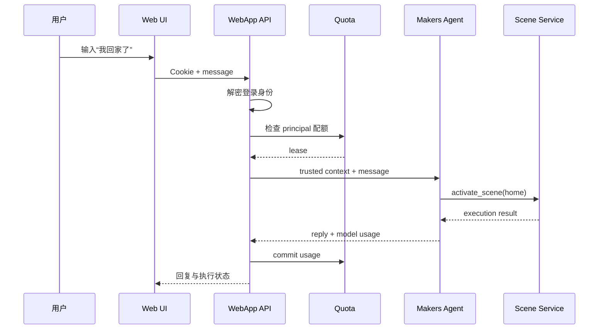

### 7.3 Web API

建议入口：

| 方法 | 路径 | 鉴权 | 用途 |
|---|---|---|---|
| `POST` | `/api/ai/chat` | `xiaomi_session` Cookie | 页面内对话 |
| `GET` | `/api/ai/quota` | `xiaomi_session` Cookie | 当前用户额度摘要 |
| `POST` | `/api/ai/conversations` | Cookie | 创建新会话 |
| `DELETE` | `/api/ai/conversations/:id` | Cookie | 删除当前用户会话 |
| `POST` | `/api/ai/command` | 后续 Automation Token | Siri/API 自动化 |

所有入口最终调用同一个内部 `AiAgentService`，不能复制意图判断、配额或工具安全逻辑。

聊天请求：

```json
{
  "conversationId": "conv_client_opaque",
  "homeId": "123456",
  "message": "我回家了",
  "idempotencyKey": "0199..."
}
```

`homeId` 必须再次校验属于当前登录用户；`principalId` 永远由服务端生成。

## 8. 未来 Siri 与外部 API

网页 PoC 稳定后，再开放自动化入口：

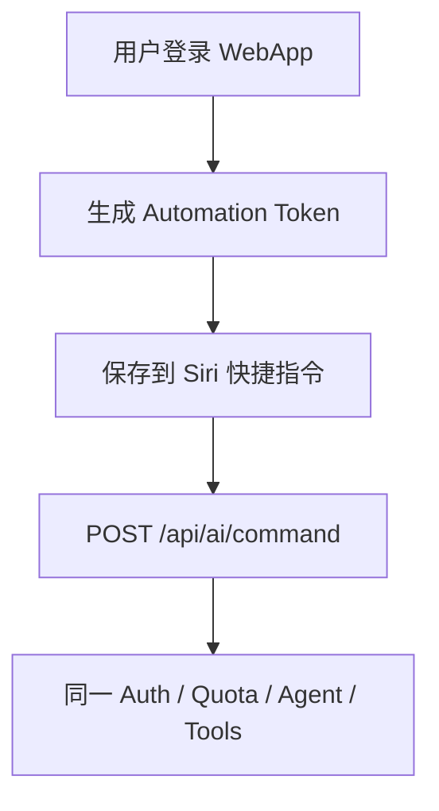

新 Automation Token 不再包含用户 LLM Key，只包含：

- 版本、用途和环境；
- `principalId` 与密封的小米会话；
- 允许的 `homeId`；
- scopes，例如 `ai:chat`、`scene:activate`；
- 签发时间、过期时间和 keyId。

Siri 入口必须与 Web UI 使用同一用户配额。Token 泄露后不能获得 Gateway Key，但仍可能控制其授权家庭，因此必须支持短有效期、Secret 轮换和后续单 Token 撤销。

## 9. 定时提醒与主动建议演进

官方文档将定时任务列为 Makers Agents 适用场景。未来提醒仍拆成三个明确职责：

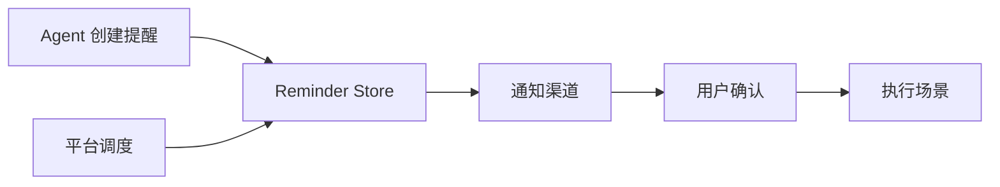

- Agent：理解时间、内容和候选动作；
- 调度器：在指定时间触发，不依赖活跃对话实例；
- 通知渠道：HA Companion、iPhone 或后续国内消息渠道；
- Scene Service：只有用户授权后执行有副作用的动作。

长期习惯学习默认只产生建议，不自动执行设备操作。用户拒绝、忽略和接受都应成为可撤回的反馈信号。

## 10. 安全边界

1. Gateway Key 只从 `context.env` 读取，不进入客户端、Cookie、Automation Token、日志或 Agent 消息。
2. `principalId` 来自可信服务端会话，不接受客户端覆盖。
3. 配额检查发生在 Agent/Gateway 调用前。
4. `AI_QUOTA_UNLIMITED_IDS` 只影响额度，不扩大家庭、场景或工具权限。
5. Agent 只能调用白名单工具；工具服务端再次做身份、家庭、风险与参数校验。
6. Web 会话和 Agent `conversation_id` 必须绑定 principal 与 home。
7. 模型不得看到 Mi Cloud Token、原始小米账号 ID或真实设备标识。
8. 高风险动作始终禁止；扩大能力必须新增 ADR 和确认流程。
9. 对有副作用的请求使用 Idempotency-Key，重试不得重复执行。
10. 日志仅记录派生 principal、requestId、conversationId、模型、usage、工具名和结果。

## 11. 可观测性

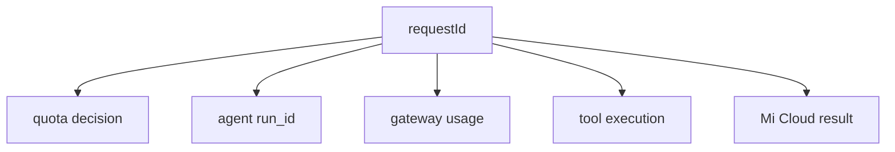

建议指标：

- `ai_requests_total{result,client}`；
- `ai_quota_rejected_total{period}`；
- `ai_gateway_tokens_total{model,direction}`；
- `ai_agent_latency_ms`；
- `ai_tool_calls_total{tool,result}`；
- `ai_scene_execution_total{result}`；
- `ai_active_conversations`。

指标标签禁止使用原始账号 ID、homeId、sceneId 或用户输入全文。

## 12. 部署配置

```env
AI_ASSISTANT_ENABLED=true
AI_EXTERNAL_API_ENABLED=false

AI_GATEWAY_API_KEY=<injected-by-makers>
AI_GATEWAY_BASE_URL=https://ai-gateway.edgeone.link/v1
AI_GATEWAY_MODEL=<approved-fast-model>
AI_GATEWAY_TIMEOUT_MS=5000
AI_GATEWAY_MAX_OUTPUT_TOKENS=256

AI_PRINCIPAL_SECRET=<environment-specific-secret>
AI_QUOTA_ENABLED=true
AI_QUOTA_DEFAULT_REQUESTS_PER_MINUTE=10
AI_QUOTA_DEFAULT_REQUESTS_PER_DAY=50
AI_QUOTA_DEFAULT_TOKENS_PER_MONTH=100000
AI_QUOTA_UNLIMITED_IDS=
AI_QUOTA_OVERRIDES_JSON={}
AI_QUOTA_FAIL_MODE=closed
AI_QUOTA_KV_BINDING=ai_quota_kv

AI_AGENT_MAX_TURNS=10
AI_AGENT_MEMORY_TTL_DAYS=30
AI_SCENE_EXECUTION_ENABLED=true
```

生产、Preview 和开发环境不得共享 Gateway Key 以外的应用 Secret。Vercel Preview 如果无法访问 Makers Agent 或共享 QuotaStore，应使用 Mock Agent 或显式显示“预览环境不执行真实设备”。

## 13. 实施阶段

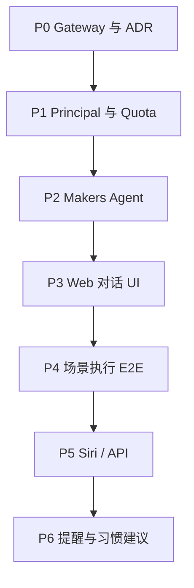

PoC 到 P4 即形成可用闭环；P5 不阻塞网页测试。

## 14. 验收标准

1. 登录用户可以从页面 AI 图标开始连续对话。
2. 未登录用户不能调用 Agent 或查询额度。
3. 模型请求全部通过 Makers AI Gateway；源码不存在用户模型 Key 配置流程。
4. 默认用户在 KV 计数传播后达到额度时，在调用 Agent 前收到稳定 `AI_QUOTA_EXCEEDED`；文档和 UI 不宣称精确硬限额。
5. `AI_QUOTA_UNLIMITED_IDS` 中的 principal 不被应用额度阻止，但仍产生 usage 指标。
6. 客户端伪造 principal、homeId 或 conversationId 不能越权。
7. 用户 A 的会话、配额、家庭和 Agent Store 不能被用户 B 访问。
8. 助手优先匹配现有审核场景，且只通过白名单 Tool 执行。
9. 同一幂等键不会重复执行场景。
10. Gateway、Agent、QuotaStore 和 Mi Cloud 故障具有不同错误码。
11. Vercel Preview 不会误控制生产家庭。
12. 文档和 TODO 足以让后续 Agent 从 Phase 0 开始实施。

## 15. ADR

| ADR | 决策 | 状态 |
|---|---|---|
| ADR-018 | 模型统一使用 Makers AI Gateway | 已确认 |
| ADR-019 | WebApp 按服务端派生 principal 实施用户配额 | 已确认 |
| ADR-020 | env 保存配额策略，QuotaStore 保存用量 | 已确认 |
| ADR-021 | 指定 principal 可通过 env 绕过应用额度 | 已确认 |
| ADR-022 | PoC 优先提供 Web 内 AI 助手 | 已确认 |
| ADR-023 | Siri/API 复用同一 Agent Service 和配额 | 已确认 |
| ADR-024 | Agent Store 仅保存会话状态，不承担配额账本 | 已确认 |
| ADR-025 | 长期习惯默认只产生建议，不自动执行 | 已确认 |
| ADR-026 | PoC 配额账本使用 EdgeOne KV | 已确认 |
| ADR-027 | 接受 KV 最终一致性带来的软配额窗口 | 已确认 |

## 16. 尚待实现时验证

1. Makers 项目中可用模型的准确 `model` 名称和中国大陆可用性。
2. 在真实 EdgeOne 多节点部署中测量 KV 传播时间和并发超用窗口，据此下调默认额度安全余量。
3. Agent 定时任务的创建、取消、重试和通知触发 API 细节。
4. Web 对话是否首期启用流式返回；建议先非流式打通执行，再增加 SSE。
5. 用户级月 Token 用量能否从 Gateway 响应稳定获得；缺失时使用服务端 tokenizer 估算并保守结算。
