# AI Home PoC 详细设计文档

> 项目：`mijia-web-console` 语音与 LLM 场景控制 PoC  
> 状态：Draft v0.5  
> 日期：2026-09-16  
> 首个用例：用户通过 iPhone/Siri 表达“我回家了”，系统理解意图并触发“回家模式”

## 1. 文档目标

本文定义在现有 `mijia-web-console` 上增加 AI 控制层的第一阶段设计。PoC 只验证一条完整链路：

```text
Siri / iPhone 快捷指令
  → HTTPS AI Command API
  → 快速 LLM 进行受限意图判断
  → activate_scene 工具调用
  → Scene Service
  → 现有 Mi Cloud / MIoT 控制层
  → 米家设备
```

本阶段不接入 Home Assistant，但所有核心接口必须允许后续把执行后端从 Mi Cloud 切换或扩展为 Home Assistant，且不改变 Siri 入口和 AI 工具协议。

## 2. 已确认的设计原则

1. **LLM 只负责理解与选择工具，不直接控制设备。** LLM 不接触 Mi Cloud token、设备 DID、`siid/piid/aiid` 或任意云端 HTTP 接口。
2. **执行能力必须白名单化。** PoC 只向模型暴露 `activate_scene`；场景从服务端已审核目录加载，首个允许场景为 `home`。
3. **现阶段以 Mi Cloud 为执行后端。** 不引入 HA 运行时，不改写现有设备同步、拓扑和 MIoT 控制能力。
4. **未来 HA 是适配器，不是上层产品。** AI API、场景定义和前端保持不变，只新增 `HomeAssistantSceneExecutor`。
5. **Siri 只负责语音入口。** 第一版由快捷指令发送固定文本；第二版使用“听写文本”接收任意表达。
6. **快速模型优先。** 默认使用 Qwen Flash 系列非思考模式；模型提供方必须可配置、可替换、可超时降级。
7. **未知关系不自动执行。** 现有设备拓扑中的推断关系不能作为高置信度控制依据；场景动作必须引用已确认的执行目标。
8. **请求必须可审计、可幂等。** 同一 Siri 请求重试不能反复开关设备；每次模型判断和设备执行应能关联到同一个 `requestId`。
9. **现有场景优先。** 场景技能优先匹配并调用米家中已经存在且经过审核的场景；只有无法匹配时，才考虑由项目编排 MIoT 动作。
10. **中国大陆优先。** 接入的模型、存储、队列和后续外部服务均优先选择中国大陆地域，减少跨境链路和数据路径复杂度。
11. **模型凭据归登录用户所有。** 每个通过小米二维码登录的用户配置并使用自己的 LLM API Token；服务端不得以共享 `LLM_API_KEY` 作为多用户调用凭据，也不得把某个用户的 Token 用于其他用户。
12. **无数据库、自包含凭据。** 登录用户在独立配置页提交原始 LLM Key；服务端验证后把米家 Binding 与模型凭据密封为自包含 Automation Token，不持久化原始 Key 或密文。
13. **Automation Token 是 Bearer 凭据。** Token 仅允许出现在 HTTPS `Authorization` 请求头和用户主动保存的快捷指令中；不得进入 URL、日志、模型上下文、错误消息、Local Storage 或客户端可读 Cookie。

## 3. 范围

### 3.1 PoC 范围内

- `POST /api/ai/command`
- Siri 快捷指令调用方式
- Qwen Flash 类模型的 OpenAI 兼容接口接入
- 登录后生成包含个人 Provider、模型和 API Key 的自包含加密 Automation Token
- 受限 Function Calling / Tool Calling
- `activate_scene`（动态匹配家庭已配置的手动场景并由 LLM 生成自然回复）
- 场景动态识别、校验和安全执行
- 基础多轮连续对话能力（通过无状态加密上下文传承会话）
- 请求鉴权、限流、幂等、日志和基础指标
- 模型超时或失败时，对明确语句进行确定性回退
- 为 HA 预留执行器接口

### 3.2 PoC 范围外

- 自建 STT、唤醒词、VAD、TTS
- 跨会话长期记忆与个性化偏好存储（通过未来数据库/向量库演进）
- 任意底层单设备精细控制、设备搜索、状态查询
- 摄像头视频、门锁、门禁、燃气等高风险设备
- 自动地理围栏触发
- Home Assistant 部署与 Integration 配置
- 让模型自由生成 MIoT 属性或任意网络请求
- 自动发现并执行未审核的米家场景

### 3.3 范围总览

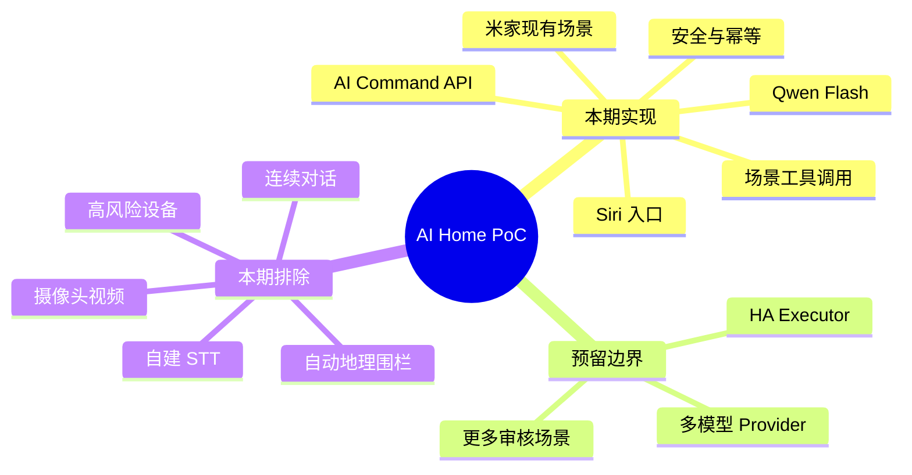
```mermaid
mindmap
  root((AI Home PoC))
    本期实现
      Siri 入口
      AI Command API
      Qwen Flash
      场景工具调用
      米家现有场景
      安全与幂等
    预留边界
      HA Executor
      多模型 Provider
      更多审核场景
    本期排除
      自建 STT
      连续对话
      摄像头视频
      高风险设备
      自动地理围栏
```

## 4. 总体架构

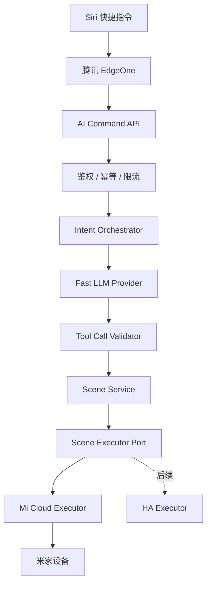
```mermaid
flowchart TD
    A["Siri 快捷指令"] --> B["腾讯 EdgeOne"]
    B --> C["AI Command API"]
    C --> D["鉴权 / 幂等 / 限流"]
    D --> E["Intent Orchestrator"]
    E --> F["Fast LLM Provider"]
    F --> G["Tool Call Validator"]
    G --> H["Scene Service"]
    H --> I["Scene Executor Port"]
    I --> J["Mi Cloud Executor"]
    J --> K["米家设备"]
    I -. 后续 .-> L["HA Executor"]
```

### 4.1 模块职责

| 模块 | 职责 | 明确不负责 |
|---|---|---|
| Siri Shortcut | 触发、听写、发送请求、朗读结果 | 理解设备、保存云端凭据 |
| 腾讯 EdgeOne | 中国大陆入口、HTTPS、WAF、基础限流和回源 | 理解意图、保存家庭设备凭据 |
| AI Command API | 输入校验、鉴权、幂等、响应协议 | 直接操作 MIoT |
| Intent Orchestrator | 构造上下文、调用模型、处理工具调用与回退 | 保存 token |
| LLM Provider | 屏蔽 Qwen/OpenAI 等供应商差异 | 执行工具 |
| Tool Call Validator | 对工具名、参数、允许场景进行强校验 | 相信模型输出 |
| Scene Service | 加载场景、做策略判断、组织执行、生成结果 | 理解自然语言 |
| Scene Executor | 执行抽象场景动作 | 决定用户意图 |
| Mi Cloud Adapter | 把抽象动作映射为现有 MIoT/Mi Cloud 调用 | 向模型泄露底层信息 |

## 5. 关键调用时序

### 5.1 入口与意图判断

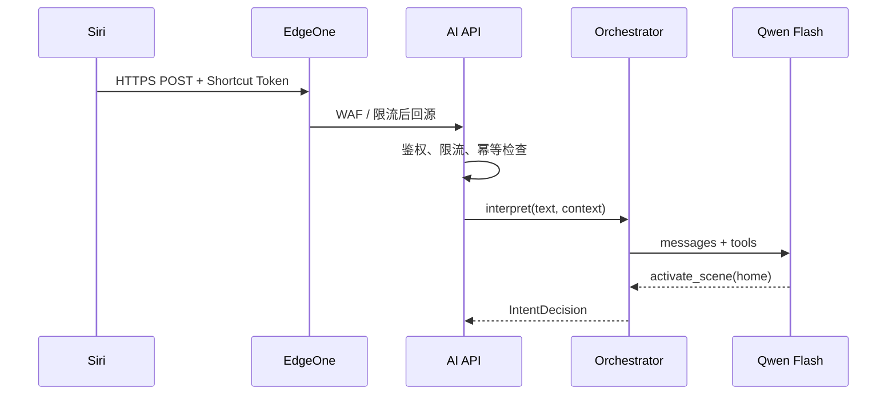
```mermaid
sequenceDiagram
    participant S as Siri
    participant E as EdgeOne
    participant A as AI API
    participant O as Orchestrator
    participant L as Qwen Flash

    S->>E: HTTPS POST + Shortcut Token
    E->>A: WAF / 限流后回源
    A->>A: 鉴权、限流、幂等检查
    A->>O: interpret(text, context)
    O->>L: messages + tools
    L-->>O: activate_scene(home)
    O-->>A: IntentDecision
```

### 5.2 校验与场景执行

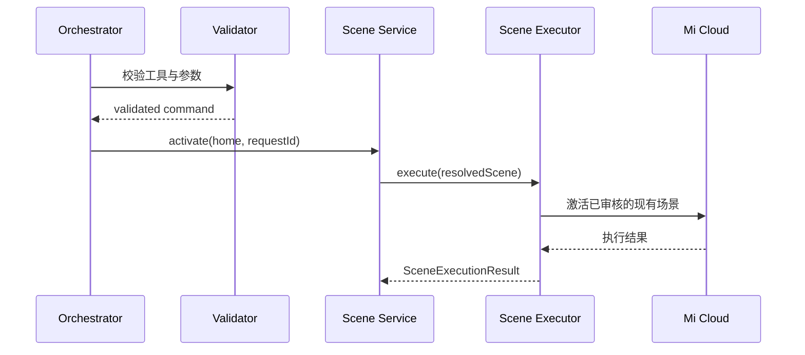
```mermaid
sequenceDiagram
    participant O as Orchestrator
    participant V as Validator
    participant C as Scene Service
    participant X as Scene Executor
    participant M as Mi Cloud

    O->>V: 校验工具与参数
    V-->>O: validated command
    O->>C: activate(home, requestId)
    C->>X: execute(resolvedScene)
    X->>M: 激活已审核的现有场景
    M-->>X: 执行结果
    X-->>C: SceneExecutionResult
```

### 5.3 延迟预算

| 阶段 | 目标 P95 | 超时上限 |
|---|---:|---:|
| API 鉴权与校验 | 100 ms | 500 ms |
| LLM 判断 | 1,500 ms | 3,000 ms |
| 场景执行 | 3,000 ms | 8,000 ms |
| 总请求 | 5,000 ms | 10,000 ms |

当前公网入口使用腾讯 EdgeOne，业务服务部署在中国大陆服务器。模型请求和 Mi Cloud 请求仍必须使用不同的连接池、超时、错误码与指标，不能把所有失败统一报告为“AI 失败”。EdgeOne 回源超时应高于业务服务的总超时，并由业务服务先返回可识别的应用错误；PoC 保持同步闭环。

## 6. API 设计

### 6.1 `POST /api/ai/command`

请求头：

```http
Authorization: Bearer <shortcut-token>
Content-Type: application/json
Idempotency-Key: <UUID generated by Shortcut>
```

请求体：

```json
{
  "text": "那离家呢？",
  "home": "我的家",
  "conversationId": "conv_8fbeb170b03a45bdaff23fe5ee9896c1",
  "sessionContext": "vKeBfxmy0td2...<上一轮返回的不透明加密上下文令牌>",
  "client": {
    "type": "siri_shortcut",
    "version": "1.0"
  },
  "locale": "zh-CN",
  "timezone": "Asia/Shanghai"
}
```

约束：

- `text`：必填，去除首尾空白后 1–200 字符。
- `home`：可选，指定目标家庭 ID 或家庭名称（例如 `"我的家"`、`"父母家"`）。优先级：请求体显式指定 > Token 绑定家庭 > 自动探测有场景的家庭。未来演进支持根据客户端地理经纬度（Geofence）或 Wi-Fi SSID 自动推断当前归属家庭。
- `conversationId`：可选，1–128 字符。用于关联多轮会话 Trace；缺省时服务端自动生成返回。
- `sessionContext`：可选，上一轮响应返回的不透明加密上下文令牌（AES-GCM，默认保留最近 5 轮问答，由 `AI_CONVERSATION_MAX_TURNS` 环境变量配置，有效期 10 分钟）。快捷指令或客户端下次请求带回此令牌即可实现无状态上下文继承。
- `history`：可选，显式历史消息数组 `[{ role: "user" | "assistant", content: string }]`（最多保留 `AI_CONVERSATION_MAX_TURNS * 2` 条）。适用于直接 API 集成或调试。
- `locale`：PoC 只允许 `zh-CN`，缺省为 `zh-CN`。
- `timezone`：由服务端白名单校验；不能用于任意模板或命令拼接。
- `Idempotency-Key`：条件必填，建议 UUID（16~128 字符）。纯闲聊/查询等未触发任何工具调用（`intent: "none"`）的请求不需要验证该标头；只有当触发 `activate_scene` 等具有物理设备副作用的场景工具调用时，才强制校验并执行 10 分钟幂等锁定与重放。
- 请求体不得包含 Mi Cloud token、DID 或模型 API Key。

成功响应：

```json
{
  "requestId": "req_8fbeb170b03a45bdaff23fe5ee9896c1",
  "conversationId": "conv_9a1b2c3d4e5f60718293a4b5c6d7e8f9",
  "sessionContext": "iv.ciphertext",
  "conversationReset": false,
  "turnIndex": 2,
  "status": "completed",
  "intent": "activate_scene",
  "sceneId": "2091417579243446272",
  "sceneName": "离家模式",
  "message": "好的，已开启离家模式，路上注意安全。",
  "execution": {
    "status": "success",
    "succeeded": 1,
    "failed": 0
  },
  "decisionSource": "llm",
  "llmOutput": "call activate_scene(scene: \"离家模式\")"
}
```

未匹配场景（作为成功交互返回，用于自然对话承接）：

```json
{
  "requestId": "req_8fbeb170b03a45bdaff23fe5ee9896c1",
  "conversationId": "conv_9a1b2c3d4e5f60718293a4b5c6d7e8f9",
  "sessionContext": "iv.ciphertext",
  "status": "completed",
  "intent": "none",
  "message": "目前支持开启回家模式和离家模式，请问您想执行哪一个呢？",
  "decisionSource": "llm",
  "llmOutput": "目前支持开启回家模式和离家模式，请问您想执行哪一个呢？"
}
```

部分成功：

```json
{
  "requestId": "req_01J...",
  "status": "partial_success",
  "intent": "activate_scene",
  "sceneId": "home",
  "message": "回家模式已部分执行，客厅空调暂时无法连接。",
  "execution": {
    "status": "partial_success",
    "succeeded": 2,
    "failed": 1
  }
}
```

### 6.2 HTTP 与业务错误码

| HTTP | code | 场景 | Siri 提示 |
|---:|---|---|---|
| 400 | `INVALID_REQUEST` | 文本为空或格式错误 | 请求格式有误 |
| 401 | `AUTOMATION_TOKEN_INVALID` | Token 解密、用途、环境或身份校验失败 | 自动化凭据无效，请重新生成 |
| 401 | `AUTOMATION_TOKEN_EXPIRED` | Token 已过期 | 自动化凭据已过期，请重新生成 |
| 409 | `IDEMPOTENCY_CONFLICT` | 同一 key 对应不同请求体 | 请求重复且内容不一致 |
| 422 | `UNSUPPORTED_INTENT` | 模型未选择允许工具 | 目前还不支持这个操作 |
| 429 | `RATE_LIMITED` | 调用过频 | 操作太频繁，请稍后重试 |
| 422 | `LLM_CREDENTIAL_INVALID` | Token 可解密但 Provider 拒绝其中的用户 Key | 模型 API Token 已失效，请重新生成 |
| 502 | `LLM_PROVIDER_ERROR` | 模型服务失败且不可回退 | AI 服务暂时不可用 |
| 502 | `MI_CLOUD_ERROR` | 米家云调用失败 | 米家服务暂时不可用 |
| 504 | `LLM_TIMEOUT` | 模型超时 | AI 响应超时 |
| 504 | `DEVICE_TIMEOUT` | 设备执行超时 | 设备响应超时 |

日志中保留内部明细，Siri 响应不返回异常堆栈、设备 ID、云端响应体或凭据。

### 6.3 请求结果分流

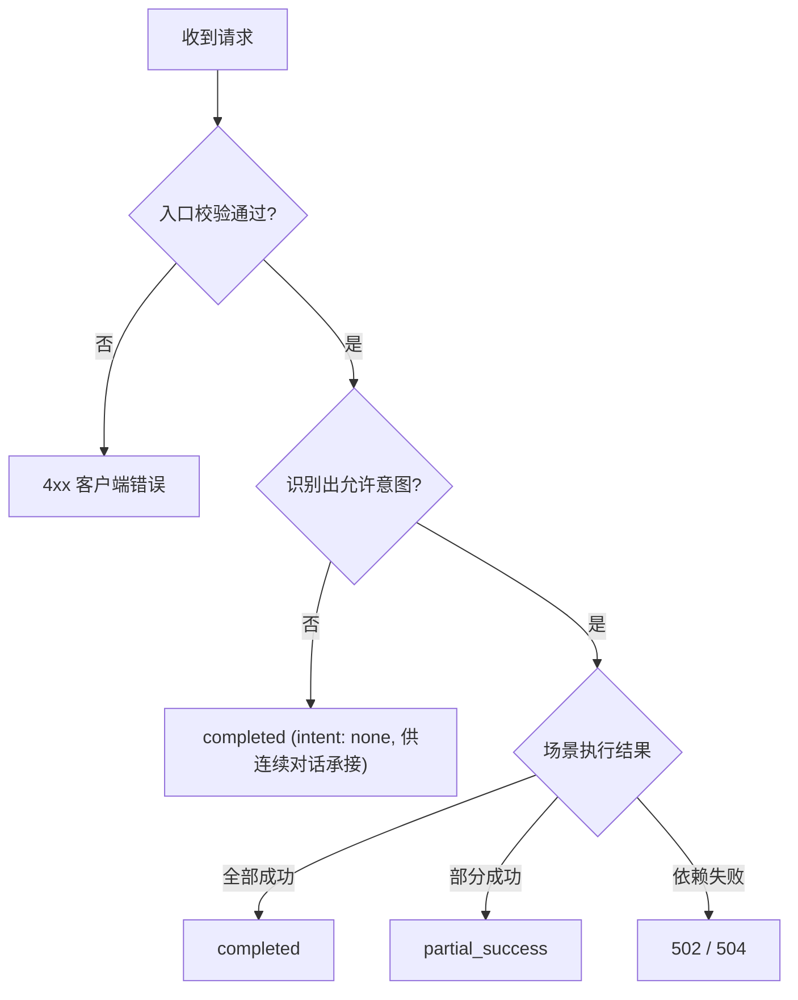
```mermaid
flowchart TD
    A["收到请求"] --> B{"入口校验通过?"}
    B -- 否 --> C["4xx 客户端错误"]
    B -- 是 --> D{"识别出允许意图?"}
    D -- 否 --> E["completed (intent: none, 供连续对话承接)"]
    D -- 是 --> F{"场景执行结果"}
    F -- 全部成功 --> G["completed"]
    F -- 部分成功 --> H["partial_success"]
    F -- 依赖失败 --> I["502 / 504"]
```

### 6.4 Automation Token 配置与签发 API（目标设计，尚未实现）

项目不依赖数据库、KV 或 Redis 保存用户模型凭据。配置页只负责一次性接收用户输入、验证凭据并签发 Automation Token，不提供“读取已保存配置”的语义。

| 方法与路径 | 鉴权 | 用途 | 持久化 |
|---|---|---|---|
| `POST /api/ai/automation-token` | 有效 `xiaomi_session` | 验证用户自己的 LLM Key，并生成自包含 Token | 服务端不保存 |
| `POST /api/ai/command` | Automation Token | 解密米家身份与 LLM 凭据，执行 AI 指令 | 服务端不保存 |

签发请求：

```json
{
  "provider": "qwen-cn",
  "apiKey": "<user-owned-token>",
  "model": "qwen3.7-flash-2026-07-15",
  "homeId": "123456",
  "expiresInDays": 30
}
```

签发响应：

```json
{
  "token": "v1.key-2026-01.<iv>.<ciphertext>.<auth-tag>",
  "provider": "qwen-cn",
  "model": "qwen3.7-flash-2026-07-15",
  "homeId": "123456",
  "expiresAt": "2026-10-16T00:00:00.000Z"
}
```

服务端必须忽略或拒绝客户端提交的 `baseUrl`，并从 Provider Catalog 选择中国大陆 endpoint。原始 API Key 只存在于签发请求和本次服务端内存中；签发完成后，浏览器只获得不可读的 Automation Token。配置页不得把原始 Key 或 Automation Token 写入 Local Storage。

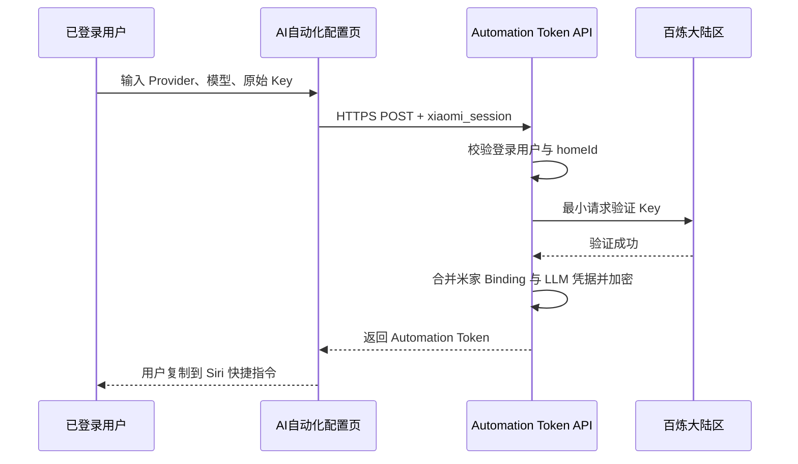
```mermaid
sequenceDiagram
    participant U as 已登录用户
    participant P as AI自动化配置页
    participant A as Automation Token API
    participant Q as 百炼大陆区

    U->>P: 输入 Provider、模型、原始 Key
    P->>A: HTTPS POST + xiaomi_session
    A->>A: 校验登录用户与 homeId
    A->>Q: 最小请求验证 Key
    Q-->>A: 验证成功
    A->>A: 合并米家 Binding 与 LLM 凭据并加密
    A-->>P: 返回 Automation Token
    P-->>U: 用户复制到 Siri 快捷指令
```

Token 密文中的载荷：

```ts
type AutomationTokenPayload = {
  version: 1;
  purpose: "ai-home-automation";
  principalId: string;
  xiaomiSession: XiaomiSession;
  region: "cn";
  homeId?: string;
  provider: "qwen-cn";
  model: string;
  apiKey: string;
  issuedAt: number;
  expiresAt: number;
};
```

默认有效期 30 天，服务端允许范围为 1–90 天。Token 必须使用独立密钥执行 AES-256-GCM 密封，使用随机 96-bit IV，并把应用名、环境、用途和版本加入 AAD。生产、Preview 和开发环境使用不同密钥；EdgeOne 与同一生产域的多个源站实例才共享生产密钥。

由于没有服务端状态，Automation Token 无法被单独吊销。泄露处置只能依赖到期、用户轮换原始 LLM Key，或轮换 `AI_AUTOMATION_TOKEN_SECRET` 使该环境全部 Token 失效。

## 7. LLM 层设计

### 7.1 实现状态审计

当前仓库已完整实现“每个登录用户使用自己的 API Token”与自包含 Automation Token 隔离架构：

| 检查点 | 实现状态 | 说明 |
|---|---|---|
| Provider 类型 | `ProviderCatalog` + `QwenOpenAiCompatibleProvider` | 服务端 Catalog 维护大陆 endpoint 与模型白名单 |
| Provider 配置来源 | `lib/ai/security/automation-token.ts` 请求级载荷 | 从加密 Token 中解密出请求级凭据，无共享 Key fallback |
| API Token | 用户私有 API Key | 每个登录用户配置并密封进自己的 Automation Token，完全隔离 |
| 命令路由 | `/api/ai/command` | 解密 Token 并构造请求级 `ResolvedProviderCredential` 传给 Provider |
| Siri 绑定 Token | `v1.<keyId>.<iv>.<ciphertext>.<tag>` | 封装米家 session、homeId、provider、model、apiKey，有效期 1-90 天 |
| Provider endpoint | `PROVIDER_CATALOG` 决定 | 固定中国大陆百炼 endpoint，拒绝请求体自定义 baseUrl |
| 模型 | 服务端允许列表 | 支持 `qwen3.7-flash-2026-07-15`, `qwen3.8-flash` 等审核模型 |

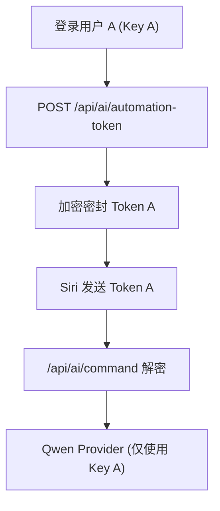
```mermaid
flowchart TD
    A["登录用户 A (Key A)"] --> B["POST /api/ai/automation-token"]
    B --> C["加密密封 Token A"]
    C --> D["Siri 发送 Token A"]
    D --> E["/api/ai/command 解密"]
    E --> F["Qwen Provider (仅使用 Key A)"]
```

### 7.2 Provider 与请求级凭据抽象

```ts
interface LlmProvider {
  decide(
    input: IntentDecisionInput,
    credential: ResolvedProviderCredential
  ): Promise<IntentDecision>;
}

interface AutomationTokenCodec {
  seal(payload: AutomationTokenPayload): Promise<string>;
  open(token: string): Promise<AutomationTokenPayload>;
}

type ResolvedProviderCredential = {
  provider: "qwen-cn";
  apiToken: string;  // 仅存在于本次服务端请求内存
  baseUrl: string;   // 来自服务端 Provider Catalog
  model: string;
};
```

首个实现仍为 `QwenOpenAiCompatibleProvider`，但 Provider 不再从全局环境变量取得业务 API Token。Command API 从 `Authorization: Bearer <automation-token>` 解密并校验载荷，再将其中的用户 API Key 转为请求级 `ResolvedProviderCredential`。Provider Catalog 决定大陆 endpoint 和模型白名单，Token 中的 `baseUrl` 即使存在也不得使用。

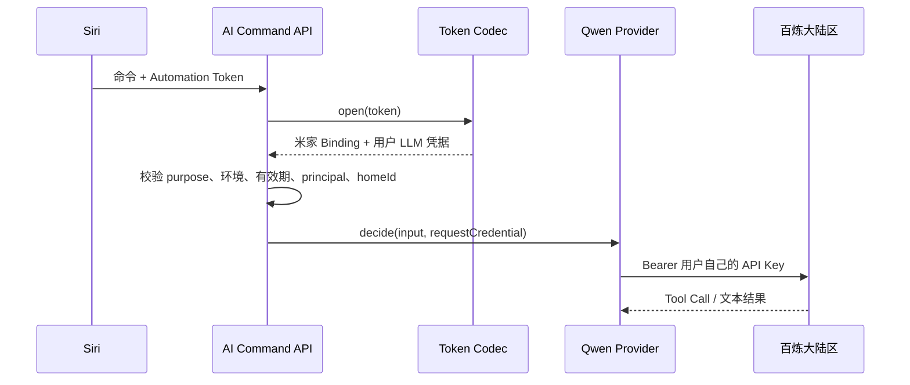
```mermaid
sequenceDiagram
    participant S as Siri
    participant A as AI Command API
    participant C as Token Codec
    participant P as Qwen Provider
    participant Q as 百炼大陆区

    S->>A: 命令 + Automation Token
    A->>C: open(token)
    C-->>A: 米家 Binding + 用户 LLM 凭据
    A->>A: 校验 purpose、环境、有效期、principal、homeId
    A->>P: decide(input, requestCredential)
    P->>Q: Bearer 用户自己的 API Key
    Q-->>P: Tool Call / 文本结果
```

Automation Token 中的模型 Key 只允许在调用 Provider 前短暂解密到请求内存，不得缓存、持久化、输出到日志或附加到异常对象。

### 7.3 模型选择策略

目标架构中的部署级配置只定义平台策略、默认值和凭据加密，不包含任何用户的模型 API Token：

```env
LLM_ALLOWED_PROVIDERS=qwen-cn
LLM_DEFAULT_PROVIDER=qwen-cn
LLM_DEFAULT_MODEL=qwen3.7-flash-2026-07-15
LLM_TIMEOUT_MS=3000
LLM_MAX_OUTPUT_TOKENS=128
LLM_ENABLE_THINKING=false
AI_AUTOMATION_TOKEN_SECRET=<32-byte-or-longer-random-secret>
AI_AUTOMATION_TOKEN_KEY_ID=key-2026-01
AI_AUTOMATION_TOKEN_DEFAULT_DAYS=30
AI_AUTOMATION_TOKEN_MAX_DAYS=90
AI_CONVERSATION_MAX_TURNS=5
```

明确禁止配置共享 `LLM_API_KEY` 作为正常或 fallback 调用凭据。所有模型调用优先使用阿里云百炼中国大陆地域。选择固定版本而不是浮动 alias，便于回归测试与避免行为漂移。若大陆地域未提供该固定版本，可把系统默认模型替换为大陆地域当前可用的 Flash 型号，例如 `qwen3.8-flash`；不得自动切换到境外 endpoint。

用户配置不形成服务端记录：Provider、模型、个人 API Key、米家 Binding 和有效期一起进入加密 Automation Token。`baseUrl` 仍由服务端 Provider Catalog 固定为百炼中国大陆 endpoint；客户端不得提交任意 URL，防止 SSRF、凭据外送和地域策略绕过。

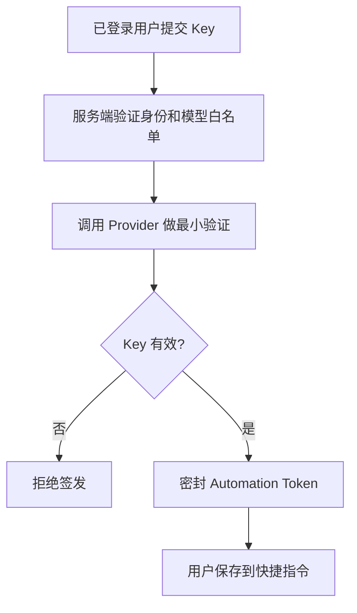
```mermaid
flowchart TD
    A["已登录用户提交 Key"] --> B["服务端验证身份和模型白名单"]
    B --> C["调用 Provider 做最小验证"]
    C --> D{"Key 有效?"}
    D -- 否 --> E["拒绝签发"]
    D -- 是 --> F["密封 Automation Token"]
    F --> G["用户保存到快捷指令"]
```

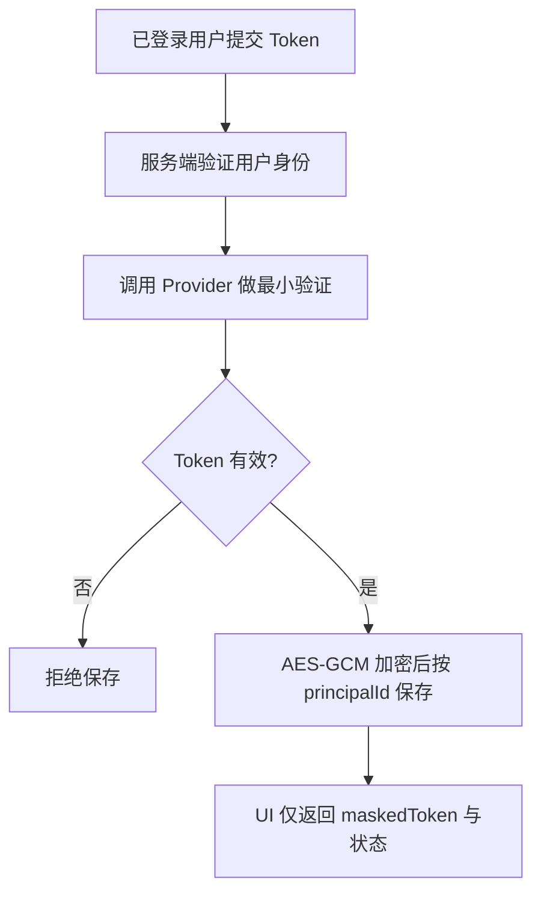
```mermaid
flowchart TD
    A["已登录用户提交 Token"] --> B["服务端验证用户身份"]
    B --> C["调用 Provider 做最小验证"]
    C --> D{"Token 有效?"}
    D -- 否 --> E["拒绝保存"]
    D -- 是 --> F["AES-GCM 加密后按 principalId 保存"]
    F --> G["UI 仅返回 maskedToken 与状态"]
```

模型选择优先级：

1. 工具调用准确率。
2. P95 延迟。
3. 中文口语和 ASR 错别字容忍度。
4. 可用性与地域网络稳定性。
5. 成本。

PoC 不需要大上下文或深度推理；应关闭思考模式，并保持工具、场景和 prompt 极小。

### 7.4 Tool Schema

```json
{
  "type": "function",
  "function": {
    "name": "activate_scene",
    "description": "当用户明确表示已经回到家或要求开启回家模式时，激活一个已配置的家庭场景。",
    "parameters": {
      "type": "object",
      "additionalProperties": false,
      "properties": {
        "sceneId": {
          "type": "string",
          "enum": ["home"],
          "description": "场景唯一标识。home 表示回家模式。"
        }
      },
      "required": ["sceneId"]
    }
  }
}
```

即使模型返回了合法 JSON，也必须在服务端再次执行：

- 工具名 allowlist 校验；
- JSON Schema 校验；
- 场景 allowlist 校验；
- 当前用户是否有该场景权限；
- 场景是否启用；
- 幂等检查；
- 风险策略检查。

### 7.5 System Prompt

```text
你是家庭控制意图路由器，只能决定是否调用提供的工具。

规则：
1. 仅当用户明确表示已经到家、刚进家门、回来了，或明确要求开启“回家模式”时，调用 activate_scene，sceneId=home。
2. 计划、假设、否定、询问和转述不执行。例如：“我还没回家”“如果我回家”“回家模式是什么”“他说他回家了”。
3. 指令含糊或不在能力范围内时，不调用任何工具。
4. 不推测设备，不生成设备 ID，不解释内部实现。
5. 每个请求最多调用一次工具。
```

模型决策与服务端策略是两道独立关卡：

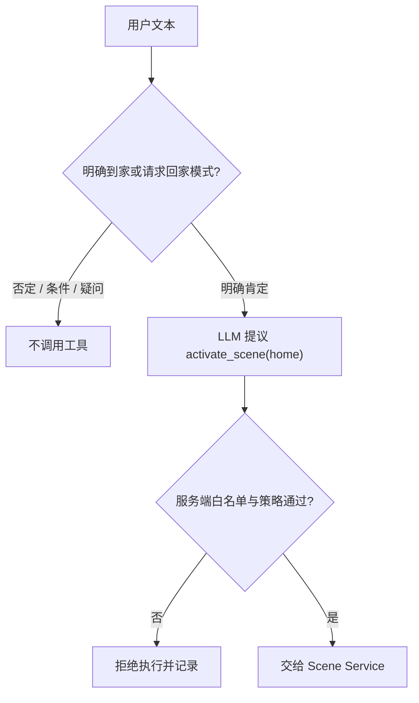
```mermaid
flowchart TD
    A["用户文本"] --> B{"明确到家或请求回家模式?"}
    B -- 否定 / 条件 / 疑问 --> C["不调用工具"]
    B -- 明确肯定 --> D["LLM 提议 activate_scene(home)"]
    D --> E{"服务端白名单与策略通过?"}
    E -- 否 --> F["拒绝执行并记录"]
    E -- 是 --> G["交给 Scene Service"]
```

输入中只提供完成当前判断所需的最少上下文。场景目录来自已同步并审核的现有米家场景，而不是由模型自行发明：

```json
{
  "availableScenes": [
    {
      "id": "home",
      "name": "回家模式",
      "aliases": ["回家", "到家", "我回来了", "刚进门"],
      "description": "用户已经回到家后激活",
      "source": "mi_home_existing_scene",
      "enabledForAi": true
    }
  ]
}
```

不得把完整设备清单、家庭 ID、房间拓扑、米家场景原始 ID 或 Mi Cloud 原始响应发送给模型。模型只看到应用内部的稳定场景 ID、名称、别名和用途。

### 7.6 确定性回退

LLM 超时或供应商故障时，仅对以下高置信度固定表达回退：

```text
我回家了
我到家了
我回来了
开启回家模式
打开回家模式
```

回退规则必须满足：

- 完整归一化文本匹配，而不是子串匹配；
- 含否定词、疑问词、条件词时禁止执行；
- 回退事件写入 `decisionSource=deterministic_fallback`；
- 不为其他场景扩展模糊正则。

正常情况下仍让这些表达经过 LLM，以验证 PoC 的核心链路；回退只用于可用性保障。

## 8. 场景模型与执行设计

### 8.1 场景定义

场景技能优先复用已经存在的米家场景。应用维护一个经过审核的 AI 场景目录，把稳定的内部 ID 映射到米家真实场景；米家场景 ID 仅保存在服务端：

```yaml
id: home
version: 1
name: 回家模式
enabled: true
riskLevel: low
aliases:
  - 我回家了
  - 我到家了
  - 我回来了
source: mi_home_existing_scene
executor: mi_cloud
externalSceneRef: secret-ref:mihome-scene-home
```

#### 8.1.1 现有场景接入流程

采用“自动同步候选、首次人工确认、之后固定 ID”的方式。同步只产生候选，不会自动开放给 AI：

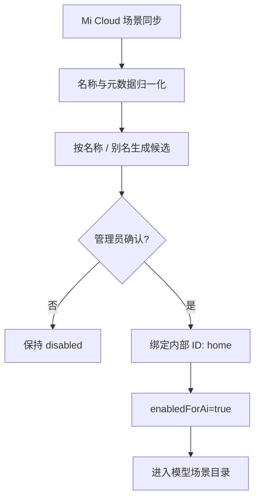
```mermaid
flowchart TD
    A["Mi Cloud 场景同步"] --> B["名称与元数据归一化"]
    B --> C["按名称 / 别名生成候选"]
    C --> D{"管理员确认?"}
    D -- 否 --> E["保持 disabled"]
    D -- 是 --> F["绑定内部 ID: home"]
    F --> G["enabledForAi=true"]
    G --> H["进入模型场景目录"]
```

后续同步发现米家 Scene ID、名称或关键元数据发生变化时，映射进入 `needs_review`，暂停 AI 执行，直到重新确认。

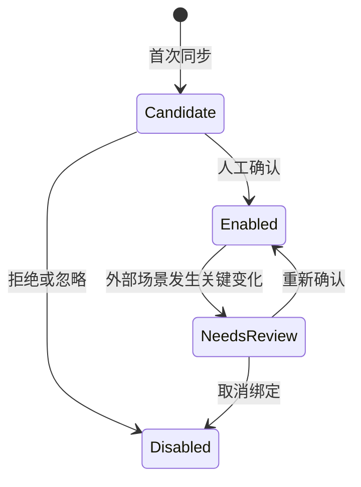
```mermaid
stateDiagram-v2
    [*] --> Candidate: 首次同步
    Candidate --> Enabled: 人工确认
    Candidate --> Disabled: 拒绝或忽略
    Enabled --> NeedsReview: 外部场景发生关键变化
    NeedsReview --> Enabled: 重新确认
    NeedsReview --> Disabled: 取消绑定
```

#### 8.1.2 运行时解析顺序

场景解析顺序固定为：

1. 在已同步、已审核且 `enabledForAi=true` 的米家现有场景中匹配。
2. 找到唯一匹配后，转换为内部稳定场景 ID，例如 `home`。
3. 由模型选择内部 ID；服务端校验后，通过保密映射找到真实米家场景。
4. 未找到、找到多个候选或场景尚未审核时，不执行并返回可解释结果。
5. 只有明确配置了项目编排场景时，才允许回退到逐个 MIoT 动作；不能由 LLM 临时生成动作列表。

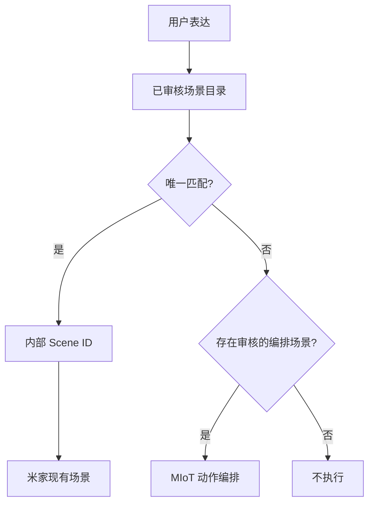
```mermaid
flowchart TD
    A["用户表达"] --> B["已审核场景目录"]
    B --> C{"唯一匹配?"}
    C -- 是 --> D["内部 Scene ID"]
    D --> E["米家现有场景"]
    C -- 否 --> F{"存在审核的编排场景?"}
    F -- 是 --> G["MIoT 动作编排"]
    F -- 否 --> H["不执行"]
```

`externalSceneRef` 不能传给模型、Siri 或浏览器，也不能直接写入普通日志。若以后使用项目编排场景，其中的 `targetRef` 同样必须人工确认，不能引用“可能是主灯”的推断拓扑。

### 8.2 执行接口

```ts
interface SceneExecutor {
  readonly kind: "mi_cloud" | "home_assistant";
  execute(
    scene: ResolvedScene,
    context: ExecutionContext
  ): Promise<SceneExecutionResult>;
}

interface SceneService {
  activate(
    sceneId: SceneId,
    context: ExecutionContext
  ): Promise<SceneExecutionResult>;
}
```

后续 HA 接入时：

```ts
class HomeAssistantSceneExecutor implements SceneExecutor {
  kind = "home_assistant" as const;
  // 可把内部 sceneId 映射到 scene.turn_on 或 script.turn_on
}
```

上层 `activate_scene("home")` 保持不变。

### 8.3 执行策略

调用米家已有场景时，执行策略为一次幂等的“激活场景”请求，并保存米家返回结果。若以后启用项目编排场景，则采用 `best_effort`：

- 独立设备动作可并行执行，但限制并发数，例如 3。
- 单个非必需动作失败，不回滚已成功动作。
- 必需动作失败时整体状态为 `partial_success` 或 `failed`。
- 每个动作最多重试 1 次，只重试网络超时、连接重置和明确的临时错误。
- 不重试鉴权失败、参数错误和设备不支持。
- 动作必须尽量具有幂等语义，例如“设置为 ON”，而不是“切换状态”。

### 8.4 幂等设计

幂等记录：

```ts
type IdempotencyRecord = {
  key: string;
  requestHash: string;
  status: "processing" | "completed" | "failed";
  response?: AiCommandResponse;
  expiresAt: string;
};
```

- 相同 key + 相同 body：处理中返回 `202 processing`，完成后返回已保存结果。
- 相同 key + 不同 body：返回 `409 IDEMPOTENCY_CONFLICT`。
- 无持久化数据库时，PoC 可使用部署在中国大陆地域的 KV/Redis；内存缓存不适合多实例或多进程部署。
- Siri 重试、移动网络切换和用户重复点击都不能造成 toggle 型副作用。

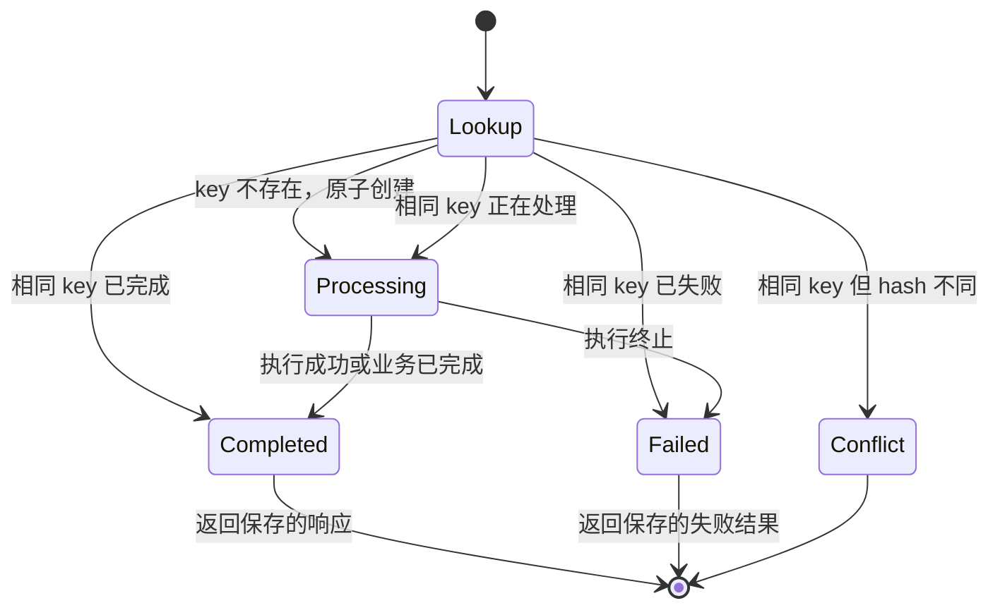
```mermaid
stateDiagram-v2
    [*] --> Lookup
    Lookup --> Processing: key 不存在，原子创建
    Lookup --> Processing: 相同 key 正在处理
    Lookup --> Completed: 相同 key 已完成
    Lookup --> Failed: 相同 key 已失败
    Lookup --> Conflict: 相同 key 但 hash 不同
    Processing --> Completed: 执行成功或业务已完成
    Processing --> Failed: 执行终止
    Completed --> [*]: 返回保存的响应
    Failed --> [*]: 返回保存的失败结果
    Conflict --> [*]
```

## 9. 鉴权与安全

### 9.1 用户身份与 Automation Token 鉴权

浏览器端使用现有 `xiaomi_session` 识别登录用户。只有登录用户可以调用签发接口；Siri 后续使用签发出的 Automation Token。

```text
principalId = SHA-256("xiaomi:" + region + ":" + userId)
```

签发时，服务端必须确认 Token 载荷中的 `principalId`、米家 Session 与 `homeId` 均属于当前登录用户。Command API 每次请求重新验证以下内容：

1. AES-GCM 认证标签有效；
2. `purpose = ai-home-automation`；
3. Token 环境与当前部署一致；
4. `issuedAt/expiresAt` 合法且未过期；
5. 解密后的米家身份与 `principalId` 一致；
6. `homeId` 位于该用户可访问家庭范围；
7. Provider 与模型位于服务端 allowlist。

Automation Token 是可重放的 Bearer 凭据。加密只隐藏内容，不降低 Token 被盗后的调用能力，因此只允许通过 HTTPS Authorization Header 传输，不进入 URL、请求体、日志或错误消息。

### 9.2 密钥边界

| 密钥或凭据 | 保存位置 | 浏览器可见 | 发给 LLM Provider |
|---|---|---:|---:|
| 原始用户 LLM Key | 仅签发请求和服务端短期内存 | 用户输入时可见 | 验证和实际调用时使用 |
| Automation Token | Siri 快捷指令；内容由服务端密封 | 配置页生成后一次性可见 | 否 |
| `AI_AUTOMATION_TOKEN_SECRET` | EdgeOne/Vercel 环境变量 | 否 | 否 |
| Mi Cloud session/token | Automation Token 密文与请求内存 | 否 | 否 |
| HA token（未来） | 服务端安全存储 | 否 | 否 |

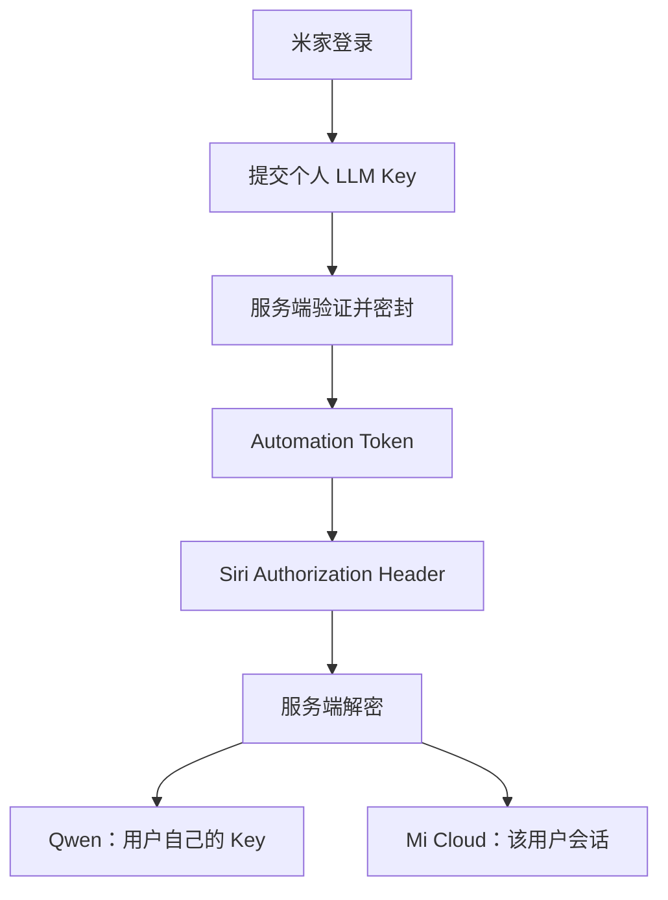
```mermaid
flowchart TD
    A["米家登录"] --> B["提交个人 LLM Key"]
    B --> C["服务端验证并密封"]
    C --> D["Automation Token"]
    D --> E["Siri Authorization Header"]
    E --> F["服务端解密"]
    F --> G["Qwen：用户自己的 Key"]
    F --> H["Mi Cloud：该用户会话"]
```

必须使用独立密钥，禁止复用 `XIAOMI_SESSION_SECRET` 或会话上下文密钥。建议 Token 格式为：

```text
v1.<keyId>.<base64url(iv)>.<base64url(ciphertext)>.<base64url(authTag)>
```

### 9.3 Automation Token 生命周期与撤销边界

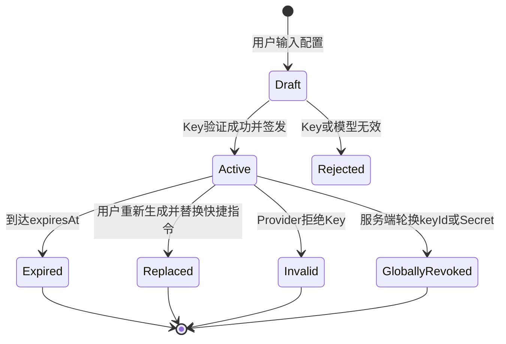
```mermaid
stateDiagram-v2
    [*] --> Draft: 用户输入配置
    Draft --> Active: Key验证成功并签发
    Draft --> Rejected: Key或模型无效
    Active --> Expired: 到达expiresAt
    Active --> Replaced: 用户重新生成并替换快捷指令
    Active --> Invalid: Provider拒绝Key
    Active --> GloballyRevoked: 服务端轮换keyId或Secret
    Expired --> [*]
    Replaced --> [*]
    Invalid --> [*]
    GloballyRevoked --> [*]
```

- 默认有效期 30 天，最大 90 天。
- 用户更新模型或 API Key 后需要重新生成并替换快捷指令中的 Token。
- Provider 返回 `401/403` 时返回 `LLM_CREDENTIAL_INVALID`，不得自动使用共享 Key。
- 无数据库时不能单独吊销某个已签发 Token，也不能可靠标记其状态。
- 紧急泄露通过轮换 `AI_AUTOMATION_TOKEN_KEY_ID` 与 Secret 全局撤销。
- 正常密钥轮换可短期保留“当前 + 上一个”解密密钥；是否启用重叠窗口必须由部署配置明确控制。
- 日志永不记录 Authorization、Automation Token、用户 LLM Key 或解密后的米家会话。

### 9.4 风险分级

PoC 的“开灯”等动作属于低风险。未来增加能力时必须分级：

| 级别 | 示例 | 默认策略 |
|---|---|---|
| Low | 灯光、窗帘、普通场景 | 可直接执行 |
| Medium | 空调温度、电视、扫地机 | 可执行，限制参数范围 |
| High | 门锁、车库门、门禁、燃气、摄像头隐私模式 | 默认不暴露；必须二次确认或禁用语音执行 |

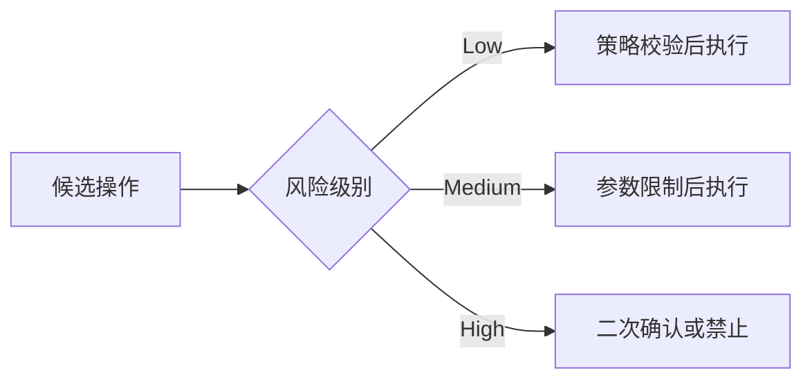
```mermaid
flowchart LR
    A["候选操作"] --> B{"风险级别"}
    B -- Low --> C["策略校验后执行"]
    B -- Medium --> D["参数限制后执行"]
    B -- High --> E["二次确认或禁止"]
```

## 10. Siri 快捷指令设计

### 10.1 第一版：固定短语

快捷指令名称：`我回家了`

动作：

1. 生成 UUID，作为 `Idempotency-Key`。
2. “获取 URL 内容”，向 `/api/ai/command` 发送 POST。
3. JSON 中固定发送 `text = 我回家了`。
4. 从响应中提取 `message`。
5. 使用“朗读文本”反馈结果。

这版的目标是验证端到端闭环和 Siri 体验，不验证任意 STT。

### 10.2 第二版：任意听写

快捷指令名称：`智能管家`

1. 使用“听写文本”。
2. 把听写结果填入 `text`。
3. 调用同一 API。
4. 朗读 `message`。

后端接口无需变化。为避免误触发，第二版只在显式唤起快捷指令后监听，不做持续监听。

### 10.3 快捷指令流程

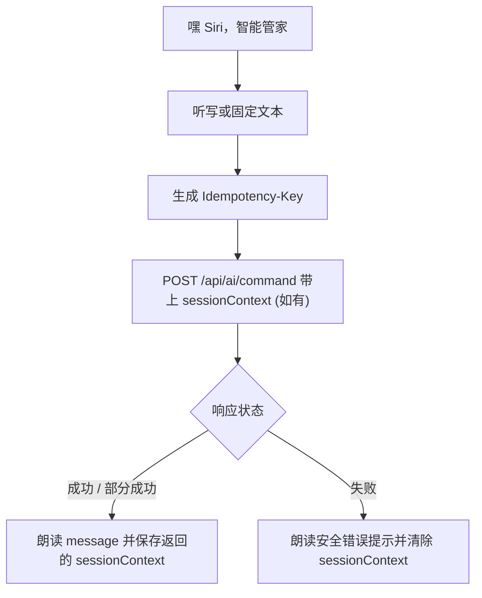
```mermaid
flowchart TD
    A["嘿 Siri，智能管家"] --> B["听写或固定文本"]
    B --> C["生成 Idempotency-Key"]
    C --> D["POST /api/ai/command 带上 sessionContext (如有)"]
    D --> E{"响应状态"}
    E -- 成功 / 部分成功 --> F["朗读 message 并保存返回的 sessionContext"]
    E -- 失败 --> G["朗读安全错误提示并清除 sessionContext"]
```

### 10.4 第三版：支持多轮对话的智能管家

在 iOS 快捷指令中实现连续对话非常直观：
1. **持久化保存上下文**：快捷指令可以使用“设定变量”或“存储在本地文件（Shortcuts/ai_context.txt）”中保存接口响应返回的 `sessionContext`。
2. **多轮追问循环**：
   - 当收到响应朗读 `message` 后，快捷指令可追加动作“要求输入文本（提示：还有什么需要处理的吗？）”；
   - 用户继续回答（例如“那离家呢”），快捷指令重新发起 POST 请求，请求体包含新文本及上一轮的 `sessionContext`；
   - 服务端解密并重组最近 3 轮对话传递给 LLM，实现代词识别和意图承接。

## 11. 数据、日志与可观测性

### 11.1 结构化日志

```json
{
  "event": "ai_command_completed",
  "requestId": "req_01J...",
  "client": "siri_shortcut",
  "decisionSource": "llm",
  "provider": "qwen",
  "model": "qwen3.7-flash-2026-07-15",
  "intent": "activate_scene",
  "sceneId": "home",
  "llmLatencyMs": 620,
  "conversationId": "conv_8fbeb170b03a45bdaff23fe5ee9896c1",
  "turnCount": 2,
  "executionLatencyMs": 1430,
  "llmOutput": "call activate_scene({\"sceneId\": \"2091417579243446272\"})",
  "result": "success"
}
```

默认不记录完整语音文本。调试期如确需记录，应进行开关控制、限制保留期并对可能的个人信息脱敏。不得记录 prompt 内部密钥、设备 DID、Authorization、Mi Cloud cookie/token 或原始云端响应。

### 11.2 指标

- `ai_command_requests_total{status}`
- `ai_decision_total{source,intent}`
- `ai_llm_latency_ms{provider,model}`
- `ai_llm_errors_total{type}`
- `scene_execution_total{scene,status}`
- `scene_execution_latency_ms{scene}`
- `scene_action_errors_total{executor,error_type}`
- `idempotency_hits_total`

### 11.3 Trace 关联

`requestId` 从 API 层生成并贯穿：

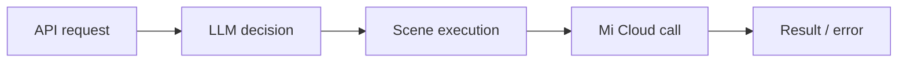
```mermaid
flowchart LR
    A["API request"] --> B["LLM decision"]
    B --> C["Scene execution"]
    C --> D["Mi Cloud call"]
    D --> E["Result / error"]
```

不要把外部 provider request ID 当作主业务 ID，但可作为内部字段保存用于故障定位。

## 12. 测试方案

### 12.1 意图评测集

必须执行：

```text
我回家了
我到家了
我回来了
刚进门
开启回家模式
到家啦，帮我开回家模式
```

不得执行：

```text
我还没回家
我准备回家了
如果我回家了怎么办
回家模式是什么
你知道我回家了吗
他说他回家了
不要开启回家模式
关闭回家模式
我回公司了
```

模糊或超范围：

```text
有点暗
打开灯
我要睡觉了
查看摄像头
把门打开
```

验收指标：

- 危险误执行数必须为 0。
- 已确认正例工具选择准确率 ≥ 98%。
- 模型返回非法工具或非法参数时，实际执行数必须为 0。
- 同一幂等 key 重放 10 次，场景只创建一次执行记录。

```mermaid
mindmap
  root((意图评测))
    正例
      明确到家
      场景显式请求
      口语与错别字
    负例
      否定
      条件
      疑问
      转述
    超范围
      设备级控制
      高风险操作
      未开放场景
    故障
      非法工具
      非法参数
      重复请求
      模型超时
```

### 12.2 分层测试

| 层级 | 测试重点 |
|---|---|
| Unit | schema、否定语句、allowlist、幂等 hash、错误映射 |
| Contract | Qwen tool call 响应解析、Mi Cloud adapter、未来 HA port |
| Integration | 模型 sandbox + mock executor，验证不会调用非法工具 |
| E2E | Siri → 公网 API → 测试设备/测试场景 |
| Failure injection | LLM timeout、Mi Cloud timeout、单动作失败、重复请求 |

PoC 首次 E2E 应使用低风险设备，例如一盏测试灯；确认稳定后再扩展到完整回家场景。

### 12.3 多用户与 Automation Token 测试

| 测试 | Token A | Token B | 预期 |
|---|---|---|---|
| 独立签发 | 用户 A Key | 用户 B Key | 密文和 principal 均不同 |
| A 发起命令 | 携带 A Token | 不访问 | Provider 只收到 A Key |
| B 发起命令 | 不访问 | 携带 B Token | Provider 只收到 B Key |
| 篡改密文 | 修改任意字节 | - | AES-GCM 校验失败，返回 `AUTOMATION_TOKEN_INVALID` |
| 跨环境使用 | 生产 Token | Preview | 解密失败或环境 AAD 不匹配 |
| 过期 Token | 已过期 | - | 返回 `AUTOMATION_TOKEN_EXPIRED` |
| A Token 改写 homeId | 篡改载荷 | - | 校验失败，不访问米家 |
| Provider 拒绝 Key | 有效密文、失效 Key | - | 返回 `LLM_CREDENTIAL_INVALID`，不使用共享 Key |
| Secret 轮换 | 旧 keyId | 新 keyId | 按部署的重叠窗口策略接受或统一失效 |

```mermaid
flowchart TD
    A["请求 + Automation Token"] --> B{"认证标签、用途、环境有效?"}
    B -- 否 --> C["拒绝并返回稳定错误"]
    B -- 是 --> D{"未过期且身份/家庭一致?"}
    D -- 否 --> E["拒绝，不访问外部服务"]
    D -- 是 --> F["解密到请求内存"]
    F --> G["调用对应 Provider"]
    F --> H["调用该用户 Mi Cloud"]
```

安全测试还必须断言响应、结构化日志、异常栈、Provider mock 之外的 spy 和测试快照中都不包含原始 Key 或完整 Automation Token。

## 13. 部署与配置

### 13.1 当前代码所需配置

当前实现不再依赖共享 `LLM_API_KEY`；部署侧只保留 Provider 策略与 Automation Token 密封相关配置：

```env
LLM_PROVIDER=qwen
LLM_BASE_URL=https://dashscope.aliyuncs.com/compatible-mode/v1
LLM_MODEL=qwen3.7-flash-2026-07-15
AI_AUTOMATION_TOKEN_SECRET=<32-byte-or-longer-random-secret>
AI_AUTOMATION_TOKEN_KEY_ID=key-2026-01
```

不得再以部署级共享 Key 作为正常路径或 fallback；每个登录用户都应通过 Automation Token 携带自己的模型凭据。

### 13.2 目标配置

目标部署环境只保留平台策略和 Automation Token 密封密钥：

```env
AI_COMMAND_ENABLED=true
LLM_ALLOWED_PROVIDERS=qwen-cn
LLM_DEFAULT_PROVIDER=qwen-cn
LLM_DEFAULT_MODEL=qwen3.7-flash-2026-07-15
LLM_TIMEOUT_MS=3000
LLM_MAX_OUTPUT_TOKENS=128
LLM_ENABLE_THINKING=false

AI_AUTOMATION_TOKEN_SECRET=<independent-high-entropy-secret>
AI_AUTOMATION_TOKEN_KEY_ID=key-2026-01
AI_AUTOMATION_TOKEN_DEFAULT_DAYS=30
AI_AUTOMATION_TOKEN_MAX_DAYS=90

SCENE_EXECUTOR=mi_cloud
SCENE_RESOLUTION_ORDER=existing_scene,composed_scene
SCENE_EXECUTION_TIMEOUT_MS=8000
SCENE_ACTION_CONCURRENCY=3

IDEMPOTENCY_TTL_SECONDS=600
AI_LOG_RAW_TEXT=false
```

目标配置中不存在共享 `LLM_API_KEY`、`LLM_CREDENTIAL_STORE` 或数据库连接。用户 API Key 由登录后的签发接口验证并密封进 Automation Token。

部署检查：

- EdgeOne 生产域名、HTTPS、WAF、限流和中国大陆服务器回源配置；
- Qwen 中国大陆 endpoint 与源站的网络连通性；
- Mi Cloud 中国大陆区 endpoint 的连通性；
- EdgeOne 回源超时高于应用总超时；
- 生产、Preview、开发使用不同 Automation Token Secret 和 keyId；
- 同一生产集群的 EdgeOne/源站实例使用一致的生产 Secret；
- Token 只通过 Authorization Header 传输；
- 响应、日志和异常不包含原始 Key、完整 Token 或解密会话；
- 测试环境不得控制真实家庭设备；
- 不配置境外模型自动 fallback；
- 明确记录无数据库导致“无法单 Token 吊销”的运维限制。

```mermaid
flowchart TD
    A["iPhone / Siri"] --> B["腾讯 EdgeOne"]
    B --> C["中国大陆源站"]
    C --> D["解密 Automation Token"]
    D --> E["百炼大陆地域"]
    D --> F["Mi Cloud 中国大陆区"]
    G["Vercel Preview"] --> H["独立 Preview Secret"]
```

## 14. 建议代码结构

仓库当前采用 `app/`、`lib/ai/` 与 `worker/` 边界。下面标记 `[现有]` 和 `[目标新增]`；本次 PR 只更新文档：

```text
app/
  ai/settings/page.tsx                  [目标新增：配置与一次性签发页面]
  api/ai/
    command/route.ts                    [现有：目标改为读取 Automation Token]
    token/route.ts                      [现有：迁移/兼容策略待实现]
    automation-token/route.ts           [目标新增：登录后验证并签发]
lib/ai/
  config.ts                             [现有：目标移除业务 API Key]
  intent-orchestrator.ts                [现有]
  providers/
    provider-catalog.ts                 [目标新增：大陆 endpoint 和模型白名单]
    qwen-openai-provider.ts             [现有：目标接收请求级凭据]
  security/
    auth.ts                             [现有]
    binding.ts                          [现有：复用载荷校验语义]
    automation-token.ts                 [目标新增：AES-GCM seal/open]
    conversation.ts                     [现有]
    idempotency.ts                      [现有]
  scenes/
    catalog.ts                          [现有]
    scene-service.ts                    [现有]
```

加密、载荷校验、Provider Catalog 和模型凭据解析放在 `lib/ai/` 的纯服务端模块；Route Handler 只负责 HTTP 边界。客户端配置页不得获得密封 Secret，也不得自行实现“加密”。

## 15. 实施阶段

完整可领取任务与文件级验收标准见 [AI Home 实现 TODO](./ai-home-implementation-todo.md)。

```mermaid
flowchart TD
    A["Phase 0：Token Contract与威胁模型"] --> B["Phase 1：Token Codec"]
    B --> C["Phase 2：Provider Catalog与签发API"]
    C --> D["Phase 3：配置页"]
    D --> E["Phase 4：Command API接入"]
    E --> F["Phase 5：Siri E2E与部署"]
```

实施顺序不能跳过 Token Codec 的单元测试。签发 API 和 Command API 接入前，必须先证明篡改、过期、跨环境和错误用途的 Token 均无法解密或使用。

## 16. 验收标准

PoC 完成必须同时满足：

1. 登录用户能在独立配置页输入个人 Qwen Key，并生成 Automation Token。
2. 原始 Key 不写入数据库、KV、Cookie、Local Storage、日志、错误消息或源码。
3. Siri 只需保存一个 Automation Token，并通过 HTTPS Authorization Header 调用。
4. Token 被篡改、过期、跨环境使用或用途错误时，在访问 Qwen/Mi Cloud 前拒绝。
5. 用户 A 的请求只使用 Token A 中的 Key 和米家会话，不能访问用户 B 的凭据或家庭。
6. 不存在共享 `LLM_API_KEY` fallback。
7. LLM 只能调用审核后的 `activate_scene`，非法工具和参数实际执行数为 0。
8. 现有米家场景优先；真实 sceneId、设备 DID 与 Mi Cloud Token 不进入模型上下文。
9. 否定、条件、疑问和转述语句不会触发场景。
10. 同一请求重试不会重复产生有副作用的执行。
11. 能区分 Automation Token、模型鉴权、模型超时和 Mi Cloud/设备失败。
12. EdgeOne 生产环境与 Vercel Preview 使用不同 Secret，生产 Token 不能用于 Preview。
13. 密钥轮换行为有自动化测试和运维说明。
14. 文档明确无数据库条件下无法单独吊销 Token，默认 30 天、最大 90 天。
15. 替换为模拟 HA executor 时，API 和 Tool Contract 不需要修改。

## 17. 架构决策记录

| ID | 决策 | 状态 | 理由 |
|---|---|---|---|
| ADR-001 | PoC 暂不接 HA | 已确认 | 最小成本验证 Voice → AI → Tool → Device |
| ADR-002 | Siri/快捷指令承担 STT | 已确认 | 不自建唤醒、VAD、STT 和 TTS |
| ADR-003 | 使用场景工具，不开放底层设备工具 | 已确认 | 安全、稳定、便于迁移 HA |
| ADR-004 | 默认 Qwen Flash 系列 | 已确认 | 中文能力、低延迟、低成本 |
| ADR-005 | 模型走 Provider 抽象 | 建议采用 | 避免锁定模型供应商 |
| ADR-006 | 明确短语可做故障回退 | 待确认 | 提高可用性，但会绕过 LLM PoC 链路 |
| ADR-007 | 场景动作同步执行 | PoC 暂定 | Siri 可立即得到结果；受部署时限约束 |
| ADR-008 | 场景目录使用运行时同步与审核映射 | 待确认 | 当前代码已有动态场景目录 |
| ADR-009 | 腾讯 EdgeOne + 中国大陆服务器 | 已确认 | 公网入口与业务源站均采用当前大陆部署 |
| ADR-010 | 优先匹配并调用米家现有场景 | 已确认 | 复用已配置动作，避免重复编排与设备级误操作 |
| ADR-011 | 模型及后续服务优先中国大陆地域 | 已确认 | 降低延迟、跨境链路和数据路径复杂度 |
| ADR-012 | 自动同步候选、首次人工确认、之后固定 Scene ID | 已确认 | 兼顾自动发现、安全审核与长期稳定映射 |
| ADR-013 | 无状态密封会话上下文承载多轮对话 | 已确认 | 契合 EdgeOne / Serverless 部署 |
| ADR-014 | 每个登录用户使用自己的 LLM API Token | 已确认 | 凭据、费用和额度按用户隔离 |
| ADR-015 | 登录后签发自包含 Automation Token | 已确认 | 无数据库条件下把米家 Binding 与用户模型凭据安全带入 Siri 请求 |
| ADR-016 | Automation Token 使用独立 AES-256-GCM 密钥 | 已确认 | 提供机密性、完整性、用途和环境隔离 |
| ADR-017 | 无单 Token 吊销能力 | 已接受限制 | 通过短有效期、用户 Key 轮换和全局 Secret 轮换降低风险 |

```mermaid
pie showData
    title 架构决策状态
    "已确认" : 13
    "建议采用" : 1
    "待确认" : 2
    "PoC暂定" : 1
    "已接受限制" : 1
```

## 18. 已关闭与待确认的架构问题

已关闭：

- 部署环境：腾讯 EdgeOne + 中国大陆服务器，Vercel 主要作为独立 Secret 的 Preview。
- 场景来源：优先匹配并调用已经存在且经过审核的米家场景。
- 场景识别：自动同步候选、首次人工确认、之后固定 Scene ID。
- 服务地域：模型及后续调用优先中国大陆地域，不自动跨境 fallback。
- Provider 凭据：每个登录用户使用自己的模型 API Key，不使用共享业务 Key。
- 凭据存储：当前阶段不引入数据库、KV 或 Redis；登录后签发自包含 Automation Token。
- Siri 鉴权：Automation Token 同时承载密封的米家 Binding、Provider、模型和用户 API Key。
- Token 有效期：默认 30 天，最大 90 天。

仍待确认但不阻塞 PoC：

1. **故障回退**：Qwen 超时时，“我回家了”是否允许直接命中确定性规则并执行。建议生产允许，PoC 观察模式先记录。
2. **场景配置存储**：继续使用运行时米家场景目录，还是增加管理页面维护内部场景映射。
3. **密钥轮换重叠窗口**：生产是否同时接受当前和上一个 keyId，以及重叠时长；默认实现可只接受当前 keyId，以降低复杂度。
4. **后续可撤销存储**：当跨设备同步、单 Token 吊销、审计或用量统计成为需求时，再引入大陆地域 KV/数据库，并保持 Command API 协议兼容。

## 19. 后续演进边界

未来系统可以沿同一接口扩展：

```mermaid
flowchart TD
    A["Voice / Web / App"] --> B["AI Command API"]
    B --> C["Intent + Tool Policy"]
    C --> D["Scene Service"]
    D --> E["Mi Cloud Executor"]
    D --> F["HA Executor"]
    F --> G["Matter / ONVIF / Vendor"]
```

扩展顺序建议为：

1. 增加只读状态查询工具。
2. 增加经过审核的 `away/sleep/movie` 场景。
3. 接入 HA，并让 HA 成为跨品牌标准设备的默认执行后端。
4. 保留 Xiaomi Adapter 处理小米私有属性、按键绑定、主控/副控、灯组和拓扑增强。
5. 最后再评估摄像头画面理解、连续对话和主动自动化。

## 20. 参考资料

- [阿里云百炼：模型列表](https://help.aliyun.com/zh/model-studio/models)
- [阿里云百炼：Function Calling](https://help.aliyun.com/zh/model-studio/qwen-function-calling)
- [阿里云百炼：OpenAI 兼容 Chat](https://help.aliyun.com/zh/model-studio/compatibility-of-openai-with-dashscope)
- [阿里云百炼：模型价格](https://help.aliyun.com/zh/model-studio/model-pricing)
