# 米家 Web 控制台架构

> 架构基线：`origin/main@a4dd9e9f001c59e45eb5a068118994672e16b1c6`（2026-08-31）
> 文档目标：描述当前实现，并识别可复用、可拆分和可扩展的组件。文中的“目标架构”是演进建议，不代表已经实现。

## 1. 系统全景

项目是一个运行在服务端边缘环境的米家 Web 控制台。浏览器只调用同源 Route Handler；小米会话、请求签名和真实云端数据均留在服务端。

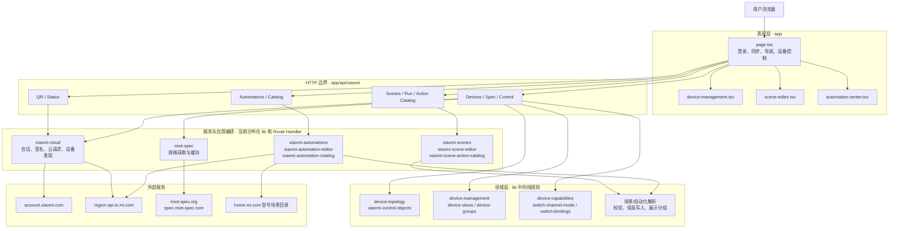

### 1.1 部署形态

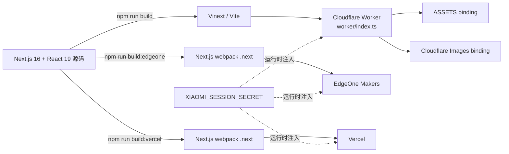

Cloudflare 构建由 `vite.config.ts` 和 `worker/index.ts` 负责；EdgeOne、Vercel 分别通过 `edgeone.json`、`vercel.json` 使用原生 Next.js 构建。三种目标共享相同的应用与领域代码。

## 2. 主要调用链

### 2.1 二维码登录

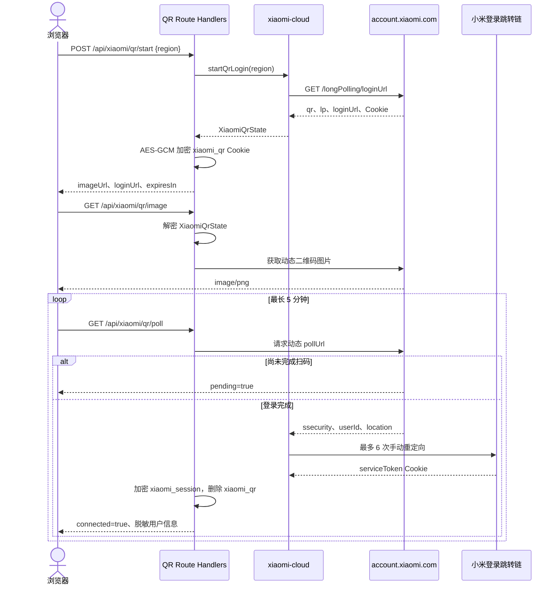

会话凭据不进入客户端响应。`ssecurity`、`serviceToken`、区域和用户标识被 AES-GCM 加密后保存到 HttpOnly Cookie，密钥由 `XIAOMI_SESSION_SECRET` 派生。

### 2.2 设备同步与运行状态增强

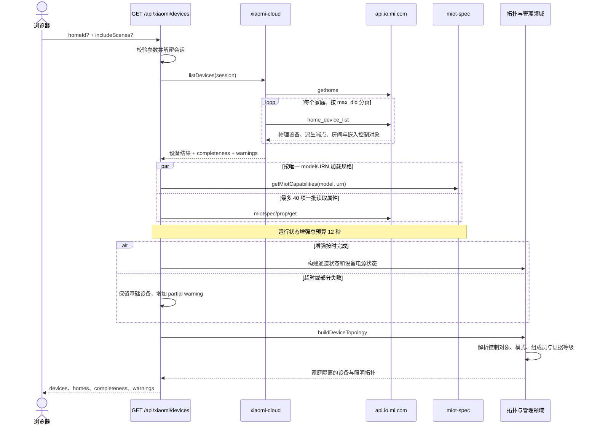

设备发现允许按家庭部分成功；规格或属性批次失败也不会丢弃已经取得的基础设备。当前实现使用 `withTimeoutFallback` 限制运行状态增强，优先保证同步接口可返回。

### 2.3 设备控制

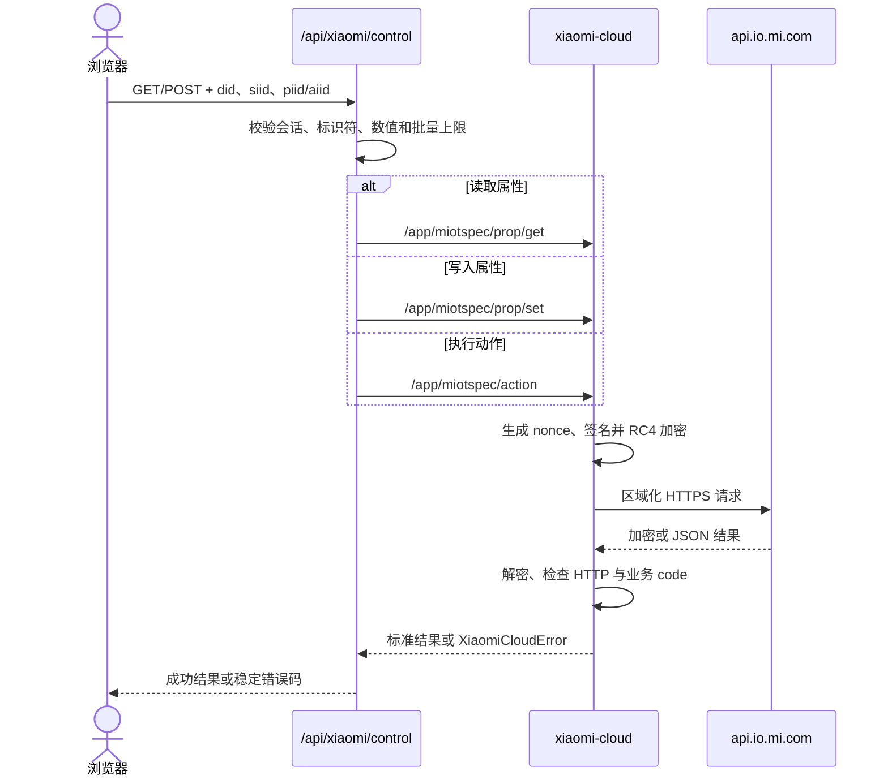

控制请求始终使用真实物理 DID 和明确的 MIoT 地址。UI 不会因为提交成功而伪造未知状态；错误仍会显式反馈。

### 2.4 场景与自动化安全写入

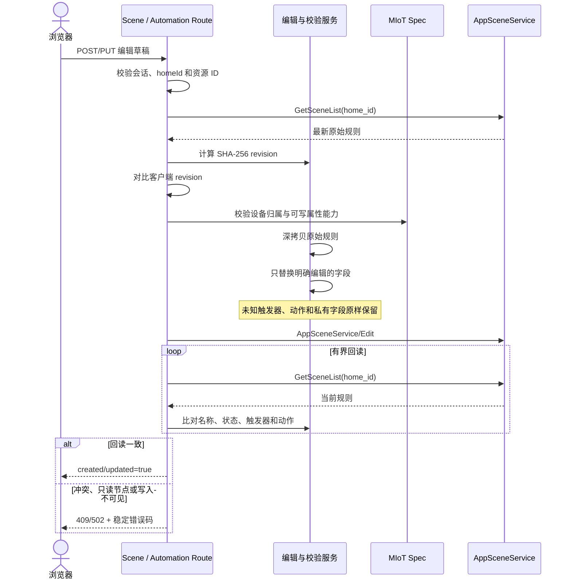

这种“原始记录保真 + 能力校验 + 乐观并发控制 + 写后验证”的模式，是场景和自动化模块最重要的可复用设计。

### 2.5 场景动作目录

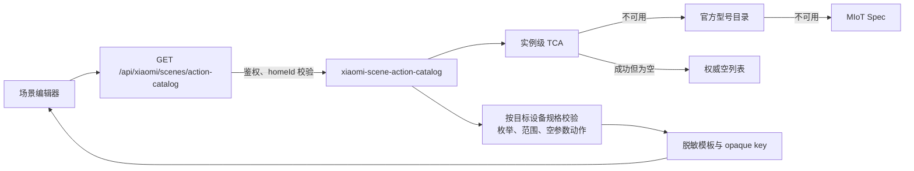

动作目录以设备实例为首选证据，严格应用 `black_dids`；实例目录成功但为空时不继续猜测。服务端保留真实目录动作 ID，客户端只接收 opaque key、官方原文和经过 MIoT 规格验证的参数约束。创建或更新场景时，服务端重新加载当前目录并校验模板，避免目录变化后写入失效或跨设备的数值。

## 3. 外部与内部 API

### 3.1 外部 API

| 主机/来源 | 路径 | 用途 | 主要保护或降级 |
| --- | --- | --- | --- |
| `account.xiaomi.com` | `/longPolling/loginUrl` | 创建二维码登录流程 | 区域白名单、12 秒超时 |
| 登录接口返回的动态 URL | QR image URL | 获取二维码图片 | 服务端代理，不暴露登录 Cookie |
| 登录接口返回的动态 URL | Poll URL / redirect chain | 轮询登录并取得服务令牌 | 5 分钟失效、最多 6 次跳转 |
| `{region.}api.io.mi.com` | `/app/v2/homeroom/gethome` | 家庭、房间、共享家庭和 owner UID | 所有后续数据按 `homeId` 隔离 |
| 同上 | `/app/v2/home/home_device_list` | 按家庭分页获取设备 | `max_did` 防重复游标；允许家庭级部分成功 |
| 同上 | `/app/home/device_list` | 无家庭结果时的兼容设备列表 | 仅遇到 HTTP 415 才尝试旧签名协议 |
| 同上 | `/app/miotspec/prop/get` | 批量读取属性 | 单批最多 40 项；批次失败局部降级 |
| 同上 | `/app/miotspec/prop/set` | 写入标准 MIoT 属性 | 服务端校验标识符和值类型 |
| 同上 | `/app/miotspec/action` | 执行标准 MIoT Action | 使用对象形 `params` envelope |
| 同上 | `AppSceneService/GetSceneList` | 读取场景和自动化 | 按用户触发器区分手动场景与自动化 |
| 同上 | `AppSceneService/NewRunScene` | 运行手动场景 | 先验证家庭归属、启用状态和场景 ID |
| 同上 | `AppSceneService/Edit` | 创建或修改场景/自动化 | revision、能力校验、原始节点保真、回读验证 |
| 同上 | `AppSceneService/GetSceneTCAConfigV3` | 获取实例级条件和动作目录 | 按真实 DID、型号、`black_dids` 过滤 |
| `miot-spec.org` / `spec.miot-spec.com` | `/miot-spec-v2/instances?status=all` | 型号解析为规格 URN | 双源顺序容错 |
| 同上 | `/miot-spec-v2/instance?type=...` | 获取服务、属性、动作和事件 | 30 分钟进程内缓存 |
| `home.mi.com` | `/cgi-op/api/v1/baike/v2/scene?model=...` | 自动化型号目录后备源 | 单型号失败不影响其他设备 |

小米云主机按区域生成：中国大陆为 `api.io.mi.com`，其他区域为 `{region}.api.io.mi.com`。支持区域为 `cn`、`sg`、`de`、`us`、`ru`、`i2`、`in`。

### 3.2 内部 Route Handler

| 路径 | 方法 | 职责 |
| --- | --- | --- |
| `/api/xiaomi/qr/start` | `POST` | 创建登录二维码状态 |
| `/api/xiaomi/qr/image` | `GET` | 代理二维码图片 |
| `/api/xiaomi/qr/poll` | `GET` | 轮询登录并建立加密会话 |
| `/api/xiaomi/status` | `GET`, `DELETE` | 返回脱敏连接状态或退出登录 |
| `/api/xiaomi/devices` | `GET` | 聚合家庭、设备、属性、拓扑及可选场景 |
| `/api/xiaomi/spec` | `GET` | 返回型号能力及公开绑定能力 |
| `/api/xiaomi/control` | `GET`, `POST` | 读取/写入属性或执行动作 |
| `/api/xiaomi/scenes` | `GET`, `POST` | 列出或创建手动场景 |
| `/api/xiaomi/scenes/:sceneId` | `GET`, `PUT` | 获取编辑草稿或安全更新场景 |
| `/api/xiaomi/scenes/action-catalog` | `GET` | 按家庭和设备实例返回脱敏、可重新验证的官方动作模板 |
| `/api/xiaomi/scenes/run` | `POST` | 执行手动场景 |
| `/api/xiaomi/automations` | `GET`, `POST` | 列出或创建自动化 |
| `/api/xiaomi/automations/:automationId` | `GET`, `PUT` | 获取草稿或安全更新自动化 |
| `/api/xiaomi/automations/catalog` | `GET` | 返回脱敏后的触发条件和动作目录 |

## 4. 当前分层与模块依赖

### 4.1 `lib` 主要依赖关系

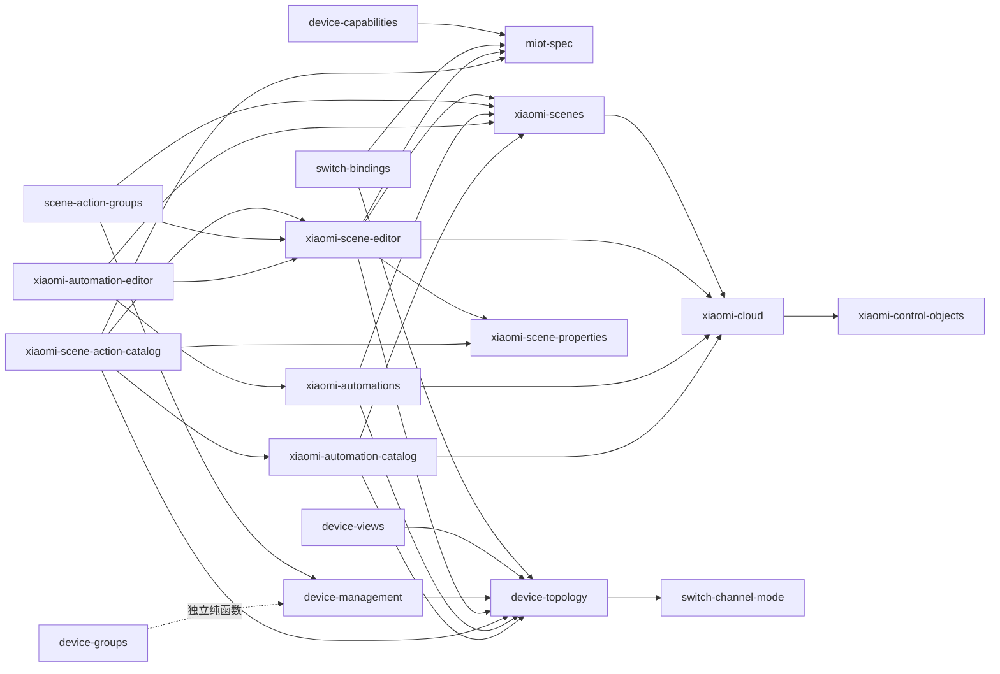

依赖方向整体以“上游适配器和场景服务依赖基础领域规则”为主，但尚未通过接口隔离基础设施。`xiaomi-scenes`、`xiaomi-automations` 等文件同时包含纯解析函数和网络访问函数。

### 4.2 Domain 层

| 领域 | 模块 | 核心职责 | 当前特征 |
| --- | --- | --- | --- |
| 设备身份与拓扑 | `device-topology`, `xiaomi-control-objects` | 识别物理设备、`.sN` 端点、控制通道、控制对象和证据 | 纯规则为主，家庭隔离明确 |
| 开关语义 | `switch-channel-mode`, `switch-bindings` | 解析有线/无线模式，识别可安全调用的绑定能力 | 未知值保持 `unknown` |
| 设备聚合 | `device-management`, `device-views`, `device-groups` | 生成硬件视图、受控设备视图、照明目标和活动设备 | 与 UI DTO 有一定耦合 |
| MIoT 能力 | `miot-spec`, `device-capabilities`, `xiaomi-scene-properties` | 规范化服务/属性/动作/事件，划分只读、读写、仅写和 Action，并限制场景可写能力 | 获取与解析仍在同一模块 |
| 场景 | `xiaomi-scenes`, `xiaomi-scene-editor`, `xiaomi-scene-action-catalog`, `scene-action-groups` | 解析、展示、草稿、实例动作目录、校验和保真写入 | 网络服务与领域逻辑混合 |
| 自动化 | `xiaomi-automations`, `xiaomi-automation-editor`, `xiaomi-automation-catalog` | 触发器分类、编辑、能力目录与安全投影 | 复用场景写入内核 |

#### 关键领域不变量

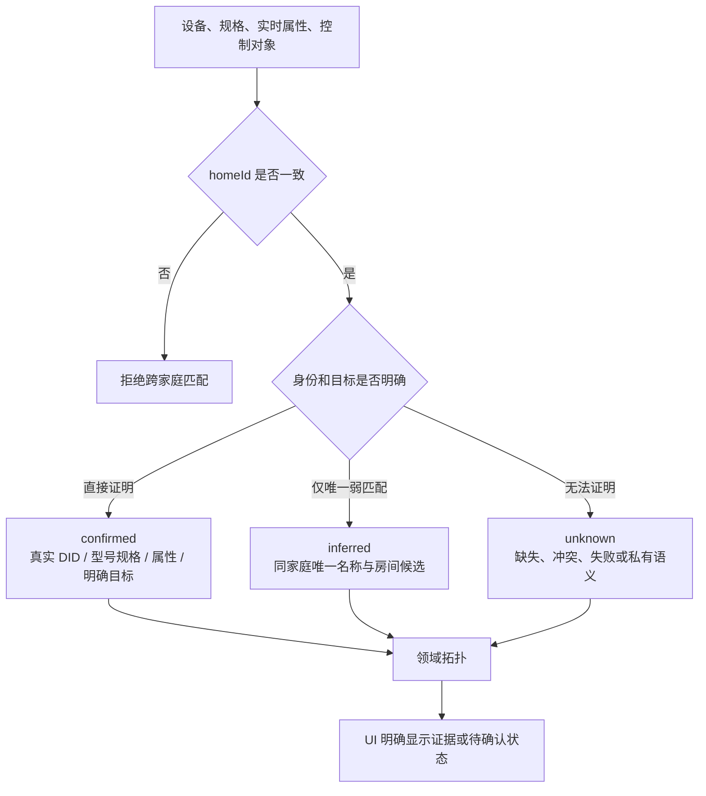

- 所有索引、匹配、去重和缓存首先按 `homeId` 分区。
- `group.*` 始终保留完整 DID；仅 `physicalDid.sN` 被视为派生端点。
- MIoT 请求使用物理 DID 和精确 `siid`/`piid`/`aiid`。
- 型号和规格优先于名称；名称推断不能伪装成云端确认关系。
- 属性失败、候选冲突和未公开协议均保留为 `unknown`。
- 普通回路状态只来自已证明的有线端点；无线按键状态不等价于目标灯状态。

### 4.3 Service 与 Application 层

当前没有独立的 `service/` 或 `application/` 目录，职责分布如下：

| 位置 | 实际职责 | 主要问题 |
| --- | --- | --- |
| `xiaomi-cloud.ts` | 登录、会话加密、RC4/HMAC 请求、错误分类、家庭与设备发现 | Gateway、认证和查询服务集中在一个文件 |
| `miot-spec.ts` | HTTP 获取、双源降级、缓存、规格规范化 | 基础设施与领域转换混合 |
| 场景/自动化模块 | 上游调用、原始记录解析、草稿与写入 payload | service 和 domain 边界不清晰 |
| Route Handlers | 鉴权、权限校验、编排、超时、写后回读、HTTP 映射 | 承担了主要 application use case |
| `app/page.tsx` | 客户端请求去重、缓存、冷却、同步和控制状态 | 页面组件承担客户端 application service |

## 5. 数据转换

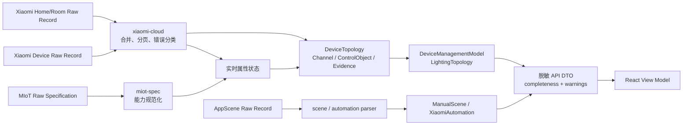

上游数据大量使用 `Record<string, unknown>` 兼容小米不同版本的字段形状。优点是协议容错强，代价是边界内存在较多运行时字段探测；后续应在适配器出口尽早转换为强类型领域对象。

## 6. 可复用性与扩展评估

### 6.1 复用矩阵

| 组件 | 复用价值 | 当前耦合 | 拆分成本 | 推荐用途 |
| --- | :---: | :---: | :---: | --- |
| `device-topology` | 高 | 低 | 低 | 独立设备拓扑 SDK、多平台聚合 |
| `xiaomi-control-objects` | 高 | 低 | 低 | 控制关系解析和证据管理 |
| `switch-channel-mode` | 高 | 低 | 低 | 开关通道语义解析 |
| `device-management` | 高 | 中 | 中 | 照明与设备管理领域模型 |
| `device-groups` / `device-views` | 高 | 中 | 低 | 设备清单、分组和 UI 投影 |
| MIoT 规格规范化 | 高 | 中 | 中 | CLI、桥接服务、能力浏览器 |
| 场景/自动化 parser | 高 | 中 | 中 | 规则审计、迁移和多端展示 |
| 安全编辑与写后验证 | 高 | 中 | 中 | 通用规则编辑内核 |
| `xiaomiRequest` 协议实现 | 中 | 中 | 中 | Xiaomi Gateway 基础客户端 |
| Route Handlers | 低 | 高 | 高 | 仅适合当前 Next.js HTTP 边界 |
| 编辑器 UI | 中 | 中 | 中 | 其他 React 米家客户端 |
| `app/page.tsx` 编排 | 低 | 高 | 高 | 应先拆 hooks/store 再复用 |

### 6.2 主要扩展阻力

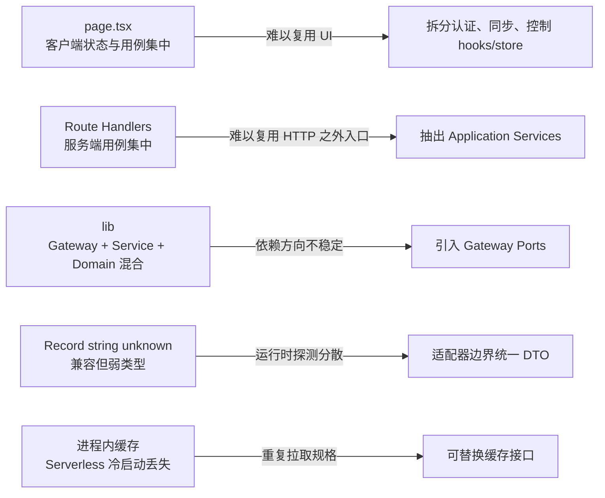

## 7. 建议的目标架构

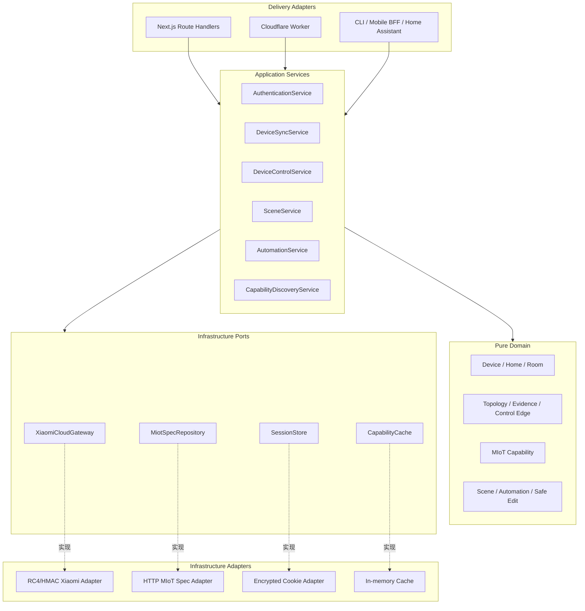

建议接口边界：

```ts
interface XiaomiCloudGateway {
  listHomes(): Promise<Home[]>;
  listDevices(homeId?: string): Promise<DeviceDiscoveryResult>;
  getProperties(refs: PropertyRef[]): Promise<PropertyBatchResult>;
  setProperty(command: PropertyCommand): Promise<void>;
  runAction(command: ActionCommand): Promise<void>;
  listRules(homeId: string): Promise<RawRule[]>;
  editRule(payload: RawRule): Promise<RuleWriteResult>;
  runScene(homeId: string, sceneId: string): Promise<void>;
}
```

接口应返回领域可识别的“完整/部分/未知”结果，不把 HTTP、Cookie 或 Next.js 类型带入 Application 和 Domain 层。

### 7.1 推荐演进顺序

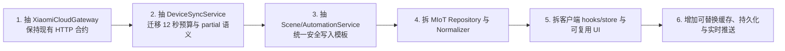

第一阶段只改变内部依赖，不改变现有 Route Handler 路径和响应结构。这样可以先让领域能力被 CLI、后台任务或其他前端复用，再逐步替换存储和交付适配器。

## 8. 测试与安全边界

现有测试集中覆盖以下架构约束：

- 家庭隔离、派生 DID、灯组和设备拓扑。
- 属性批次、设备分页、部分成功、错误分类和时间预算。
- 场景/自动化识别、草稿校验、未知节点保真和写后验证。
- TCA 目录分页、黑名单、脱敏投影、实例动作验证和逐型号降级。
- Route Handler 未登录保护、参数校验和稳定错误响应。
- Cloudflare、EdgeOne、Vercel 构建配置及响应式 UI。

后续抽层时应以这些测试作为兼容契约，尤其不得破坏：

1. 会话字段只存在于服务端边界。
2. 不记录真实 DID、Cookie、Token 或账号数据。
3. 不跨家庭合并、匹配或建立控制关系。
4. 单个规格、属性批次、家庭或型号目录失败不拖垮其他结果。
5. 未知和冲突数据保持 `unknown`，不使用默认值伪装为已确认。
6. 对未知规则只读或原样保留，不生成无法证明安全的写入 payload。
