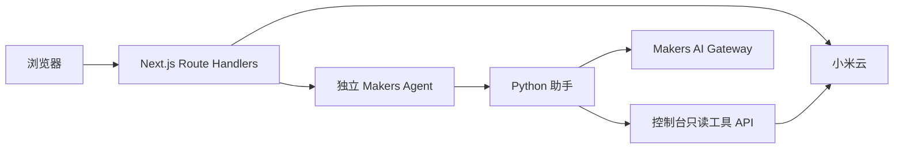

# 米家 Web 控制台架构

## 运行时与职责

- `app/` 提供页面与 Next.js Route Handlers；浏览器只调用同源 API。
- `lib/` 持有小米登录、会话加密、云请求、设备、场景、自动化和 AI 工具实现。
- `mijia-agent` 独立部署，持有模型访问、对话编排及 Makers adapter。控制台不持有模型密钥，也不调用模型供应商。
- 本地开发和测试使用 Vinext/Vite。EdgeOne 和 Vercel 分别通过 `edgeone.json`、`vercel.json` 执行原生 Next.js 构建。没有 Cloudflare Worker 入口。

## 信任边界

二维码登录后的米家会话仅在服务端解密。`XIAOMI_SESSION_SECRET` 不进入
Python、模型消息或浏览器响应。控制台从认证会话派生 principal，确认家庭归属，
签发短期 Automation Token。Agent 通过 `AI_AGENT_INTERNAL_SECRET` 接收请求，
再用 `AI_TOOLS_INTERNAL_SECRET` 向控制台验证 token 和家庭权限。Python 使用
`AI_PYTHON_INTERNAL_SECRET` 接受 adapter 转发的回合；仅将 opaque token
送往控制台工具 API。所有服务 Secret 在部署环境中独立配置。

模型只得到用户文本、受限历史与已脱敏的工具描述。真实场景 ID、DID、会话、
内部 Secret、principal/home ID 不进入模型消息。家居读取在模型选择能力后才执行；
返回结构化卡片数据，不回填模型历史。远程物理执行保持关闭，直到 agent
`docs/TODO.md` 的持久化执行器门禁完成。

## 当前 API

| 路径 | 用途 |
| --- | --- |
| `/api/xiaomi/**` | 登录、家庭/设备同步、控制、场景和自动化 |
| `/api/ai/chat` | Cookie 鉴权、家庭校验、短期 token、Agent 对话 |
| `/api/ai/conversations` | 当前用户/家庭的对话句柄 |
| `/api/ai/automation-token` | 签发直连 Agent 的短期 token |
| `/api/ai/exposure` | 当前家庭的 AI 读取和场景授权配置 |
| `/api/ai/tools` | Agent 回调时验证 token 并调用服务端工具 |
| `/api/internal/assistant/v1/**` | Python 助手的受控能力调用 |

预览模式由 `AI_PREVIEW_MODE=true` 或 `VERCEL_ENV=preview` 触发，返回固定 mock
文本，不调用模型或物理设备。本地 `NODE_ENV=development` 使用文件式家庭授权
存储；其他运行时使用 EdgeOne Blob，缺失时失败关闭。Automation Token 的 AAD
realm 固定为 `production`；各部署环境用不同的 token Secret 隔离。

设备和场景领域细节见 [设备管理设计](device-management-design.md)。本地跨仓库
联调见 [联调指南](local-integration-test.md)。
