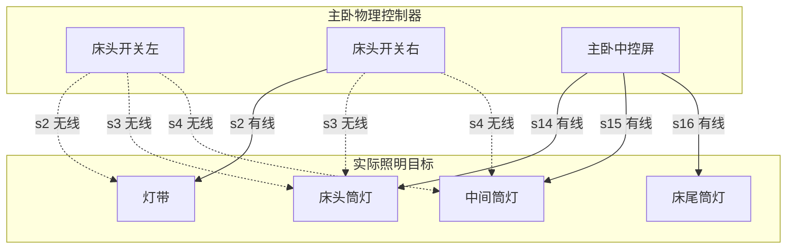

# 米家设备管理与照明控制拓扑设计

- 文档状态：第一版实现基线；后续根据真实使用反馈迭代。
- 更新日期：2026-08-26。
- 适用项目：米家 Web 控制台。
- 设计依据：真实米家设备清单、三个真实设备属性响应、设备型号 MIoT 规格、当前项目的接口实现，以及公开的米家灯组行为说明与非官方云接口实现。
- 约束：先明确数据语义和展示规则，再决定代码改造；禁止把猜测的关联关系当作米家云已经确认的绑定。

## 1. 背景与目标

米家云的设备列表同时包含物理开关、智能中控屏、独立智能灯具、智能灯组，以及从开关按键派生出来的逻辑设备。这些记录在米家中可以分配到不同房间，因此“列表里有一个设备”不等于“现实中有一件独立硬件”。

当前需要解决的问题是：

1. 按真实物理设备展示开关、中控屏、独立智能灯具和其他硬件。
2. 正确识别每个开关按键对应的派生设备、实际工作模式和受控对象。
3. 把同一盏普通灯的有线主控、无线副控及语音映射归入同一个拓扑。
4. 区分普通负载、独立智能灯具、智能灯组、场景按键和辅助设备。
5. 支持跨房间关联，但禁止跨家庭误关联。
6. 明确哪些关系可以从真实接口确认，哪些只能根据名称推断，哪些当前根本无法获取。
7. 为后续实现设备页面、按键绑定入口和拓扑图提供稳定的数据模型。

本文同时作为第一版实现的约束与验收基线；尚未取得真实返回的数据仍明确标记为待确认。

## 2. 数据来源与可信等级

### 2.1 真实数据来源

| 来源 | 内容 | 能直接证明的事实 | 局限 |
| --- | --- | --- | --- |
| `GET /api/xiaomi/devices` | 家庭、房间、设备 DID、名称、型号、URN、在线状态 | 设备是否存在、所属家庭、米家房间、型号、派生 DID | 不包含按键实时模式；当前返回中的绑定和组成员均为空 |
| `GET /api/xiaomi/spec?model=...&urn=...` | 型号服务、属性、事件、动作及读写能力 | 型号有哪些服务、每个服务的 `siid`、属性 `piid`、枚举定义 | 只说明型号能力，不说明某一台设备的实际设置 |
| `GET /api/xiaomi/control?did=...&properties=...` | 指定真实设备的属性值 | 某一台设备某一按键的实际开关状态、工作模式和厂商属性 | 响应回显 DID 和采集时间；不直接返回跨设备绑定目标 |
| MIoT 公开规格 | 同型号的服务、属性和动作定义 | `.sN` 的服务含义、`mode` 枚举、厂商动作及事件能力 | 公开规格不代表账号已经配置了对应功能 |

底层米家接口目前包括：

```text
/app/v2/homeroom/gethome
/app/v2/home/home_device_list
/app/home/device_list
/app/miotspec/prop/get
/app/miotspec/prop/set
/app/miotspec/action
```

本设计阶段只使用设备列表和属性读取。`prop/set` 及 `action` 均属于设备操作，不能自动执行。

### 2.2 证据等级

任何展示出来的关系都必须携带其证据来源：

| 证据等级 | 含义 | 示例 |
| --- | --- | --- |
| `confirmed` | 来自真实 DID、型号规格、实时属性，或云端明确返回的目标 DID | `1206737667.s3` 属于 DID `1206737667` 的 `siid=3`；`3.2=1` 表示该按键纯无线 |
| `inferred` | 由同家庭、开关归属房间和名称匹配推断 | 主卧左床头开关的“床头筒灯”与主卧中控屏的“床头筒灯”属于同一实际目标 |
| `unknown` | 接口暂未公开，或者存在多个不可区分候选 | 智能灯组的真实成员 DID；无线按键究竟绑定了哪个云端自动化 |

`confirmed` 与 `inferred` 不可混用。尤其不能把同名关联显示成“米家已确认绑定”。

本文还使用用户确认的业务规则作为设计输入，例如名称中的“副控”表示该开关按键工作在无线副控角色。该规则可以确认按键角色，但不能单独确认它最终关联的目标 DID；目标匹配仍需分别标记为 `confirmed` 或 `inferred`。

## 3. 当前真实设备清单

### 3.1 家庭与设备数量

当前账号下有两个家庭：

| 家庭 ID | 家庭名称 | 已观察设备数量 |
| --- | --- | --- |
| `173001365263` | `1010978392的家庭` | 1 |
| `173001919747` | `Fabric` | 69 |

合计 70 条米家设备记录，其中：

- 13 台物理开关或中控屏。
- 33 条开关或中控屏的 `.sN` 派生记录。
- 12 台独立智能灯具。
- 4 个智能灯组。
- 8 台其他设备，包括网关、空调、摄像头和传感器。

这些统计以当前已抓取快照为准，不代表长期固定数量。

### 3.2 当前设备列表字段

每条记录目前包含：

```ts
type XiaomiListedDevice = {
  did: string;
  name: string;
  model: string;
  online: boolean;
  room: string;
  homeId: string;
  home: string;
  roomId: string;
  icon: unknown | null;
  parentId: string | null;
  logicalType: string;
  urn: string | null;
  groupMemberIds: string[];
  groupIds: string[];
  topology: unknown | null;
};
```

当前快照存在以下限制：

- `logicalType` 全部为空字符串。
- `roomId` 全部为空字符串。
- `.sN` 记录的 `parentId` 当前全部为空。
- 开关和中控的 `topology.bindings` 当前没有真实绑定数据。
- 四个智能灯组的 `groupMemberIds` 当前全部为空。
- 现有 `topology.connectionType = "wired"` 经常只是代码默认值，不能当作真实模式。

因此，设备类别和控制关系不能依赖 `logicalType`、现有 `parentId` 或默认拓扑字段。

### 3.3 已识别的物理控制设备

| 物理 DID | 名称 | 房间 | 型号 | 已观察派生服务 |
| --- | --- | --- | --- | --- |
| `1206737667` | 主卧床头开关-左 | 主卧 | `linp.switch.qh2db4` | `2`、`3`、`4` |
| `1206848237` | 主卧床头开关-右 | 主卧 | `linp.switch.qh2db4` | `2`、`3`、`4` |
| `720449456` | 主卧智能中控屏 | 主卧 | `xiaomi.controller.oh4w` | `14`、`15`、`16` |
| `1206737080` | 次卧床头四键 | 次卧 | `linp.switch.qh2db4` | `2`、`3`、`4` |
| `720492619` | 次卧中控屏 | 次卧 | `xiaomi.controller.oh4w` | `14`、`15`、`16` |
| `1206737044` | 客厅四开 | 客厅 | `linp.switch.qh2db4` | `2`、`3`、`4` |
| `2158725755` | 客厅三开 | 客厅 | `linp.switch.t2dbw3` | `2`、`3`、`4` |
| `720486743` | 玄关中控屏 | 玄关 | `xiaomi.controller.oh4w` | `14`、`15`、`16` |
| `720457393` | 电竞房中控屏 | 电竞房 | `xiaomi.controller.oh4w` | `14`、`15`、`16` |
| `2144027291` | 厨房开关 | 厨房 | `linp.switch.t2dbw2` | `2`、`3` |
| `2144014346` | 阳台开关 | 阳台 | `linp.switch.t2dbw2` | `2`、`3` |
| `2002959916` | 卫生间灯光、凉霸 | 卫生间 | `linp.switch.t2dbw2` | `2`、`3` |
| `949084854` | 筒灯 | 卫生间 | `linp.switch.t2dbw1` | 当前没有独立 `.sN` 列表记录 |

### 3.4 已识别的智能灯组

| 灯组 DID | 名称 | 房间 | 已确认成员 |
| --- | --- | --- | --- |
| `group.2091412670934687745` | 餐厅轨道灯 | 餐厅 | 未公开 |
| `group.2091412410988503040` | 轨道灯 | 客厅 | 未公开 |
| `group.2091409300609183744` | 客厅射灯 | 客厅 | 未公开 |
| `group.2091406875143831555` | 餐厅射灯 | 餐厅 | 未公开 |

`group.*` 是完整的智能灯组 DID，而不是“父设备 + 派生服务”的结构，不能按最后一个点号截断。

## 4. 型号规格与 DID 结构

### 4.1 物理设备和派生服务

对于当前已经验证的开关和中控：

```text
派生 DID = 物理设备 DID + ".s" + 服务 siid
```

例如：

```text
1206737667.s2 -> 物理 DID 1206737667，开关服务 siid 2
1206737667.s3 -> 物理 DID 1206737667，开关服务 siid 3
1206737667.s4 -> 物理 DID 1206737667，开关服务 siid 4

720449456.s14 -> 物理 DID 720449456，开关服务 siid 14
720449456.s15 -> 物理 DID 720449456，开关服务 siid 15
720449456.s16 -> 物理 DID 720449456，开关服务 siid 16
```

当前快照中的 33 条 `.sN` 记录均与其物理设备对应型号的真实 `switch` 服务编号一致。

识别规则：

1. 先判断是否是 `group.*`；是则保持完整 DID。
2. 再判断 DID 是否符合 `^(?<physicalDid>.+)\.s(?<siid>\d+)$`。
3. 只有当 `physicalDid` 确实存在于同一家庭的设备列表中，并且型号规格确实存在对应 `siid` 的 `switch` 服务时，才识别为派生按键。
4. 其他协议型 DID，例如 `blt.*`，不得因为包含点号就被盲目截断。

### 4.2 按型号识别实际硬件类别

| 型号 | 实际硬件 | 开关服务 | 派生 DID 示例 |
| --- | --- | --- | --- |
| `xiaomi.controller.oh4w` | 智能中控屏 | `14`、`15`、`16` | `720449456.s15` |
| `linp.switch.qh2db4` | 四键墙壁开关 | `2`、`3`、`4` | `1206737667.s4` |
| `linp.switch.t2dbw3` | 三键墙壁开关 | `2`、`3`、`4` | `2158725755.s3` |
| `linp.switch.t2dbw2` | 双键墙壁开关 | `2`、`3` | `2144027291.s2` |
| `linp.switch.t2dbw1` | 单键墙壁开关 | `2` | 当前快照只有物理 DID |
| `mijia.light.group3` | 智能灯组 | 灯光服务 `2` | `group.2091409300609183744` |

分类依据优先级：

```text
明确的完整 DID 规则
    > 型号和型号规格
    > URN 中声明的设备类别
    > 设备名称
    > 其他弱信号
```

型号用于判断物理硬件类别，不能把中控屏派生设备名称“中间筒灯”误认为中控屏本体就是智能灯具。

### 4.3 四键面板的第四个按键

`linp.switch.qh2db4` 虽然是四键面板，但公开规格只有三个 `switch` 服务：

```text
siid 2：第一路开关
siid 3：第二路开关
siid 4：第三路开关
siid 10：switch-sensor，事件参数支持按键 1、2、3、4
```

第四个按键通过按键事件能力暴露，没有独立的第四路继电器服务，也没有在当前设备列表中出现 `.s5`。

设计必须区分：

- `relayChannel`：具有独立 `switch` 服务的按键。
- `eventOnlyButton`：只有事件能力、没有独立 `switch` 服务的按键。

不能由“四键”直接推断存在四条电源回路。

本期照明拓扑明确忽略第四个事件型按键：不为它创建控制端点、逻辑目标或拓扑边。其事件能力可以保留在设备详细信息中，未来如果实现自动化或场景编辑，再作为独立能力处理。

## 5. 指定 DID 的真实属性读取

### 5.1 现有接口

读取单个属性：

```http
GET /api/xiaomi/control?did=1206737667&siid=2&piid=2
```

读取同一设备的多个属性：

```http
GET /api/xiaomi/control?did=1206737667&properties=2.1,2.2,3.1,3.2,4.1,4.2,11.4,11.15,11.16
```

当前接口每次最多读取 40 个 `siid.piid` 组合。

返回结构：

```json
{
  "ok": true,
  "did": "1206737667",
  "values": {
    "2.1": true,
    "2.2": 1
  },
  "errors": {},
  "capturedAt": "2026-08-26T00:00:00.000Z"
}
```

其中：

- `siid.1` 通常对应该开关服务的 `on` 属性。
- `siid.2` 对当前已验证的开关和中控对应 `mode` 属性。
- 对其他型号不能硬编码该规律，应先读取型号规格。
- 属性请求必须使用物理设备 DID，而不是仅凭名称构造目标。

### 5.2 工作模式的准确语义

对于本文已验证的开关和中控型号：

| 实际 `mode` 值 | 规格枚举含义 | 设计层分类 | 能否作为有线负载锚点 |
| --- | --- | --- | --- |
| `0` | 有线和无线开关 | `relay-enabled` | 可以 |
| `1` | 无线开关 | `wireless-only` | 不可以 |
| 缺失、读取失败或其他值 | 当前无法确认 | `unknown` | 不可以直接假设 |

重要细节：

1. `0` 的描述包含“无线”二字，但它并不是“纯无线开关”。
2. 必须按型号规格和值解释，不能简单检测枚举文案是否包含“无线”。
3. 正确的判断字段是对应 `switch` 服务内的 `mode`，而不是任意位置名为 `wireless-mode` 的厂商属性。
4. `relay-enabled` 描述的是继电器参与能力，不代表该按键不能同时关联无线场景。
5. 模式是按键级属性，而不是整个物理开关的单一属性；同一面板允许混合模式。

### 5.3 实际抓取结果与来源限制

当前已收到三份属性响应。由于现有批量读取接口没有在响应中回显 `did`，文件与设备的对应关系是依据抓取链接顺序、服务编号及米家房间记录交叉确认的；后续诊断接口应回显 DID，避免失去来源信息。

#### 主卧床头开关-左：`1206737667`

```json
{
  "ok": true,
  "values": {
    "2.1": true,
    "2.2": 1,
    "3.1": true,
    "3.2": 1,
    "4.1": true,
    "4.2": 1,
    "11.4": false,
    "11.15": 255,
    "11.16": 0
  },
  "errors": {}
}
```

解析：

| 服务 | 派生 DID | 米家名称 | 记录所在房间 | 开关值 | `mode` | 结论 |
| --- | --- | --- | --- | --- | --- | --- |
| `2` | `1206737667.s2` | 灯带 | 勿关 | `true` | `1` | 无线副控 |
| `3` | `1206737667.s3` | 床头筒灯 | 勿关 | `true` | `1` | 无线副控 |
| `4` | `1206737667.s4` | 中间筒灯 | 勿关 | `true` | `1` | 无线副控 |

这是一台三个继电器服务全部处于无线模式的物理面板。

#### 主卧床头开关-右：`1206848237`

```json
{
  "ok": true,
  "values": {
    "2.1": false,
    "2.2": 0,
    "3.1": true,
    "3.2": 1,
    "4.1": true,
    "4.2": 1,
    "11.4": false,
    "11.15": 255,
    "11.16": 0
  },
  "errors": {}
}
```

解析：

| 服务 | 派生 DID | 米家名称 | 记录所在房间 | 开关值 | `mode` | 结论 |
| --- | --- | --- | --- | --- | --- | --- |
| `2` | `1206848237.s2` | 灯带 | 主卧 | `false` | `0` | 主卧灯带的有线负载 |
| `3` | `1206848237.s3` | 床头筒灯 | 勿关 | `true` | `1` | 床头筒灯的无线副控 |
| `4` | `1206848237.s4` | 中间筒灯 | 勿关 | `true` | `1` | 中间筒灯的无线副控 |

这是一台同时包含有线回路和无线按键的混合模式面板。

#### 主卧智能中控屏：`720449456`

```json
{
  "ok": true,
  "values": {
    "14.1": false,
    "14.2": 0,
    "15.1": false,
    "15.2": 0,
    "16.1": false,
    "16.2": 0
  },
  "errors": {}
}
```

解析：

| 服务 | 派生 DID | 米家名称 | 记录所在房间 | 开关值 | `mode` | 结论 |
| --- | --- | --- | --- | --- | --- | --- |
| `14` | `720449456.s14` | 床头筒灯 | 主卧 | `false` | `0` | 床头筒灯的有线负载 |
| `15` | `720449456.s15` | 中间筒灯 | 主卧 | `false` | `0` | 中间筒灯的有线负载 |
| `16` | `720449456.s16` | 床尾筒灯 | 主卧 | `false` | `0` | 床尾筒灯的有线负载 |

### 5.4 已被真实返回证明的例外

#### 例外一：无线按键状态不等于实际灯具状态

同一时刻：

```text
主卧中控屏床头筒灯：14.1 = false
左床头开关床头筒灯：3.1 = true
右床头开关床头筒灯：3.1 = true

主卧中控屏中间筒灯：15.1 = false
左床头开关中间筒灯：4.1 = true
右床头开关中间筒灯：4.1 = true

右床头开关灯带：2.1 = false
左床头开关灯带：2.1 = true
```

因此：

- 普通灯具的展示状态应优先来自有线主控回路。
- 独立智能灯具的展示状态应优先来自智能灯具自身。
- 无线副控的 `on` 属性不能覆盖实际负载状态。
- 不能通过比较两个按键 `on` 值是否相等来判断它们是否控制同一盏灯。

#### 例外二：本地互控字段不参与拓扑判断

两个主卧床头面板都返回：

```text
11.16 local-control-num = 0
```

但左侧面板三个按键的 `mode` 都是 `1`，右侧面板也有两个按键的 `mode` 是 `1`。

用户已经确认 `local-control-num`、`get-control-num` 和同类本地互控字段对当前设备管理没有实际作用。因此：

- 不用 `local-control-num` 判断是否存在无线副控。
- 不把 `get-control-num` 或 `get-local-ctrl` 的返回作为构建拓扑的前置条件。
- 不需要为了拓扑设计解释厂商私有 `uint32` 编码。
- 是否为无线副控，只看对应 `switch` 服务的真实 `mode`、派生设备语义和明确的业务规则。

#### 例外三：厂商 `wireless-mode` 并不是按键工作模式

两个主卧床头面板都返回：

```text
11.15 wireless-mode = 255
```

公开规格将这个属性描述为厂商的“疾速模式”。它既没有区分左、右面板，也没有区分同一面板上的三个按键。

不能使用 `11.15` 替代各 `switch` 服务中的 `mode`。

#### 例外四：设备响应没有回显 DID

当前批量属性接口只返回：

```json
{
  "ok": true,
  "values": {},
  "errors": {}
}
```

离线保存后无法直接从 JSON 确定响应属于哪台设备。后续应返回：

```json
{
  "ok": true,
  "did": "1206737667",
  "values": {},
  "errors": {}
}
```

这是诊断能力设计建议，不表示现有接口已经修改。

## 6. 已验证的主卧拓扑

### 6.1 目标与控制关系

| 实际照明目标 | 有线主控 | 无线副控 | 已知关联 DID 数量 |
| --- | --- | --- | --- |
| 主卧灯带 | 右床头开关 `1206848237.s2` | 左床头开关 `1206737667.s2` | 2 |
| 主卧床头筒灯 | 中控屏 `720449456.s14` | 左床头开关 `1206737667.s3`、右床头开关 `1206848237.s3` | 3 |
| 主卧中间筒灯 | 中控屏 `720449456.s15` | 左床头开关 `1206737667.s4`、右床头开关 `1206848237.s4` | 3 |
| 主卧床尾筒灯 | 中控屏 `720449456.s16` | 当前未发现 | 1 |

其中：

- 物理设备与按键服务的关系是 `confirmed`。
- 每个按键是有线还是无线，由真实 `mode` 确认，属于 `confirmed`。
- 不同物理设备的同名按键属于同一个实际照明目标，目前仍是基于房间和名称的 `inferred`，除非后续接口返回明确目标 DID。

### 6.2 拓扑示意



一个物理面板可以控制多个目标，一个目标也可以同时拥有多个控制来源，因此关系是多对多；对于单个无线按键，后续还必须允许一个按键对应多个目标。

## 7. 房间语义与“勿关”设备

### 7.1 需要区分的三种房间

| 字段 | 含义 | 示例 |
| --- | --- | --- |
| `sourceRoom` | 物理开关或中控屏所在房间 | 左床头开关在主卧 |
| `endpointRoom` | `.sN` 派生设备在米家中的房间 | 左床头开关的“床头筒灯”在勿关 |
| `targetRoom` | 实际照明目标所属房间 | 普通灯跟随其有线派生设备位置；智能灯跟随自身设备位置 |

三者不能相互替代。

对于普通灯具，`targetRoom` 使用其 `mode=0` 有线派生设备的 `endpointRoom`，而不是物理控制器的 `sourceRoom`。对于独立智能灯具或灯组，`targetRoom` 使用智能设备自身房间；位于“勿关”的供电派生设备不改变智能设备的实际房间。

### 7.2 “勿关”不是一种设备类别

当前“勿关”房间共有 16 条记录：

- 14 条开关或中控屏的 `.sN` 派生记录。
- 2 台真实网关。

因此：

- 不能把“勿关”房间里的所有记录都归类为无线开关。
- 不能把“勿关”房间里的真实网关隐藏为语音别名。
- 不能因为派生记录不在主卧就把主卧实际灯具错误归类到“勿关”。
- 不能因为派生记录在“勿关”就认定其 `mode=1`；必须读取真实按键模式。

### 7.3 “勿关”派生设备的两种主要情况

#### 情况一：已存在同名有线主控

例如：

```text
720449456.s15   主卧中控屏 / 中间筒灯 / mode 0 / 主卧
1206737667.s4   左床头开关 / 中间筒灯 / mode 1 / 勿关
1206848237.s4   右床头开关 / 中间筒灯 / mode 1 / 勿关
```

这里“勿关”中的两个记录属于纯无线副控；实际照明目标应该归入主卧，并以中控屏的 `siid=15` 作为有线主控锚点。

#### 情况二：控制的是独立智能灯具或智能灯组

例如：

```text
720486743.s15   餐厅吊灯 / 米家记录在勿关
1168371692      餐厅吊灯 / 独立智能灯具 / 房间为餐厅

1206737044.s4             客厅射灯副控 / 米家记录在勿关
group.2091409300609183744 客厅射灯 / 智能灯组 / 房间为客厅
```

用户已经确认这类同名派生记录表达智能灯具或灯组的供电控制，而不是把智能灯本体降级为普通灯：

- `720486743.s15` 表达餐厅吊灯的电源控制；餐厅吊灯本体仍是 DID `1168371692` 的独立智能灯具。
- 射灯及射灯组采用相同规则：派生设备表达电源控制，灯组 DID 仍是可独立控制和配置的目标。
- 名称包含“副控”的开关表示无线副控：它通过另一个有线开关控制电源，不直接等同于智能灯或灯组本身。
- 派生供电端点的房间可以是“勿关”，但智能灯具或灯组的目标房间仍取其真实设备记录所在房间。

拓扑应同时保留“供电控制关系”和“智能设备自身”两个层次。按键模式决定它是有线供电端点还是无线副控；智能设备的开关、亮度、色温和在线状态仍来自智能设备自己的 DID。

### 7.4 跨房间控制

当前设备清单已经出现跨房间实例：

```text
2158725755      客厅三开 / 物理设备位于客厅
2158725755.s2   玄关柜灯带 / 派生设备位于玄关
2158725755.s3   餐边柜灯带 / 派生设备位于餐厅

720486743       玄关中控屏 / 物理设备位于玄关
720486743.s16   客厅灯带 / 派生设备位于客厅
```

因此搜索关联关系时必须扫描同一家庭的全部房间，而不能只查当前界面选中的房间。

普通灯的 `targetRoom` 以有线派生设备的 `endpointRoom` 为准。因此客厅三开上的“玄关柜灯带”和“餐边柜灯带”分别归入玄关和餐厅，不因控制器位于客厅而改回客厅。`sourceRoom` 继续保留物理控制器的位置，用于表达跨房间控制关系。

## 8. 目标分类

### 8.1 物理节点

```ts
type PhysicalDeviceKind =
  | "switch"
  | "control-panel"
  | "smart-light"
  | "smart-light-group"
  | "gateway"
  | "air-conditioner"
  | "sensor"
  | "camera"
  | "other";
```

物理开关和中控屏以完整根 DID 去重，不能把 `.sN` 派生记录再当作一台独立硬件。

智能灯组虽然未必代表单独物理硬件，但它是一个拥有真实完整 DID、可独立控制和配置的业务实体，因此在硬件与设备视图中应作为独立组合卡片。

### 8.2 逻辑照明目标

```ts
type LogicalTargetKind =
  | "ordinary-load"
  | "smart-light"
  | "smart-light-group"
  | "scene"
  | "fan-or-appliance"
  | "unknown";
```

其中：

- `ordinary-load`：没有独立智能灯 DID 的普通照明回路。
- `smart-light`：有独立灯具型号和 DID，例如餐厅吊灯。
- `smart-light-group`：以 `group.` 开头的智能灯组。
- `scene`：类似“电竞模式”的场景或行为，不应硬归类为灯。
- `fan-or-appliance`：凉霸、排气扇等非灯类回路。

### 8.3 控制关系种类

```ts
type ControlRelationship =
  | "relay-load"
  | "wireless-secondary"
  | "smart-device-control"
  | "smart-device-power"
  | "group-control"
  | "scene-trigger"
  | "unknown";
```

按键工作方式与目标类型必须分开保存。“副控”确认的是无线角色；目标可能是普通灯的供电回路，也可能最终为智能灯或灯组供电。

例如“客厅射灯副控”应表达为：

```text
channelMode = wireless-only
targetKind = smart-light-group
relationship = wireless-secondary
effect = 通过另一个有线端点控制灯组供电
```

不能因为名称与灯组相似，就把这条无线副控边标成对灯组 DID 的直接 `group-control`。只有云端返回明确目标 DID 或真实绑定接口结果时，才能确认直接智能设备控制。

### 8.4 建议的数据模型

```ts
type Evidence = {
  confidence: "confirmed" | "inferred" | "unknown";
  source:
    | "device-list"
    | "did-service-match"
    | "miot-spec"
    | "miot-property"
    | "user-domain-rule"
    | "explicit-binding"
    | "same-room-and-name"
    | "fuzzy-name"
    | "not-available";
};

type PhysicalDevice = {
  homeId: string;
  did: string;
  name: string;
  model: string;
  urn: string | null;
  room: string;
  kind: PhysicalDeviceKind;
  online: boolean;
};

type ControlEndpoint = {
  key: string;
  homeId: string;
  physicalDid: string;
  endpointDid: string | null;
  siid: number | null;
  buttonIndex: number | null;
  buttonKind: "relay-channel" | "event-only";
  name: string;
  sourceRoom: string;
  endpointRoom: string | null;
  mode: "relay-enabled" | "wireless-only" | "unknown";
  modeValue: number | null;
  reportedOn: boolean | null;
  evidence: Evidence[];
};

type LogicalTarget = {
  key: string;
  homeId: string;
  room: string;
  name: string;
  kind: LogicalTargetKind;
  deviceDid: string | null;
  powerSource:
    | { kind: "wired-endpoint"; endpointKey: string }
    | { kind: "unknown" }
    | null;
  stateSource:
    | { kind: "smart-device"; did: string }
    | { kind: "wired-endpoint"; did: string; siid: number }
    | { kind: "unknown" };
  evidence: Evidence[];
};

type ControlEdge = {
  key: string;
  homeId: string;
  endpointKey: string;
  targetKey: string;
  relationship: ControlRelationship;
  evidence: Evidence[];
};
```

约束：

- `PhysicalDevice` 和 `ControlEndpoint` 分开建模。
- 同一个 `ControlEndpoint` 可以连接多个 `LogicalTarget`。
- 同一个 `LogicalTarget` 可以接收多个 `ControlEndpoint`。
- 所有节点和边必须包含 `homeId`。
- `stateSource` 只能指向已确认的智能设备或有线回路。
- 对智能灯具或灯组，`powerSource` 与 `stateSource` 必须分开：继电器只描述供电，界面状态仍读取智能设备 DID。
- “副控”这一角色可以来自用户确认的业务规则；它最终连接哪个目标仍需要独立证据。

## 9. 拓扑构建流程

### 9.1 第一阶段：建立家庭级设备索引

```text
homeId + did -> 原始设备记录
homeId + physicalDid -> 物理控制器
homeId + physicalDid + siid -> 控制按键
homeId + smartDid -> 独立智能灯具或智能灯组
```

不同家庭即使设备名称完全一样，也不能合并。

### 9.2 第二阶段：按型号规格解析控制服务

对每一种控制设备型号：

1. 请求一次型号规格，并按 `model + urn` 缓存。
2. 找到所有 `name === "switch"` 的服务。
3. 记录每个服务的 `siid`、可读属性、可写属性、动作和事件。
4. 识别事件型按键，但本期照明拓扑过滤没有独立 `switch` 服务的第四键。
5. 根据服务定义决定实际读取哪些属性，不能对未知型号盲目假设 `piid=2` 一定是工作模式。

### 9.3 第三阶段：批量读取真实按键模式

对每一台物理控制器，读取：

```text
每个 switch 服务：on、mode
```

`local-control`、`local-control-num`、`get-control-num`、`get-local-ctrl`、`key-relay-set` 及其私有参数不参与当前拓扑构建。

读取策略：

- 同一物理 DID 的属性合并请求，最多 40 项。
- 同型号规格复用缓存。
- 先读取当前家庭中的物理开关和中控屏。
- 一个设备读取失败不能阻止其他设备拓扑构建。
- 离线设备的模式显示为 `unknown`，不要默认有线。
- 模式读取必须早于最终拓扑分类，不能等用户点开设备详情后才纠正界面。

### 9.4 第四阶段：解析派生设备

对每条 `.sN` 记录：

```text
owner = 同家庭中 DID 等于前缀的物理设备
siid = 后缀 N
specService = owner 对应型号中 siid 等于 N 的 switch 服务
mode = owner 对应 siid 的实时 mode 属性
```

如果找不到 owner 或对应服务，则保留为 `unknown`，不把它强行挂到名称相近的设备上。

### 9.5 第五阶段：建立目标锚点

锚点优先级：

1. 已确认的独立智能灯具 DID。
2. 已确认的智能灯组 DID。
3. `mode=0` 的有线控制按键。
4. 暂无有线控制但名称明确的无线目标，标记为未解决。

普通灯具不能由无线按键直接决定其显示状态和所属房间。普通灯目标房间取有线锚点对应派生设备的 `endpointRoom`；独立智能灯具或灯组取自身设备房间。

当派生设备与独立智能灯具或灯组同名时，派生设备先解释为该智能设备的供电控制候选：

- `mode=0`：作为有线供电端点。
- `mode=1` 或名称带“副控”：作为无线副控，连接到对应的有线供电目标。
- 智能设备 DID 始终保留为独立可配置节点。

### 9.6 第六阶段：关联无线副控

关联范围限定在同一家庭，搜索该家庭全部房间。

匹配优先级：

1. 云端明确返回的目标 DID 和目标 `siid`。
2. 同名、同目标房间、且已存在 `mode=0` 的有线目标。
3. 同名、且物理无线开关与目标有线开关位于同一房间。
4. 明确匹配独立智能灯具或智能灯组名称。
5. 去掉“副控”“电源”等后缀后的唯一候选。
6. 多个候选或名称差异过大时，不自动合并。

名称规范化只能用于产生候选，不可覆盖原始名称：

```text
去除空白、全角空格和视觉分隔符。
保留原始名称用于展示。
谨慎识别“副控”“电源”等描述性词语。
房间前缀仅在不产生歧义时参与弱匹配。
```

例如：

```text
"中间筒灯" <-> "中间筒灯"：强候选。
"客厅射灯副控" <-> "客厅射灯"：弱候选。
"电竞房灯带电源" <-> "彩光灯带"：证据不足，不能自动确认。
```

名称中的“副控”可以确认该端点是无线副控，但去掉“副控”后得到的名称仍只用于查找目标候选。除非存在唯一匹配或明确绑定数据，不能确认目标 DID。

### 9.7 第七阶段：确定目标状态

```text
独立智能灯具 / 智能灯组：读取真实智能设备自身状态；离线或读取失败时标记离线，不回退显示供电继电器状态。
普通灯具：读取已确认有线主控的 on 属性。
只有无线副控且没有找到真实目标：状态未知。
存在多个互相冲突的有线主控：标记冲突并要求人工确认。
```

## 10. 设备页面设计

### 10.1 全局筛选

页面筛选顺序：

```text
家庭 -> 房间 -> 展示视图
```

要求：

- 家庭选择器显示账号下的全部家庭。
- 视图切换控件放在房间选择器下方。
- 切换视图时保留当前家庭和房间，不要求重新选择。
- 房间筛选只控制界面显示范围，不限制同家庭拓扑的底层搜索范围。

### 10.2 视图一：开关与实际设备

每个房间显示真实控制器和可独立配置的设备：

- 物理开关，每个物理 DID 仅一张卡片。
- 智能中控屏，每个物理 DID 仅一张卡片。
- 独立智能灯具。
- 智能灯组。
- 网关、空调、传感器等其他真实设备。

规则：

1. `.sN` 派生记录不与物理开关并列显示为额外硬件。
2. 物理开关卡片不显示“虚拟开关”标签。
3. 同一物理 DID 的不同 `.sN` 服务只在设备详情中作为按键出现。
4. 点击物理开关或中控屏后，直接展示其各按键及对应的受控对象，不需要二次展开另一张硬件卡片。
5. 普通灯只显示名称及其有线主控，不创建可独立配置的“智能灯卡片”。
6. 独立智能灯具或灯组可以从按键关联处跳转到该设备自己的设置。
7. 真实网关即使在“勿关”房间，也仍按实际网关展示。

主卧示例：

```text
主卧智能中控屏
  按键 14：床头筒灯，有线。
  按键 15：中间筒灯，有线。
  按键 16：床尾筒灯，有线。

主卧床头开关-左
  按键 2：灯带，无线。
  按键 3：床头筒灯，无线。
  按键 4：中间筒灯，无线。
  额外的第四个实体按键为事件能力，本期不进入照明拓扑。

主卧床头开关-右
  按键 2：灯带，有线。
  按键 3：床头筒灯，无线。
  按键 4：中间筒灯，无线。
```

界面中“按键 2/3/4”在这个示例里指服务 ID；最终产品应展示用户可理解的实体按键顺序，同时在详细信息中保留 `siid`，避免把 `siid=4` 误叫“第四键”。

### 10.3 视图二：实际照明与控制拓扑

以实际照明目标为主体，而不是以原始米家设备记录为主体。

分组键：

```text
homeId + targetRoom + normalizedTargetName
```

每个照明目标只展示一张聚合卡片，卡片包含：

- 灯具名称。
- 实际所属房间。
- 普通灯、智能灯、智能灯组或场景类型。
- 真实有线控制数量。
- 真实无线控制数量。
- 所有关联的物理 DID、服务 `siid` 和派生 DID。
- 关系证据等级。
- 来自真实负载或真实智能灯具的实际状态。
- 智能灯具或灯组的供电端点及其在线状态；二者不能合并成一个状态。

点击卡片后展开拓扑，可用 Canvas 绘制：

- 普通灯：有线主控 -> 真实照明目标；无线副控 -> 同一目标。
- 智能灯：有线供电端点 -> 独立智能灯具 DID；无线副控 -> 同一供电目标。
- 智能灯组：有线供电端点 -> 灯组 DID；无线副控 -> 同一供电目标；已确认成员再从灯组 DID 向下展开。
- 一个无线按键控制多个目标时，为该按键绘制多条边。

智能设备离线时，智能设备节点显示“离线”；供电端点仍可单独显示自身继电器状态，但不能把该状态冒充为灯具状态。

点击拓扑中的物理开关、中控屏、智能灯具或智能灯组时，跳转到对应真实 DID 的设置页面。

### 10.4 普通灯与智能灯的交互差异

| 目标类型 | 聚合卡片是否存在 | 是否有独立设备设置 | 用户点击后的行为 |
| --- | --- | --- | --- |
| 普通灯 | 有，作为逻辑照明目标 | 没有 | 显示其有线主控和无线副控；进入控制器对应按键 |
| 智能灯具 | 有 | 有 | 可进入智能灯具自身，也可以查看关联控制器 |
| 智能灯组 | 有 | 有 | 可进入灯组；已确认成员允许分别进入成员设置 |
| 场景按键 | 可按场景单独归类 | 依能力决定 | 显示场景或自动化能力，不能伪装为灯 |

### 10.5 智能灯组的成员展示

如果未来能通过真实接口拿到成员 DID：

```text
灯组卡片
  成员设备 A，可单独进入设置。
  成员设备 B，可单独进入设置。
```

但对当前快照：

```text
groupMemberIds = []
```

只能表示“当前接口没有返回成员”，不能显示成“该灯组有 0 个成员”。

在找到真实灯组管理接口前，应显示：

```text
组合设备；成员关系暂未公开。
```

禁止根据名字“客厅射灯1、客厅射灯2、客厅射灯3”自动宣布其属于 `客厅射灯` 灯组；最多只能给出待确认候选。

### 10.6 桌面与移动端

- 同一套数据模型适用于桌面和移动端。
- 主要文本、按键模式和目标名称需要足够清晰，不能依赖过小字号。
- 桌面端拓扑可左右分栏；移动端拓扑应垂直排列。
- 房间切换和视图切换应适合触控。
- 重要状态不能只通过颜色区分，应同时显示“有线”“无线”“未确认”等文字。

## 11. 按键绑定与 API 能力边界

### 11.1 已公开的领普四键厂商能力

`linp.switch.qh2db4`：

```text
siid 11 / piid 4  = relay-lock，常通电模式。
siid 11 / piid 15 = wireless-mode，厂商疾速模式。
siid 11 / piid 16 = local-control-num，本地互控及配对数量。

siid 11 / aiid 1 = get-control-num，获取互控 ID 和配对数量。
siid 11 / aiid 2 = enter-study，进入学习模式。
siid 11 / aiid 3 = clear-wireless，清除无线开关。
siid 11 / aiid 4 = clear-wireless，清除本地互控。
```

动作入参 `action-channel` 的取值范围为 `1` 到 `4`，代表实体按键。

### 11.2 已公开的领普单键、双键、三键厂商能力

`linp.switch.t2dbw1`、`linp.switch.t2dbw2`、`linp.switch.t2dbw3`：

```text
siid 10 / piid 2 = key-mode，厂商按键模式。
siid 10 / piid 5 = local-control，本地互控。
siid 10 / piid 6 = key-param，本地控制参数。
siid 10 / piid 9 = key-relay-set，按键负载设置。

siid 10 / aiid 1 = get-local-ctrl，查询互控 ID 和数量。
siid 10 / aiid 2 = enter-study，进入学习或配对状态。
siid 10 / aiid 3 = clear-wireless，清除配对。
siid 10 / aiid 4 = clear-local-ctrl，清除互控。
siid 10 / aiid 8 = set-key，写入厂商私有按键配置。
```

动作入参 `action-channel` 对三键开关使用 `0`、`1`、`2` 对应左、中、右键，与四键面板使用 `1` 到 `4` 的规则不同。

### 11.3 当前可以确认的边界

可以确认：

- 这些型号允许读取每个按键的真实有线或无线模式。
- 部分型号公开本地学习、配对、清除和厂商配置动作。
- `local-control-num`、`get-control-num`、`get-local-ctrl` 及厂商私有 `uint32` 参数对当前拓扑设计没有实际作用。

不能确认：

- 是否支持直接传入“目标灯具 DID + 目标服务 siid”完成绑定。
- 真正的无线绑定关系是否通过另一组云端自动化、场景或插件接口维护。

因此，在找到真实绑定接口前，不能设计成“选择任何灯具，点击绑定即可完成真实米家绑定”。

`get-control-num` 和 `get-local-ctrl` 虽然名称像查询，但在 MIoT 协议里仍通过 `action` 执行；本设计不再把它们列为拓扑验证项。进入学习模式、清除配对、清除互控和写入厂商配置会改变设备状态，这类操作必须经过明确确认，设计阶段不得自动调用。

### 11.4 绑定界面的产品规则

1. 先展示真实按键模式及已知受控对象。
2. 对无线按键展示“查看关联”或“管理绑定”，但具体操作根据型号真实能力决定。
3. 公开规格存在明确目标 DID 和目标服务参数时，才允许选择目标设备直接绑定。
4. 只支持学习配对时，展示学习配对流程，不伪装成可任意选择目标 DID。
5. 只有本地互控字段或私有整数编码时，不据此提供拓扑绑定入口。
6. 无绑定能力或无法确认时，只展示信息，不显示会失败的绑定按钮。

## 12. 当前实现与目标设计的差距

### 12.1 `.sN` 父设备识别失败

现有拓扑构建逻辑只识别类似：

```text
.1
_1
:1
-1
```

它没有识别 `.s2`、`.s14` 这种真实返回格式，导致：

- 33 个派生设备没有正确的 `parentId`。
- 物理开关没有聚合出真实按键。
- 中控屏和实际灯具在同一层级重复出现。
- 跨设备关系缺少基础的物理控制器归属。

### 12.2 真实按键 `mode` 被忽略

现有模式识别重点匹配：

```text
wireless
button-mode
button-type
switch-mode
control-mode
```

但当前型号真正需要识别的是 `switch` 服务内属性名恰好为：

```text
mode
```

结果是：即使米家已经返回 `2.2=1`、`3.2=1`、`4.2=1`，界面仍然回退到“有线主控”。

另外，`mode=0` 对应的文案是“有线和无线开关”，如果先判断文本中是否包含“无线”，也会把 `0` 错误识别成纯无线。必须结合型号、服务上下文和数值解释。

### 12.3 先分类、后读取模式的顺序不正确

当前设备页面主要依靠列表返回先构建拓扑，只有打开设备详情时才请求规格和实时属性。

而真实数据表明，物理模式是决定有线主控、无线副控和实际目标状态的必要条件。因此拓扑模型必须先获取必要模式，或者明确提供“待确认”状态，不能先把全部按键默认显示为有线。

### 12.4 灯组成员缺失被误读为没有成员

智能灯组公开的可读属性主要包括：

```text
2.1 on
2.2 brightness
2.3 color-temperature
2.6 mode
```

不包含组成员列表。当前 `groupMemberIds=[]` 表示数据缺失，不表示灯组为空。

### 12.5 现有厂商动作不能代表云端绑定能力

厂商动作命名使用：

```text
enter-study
get-control-num
get-local-ctrl
set-key
```

这类命名不一定匹配当前围绕 `bind`、`pair`、`learn`、`target-did` 编写的通用规则；其中本地互控查询和私有参数已经明确不参与当前拓扑设计。

后续能力识别应保留：

- 标准直接绑定能力。
- 厂商学习配对能力。
- 私有配置能力。
- 无法安全解释的能力。

识别出动作并不等于可以安全执行、已经知道参数协议，或已经找到米家云中的实际目标 DID。绑定 UI 必须等待明确的云端绑定接口证据。

## 13. 后续建议接口

以下仅为设计建议，不代表这些接口已实现。

### 13.1 属性诊断接口增强（第一版已实现）

现有单属性和批量属性响应已经回显：

```json
{
  "ok": true,
  "did": "1206737667",
  "values": {
    "2.2": 1
  },
  "errors": {},
  "capturedAt": "2026-08-26T00:00:00.000Z"
}
```

### 13.2 家庭拓扑读取接口

建议提供专门的只读聚合接口：

```http
GET /api/xiaomi/topology?homeId=173001919747
```

建议响应：

```ts
type HomeTopologyResponse = {
  homeId: string;
  generatedAt: string;
  physicalDevices: PhysicalDevice[];
  controlEndpoints: ControlEndpoint[];
  logicalTargets: LogicalTarget[];
  edges: ControlEdge[];
  unresolved: Array<{
    kind:
      | "missing-parent"
      | "unknown-channel-mode"
      | "ambiguous-target"
      | "missing-group-members"
      | "conflicting-target-room"
      | "unresolved-event-button";
    did: string;
    message: string;
  }>;
};
```

要求：

- 服务端完成同家庭全量索引和同型号规格缓存。
- 批量获取必要的按键模式。
- 保留每个关联关系的证据等级。
- 对失败和未知项提供明确信息。
- 不自动执行任何设备动作。

### 13.3 灯组关系接口

公开资料检索得到两个重要结论：

1. 小米官方 Home Assistant 文档明确区分物理灯组和虚拟灯组。物理灯组拥有由中枢网关分配的 Mesh 组地址，属性变化可以用灯组 DID 上报；虚拟灯组只是米家 App 的聚合展示，控制时会向每个成员分别下发，且不会以虚拟灯组 DID 发布属性变化。因此不能假设所有 `group.*` 都有同一种成员或状态接口。
2. 已检查的非官方云接口实现没有暴露专门的“获取灯组成员”端点。`hass-xiaomi-miot` 仍主要从 `/home/device_list`、`/v2/home/home_device_list` 和 `/v2/homeroom/gethome_merged` 合并设备，其中 `/home/device_list` 使用 `getVirtualModel: true`、`get_split_device: false`。

当前项目则使用：

```text
/app/v2/home/home_device_list  -> get_split_device: true
/app/home/device_list          -> getVirtualModel: false, get_split_device: true
```

这说明下一步最安全、最有价值的验证不是猜测新 URL，而是只读比较现有设备列表接口的原始返回：

1. 对 `/app/home/device_list` 分别测试 `getVirtualModel: true/false`。
2. 对两个列表接口分别测试 `get_split_device: true/false`。
3. 不先做字段归一化，完整保留 `pid`、`parent_id`、嵌套 `members/devices/children` 以及 `group.*` 附近的未知字段。
4. 比较同一灯组和候选成员在四种参数组合下的差异。
5. 如果仍未返回成员，则把灯组作为不透明但可控制的独立节点，显示“成员关系暂未公开”，禁止按名称伪造成员。

截至本文更新时，尚未找到可信的独立灯组成员 API，因此具体 URL、请求参数和返回结构仍为唯一待查的外部数据点。

参考：

- [小米官方：物理灯组与虚拟灯组](https://github.com/XiaoMi/ha_xiaomi_home/wiki/Physical-light-group-and-virtual-light-group)
- [`hass-xiaomi-miot` 的云设备列表实现](https://github.com/al-one/hass-xiaomi-miot/blob/master/custom_components/xiaomi_miot/core/xiaomi_cloud.py)

## 14. 建议的测试与验收

### 14.1 数据解析测试

必须覆盖：

1. `1206737667.s2` 正确解析为根 DID `1206737667` 和 `siid=2`。
2. `720449456.s15` 正确解析为根 DID `720449456` 和 `siid=15`。
3. `group.2091409300609183744` 保持完整，不能识别成普通 DID 后缀。
4. 其他带点号的协议 DID 不会被错误截断。
5. 两个不同家庭中同名目标不会被合并。

### 14.2 真实模式测试

使用本文第 5 节的真实属性值建立测试夹具：

- 左床头开关：三个 `wireless-only`。
- 右床头开关：一个 `relay-enabled`、两个 `wireless-only`。
- 主卧中控屏：三个 `relay-enabled`。
- `11.15=255` 不改变按键模式判断。
- `11.16=0` 及本地互控字段完全不参与拓扑判断。
- 读取失败时显示 `unknown`，不能默认有线。
- 四键面板额外的事件型第四键不创建照明拓扑节点。

### 14.3 主卧拓扑验收

必须得到：

| 目标 | 有线数量 | 无线数量 | 聚合关联数 |
| --- | --- | --- | --- |
| 灯带 | 1 | 1 | 2 |
| 床头筒灯 | 1 | 2 | 3 |
| 中间筒灯 | 1 | 2 | 3 |
| 床尾筒灯 | 1 | 0 | 1 |

同时：

- 主卧开关视图只显示三台物理控制器，不显示九张重复开关卡。
- 主卧灯光视图显示四个实际照明目标。
- 床头筒灯和中间筒灯均能看到三个关联 DID。
- 每条控制关系均可跳转到对应真实物理设备设置。
- 灯具状态以有线主控返回值为准，而不是无线副控的 `on=true`。

### 14.4 跨房间与特殊设备验收

- 客厅三开的玄关柜灯带、餐边柜灯带不能因房间不同而丢失。
- 玄关柜灯带归入玄关、餐边柜灯带归入餐厅；目标房间取有线派生设备位置，而不是客厅三开的位置。
- “勿关”中的真实网关仍然保留为网关。
- “电竞模式”不能强制归类为灯。
- 凉霸、排气扇不能合并进灯光拓扑。
- 智能灯组没有成员数据时显示“成员未公开”，不能显示“0 个成员”。
- 餐厅吊灯与射灯派生项显示为智能设备的供电控制，智能设备自身仍保留独立设置入口。
- 独立智能灯具不因离线而被当作普通非智能灯；离线时只标记离线，不回退显示供电继电器状态。
- 名称含“副控”的端点显示为无线副控，并通过另一个有线端点连接供电目标；名称推断的具体目标仍标记证据等级。
- 同一个无线按键允许连接多个实际目标。

## 15. 分阶段实施建议

### 第一阶段：数据语义修正

1. 正确解析 `.sN` 与 `siid`。
2. 按型号和 URN 识别真实硬件。
3. 在拓扑构建前获取按键 `mode`。
4. 将 `unknown` 与真实有线模式分开。
5. 为属性接口响应回显 DID。

### 第二阶段：拓扑模型重建

1. 引入物理设备、按键端点、逻辑目标和控制边。
2. 分离 `sourceRoom`、`endpointRoom` 与 `targetRoom`。
3. 建立同家庭、跨房间的目标匹配。
4. 区分真实确认关系与名称推断关系。
5. 以真实有线回路或智能设备作为状态来源。

### 第三阶段：设备页面重构

1. 开关视图以物理 DID 去重。
2. 灯光视图以目标名称和实际房间聚合。
3. 开关详情直接展示按键和受控对象。
4. 拓扑图展示有线和无线的多对多关系。
5. 保留家庭与房间筛选状态，并兼顾移动端。

### 第四阶段：真实绑定与灯组关系验证

1. 只读比较现有设备列表接口的 `getVirtualModel` 和 `get_split_device` 参数组合，保存未经归一化的原始返回。
2. 验证是否存在真实灯组成员字段；没有则继续把灯组作为不透明节点。
3. 继续查找独立的云端无线绑定接口，不使用本地互控字段代替。
4. 只有真实绑定接口和参数结构验证通过后，再设计安全的绑定和组管理操作。

## 16. 实现基线

本节只保留后续开发必须遵守的最终规则，不再记录已关闭的问题。

### 16.1 拓扑输入边界

拓扑构建只使用以下有效输入：

- 家庭设备列表中的 DID、名称、型号、房间和在线状态。
- 型号规格中的设备类别、`switch` 服务和服务编号。
- 每个实际开关服务的实时 `on` 与 `mode`。
- 云端明确返回的目标 DID、目标服务或其他真实绑定数据。
- 本文已经确认的“副控”和智能设备供电语义。

`local-control`、`local-control-num`、`get-control-num`、`get-local-ctrl`、`key-relay-set` 及厂商私有整数参数不参与拓扑。四键面板中没有独立 `switch` 服务的事件按键也不进入本期照明拓扑。

### 16.2 控制关系

- 普通灯以 `mode=0` 的有线派生端点作为实际负载锚点。
- 智能灯具和灯组始终保留自己的 DID、状态和配置入口；同名派生设备只表示它们的供电控制。
- “副控”端点是无线开关，通过另一个有线端点控制同一供电目标。
- 一个无线端点可以连接多个目标，一个目标也可以拥有多个有线或无线控制来源。
- 名称只能用于生成和筛选候选关系；没有明确绑定数据时，具体目标 DID 必须标记为 `inferred`。

### 16.3 房间与状态

- 普通灯的 `targetRoom` 取有线派生设备的 `endpointRoom`。
- 独立智能灯具或灯组的 `targetRoom` 取智能设备自身房间；位于“勿关”的供电派生设备不会改变它的位置。
- 普通灯状态取有线负载端点，不能使用无线副控的 `on` 覆盖。
- 智能灯具或灯组状态取自己的 DID；离线时只显示离线，不使用供电继电器状态替代。

### 16.4 外部数据待查项

目前唯一尚未获得真实返回的数据是智能灯组成员关系。按第 13.3 节对现有设备列表接口做只读原始返回验证；在拿到可信成员 DID 前，灯组作为不透明的可控制节点展示，并显示“成员关系暂未公开”。该数据缺失不阻塞拓扑骨架和设备页面重构。

## 17. 相关代码与规格参考

项目现有文件：

```text
app/api/xiaomi/devices/route.ts
app/api/xiaomi/spec/route.ts
app/api/xiaomi/control/route.ts
app/device-management.tsx
app/page.tsx
lib/xiaomi-cloud.ts
lib/miot-spec.ts
lib/device-topology.ts
lib/device-management.ts
lib/device-groups.ts
lib/switch-channel-mode.ts
lib/switch-bindings.ts
```

型号规格参考：

- [领普四键墙壁开关 `linp.switch.qh2db4`](https://home.miot-spec.com/spec/linp.switch.qh2db4)
- [领普三键墙壁开关 `linp.switch.t2dbw3`](https://home.miot-spec.com/spec/linp.switch.t2dbw3)
- [领普双键墙壁开关 `linp.switch.t2dbw2`](https://home.miot-spec.com/spec/linp.switch.t2dbw2)
- [领普单键墙壁开关 `linp.switch.t2dbw1`](https://home.miot-spec.com/spec/linp.switch.t2dbw1)
- [小米智能中控屏 `xiaomi.controller.oh4w`](https://home.miot-spec.com/spec/xiaomi.controller.oh4w)
- [智能灯组 `mijia.light.group3`](https://home.miot-spec.com/spec/mijia.light.group3)
